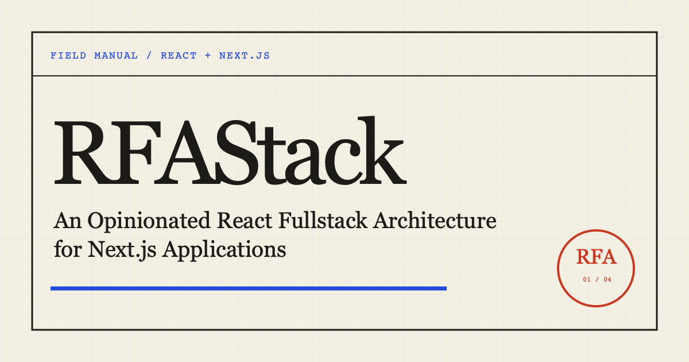

# RFAStack

**An Opinionated React Fullstack Architecture for Next.js Applications**

A Next.js project is easy to navigate while it is small. Then one product change starts crossing routes, components, hooks, services, schemas, and API handlers scattered across the repository.

RFAStack keeps the code for a business capability together. An `orders` feature owns its UI, rules, reads, mutations, and server code. `src/app` stays focused on the Next.js boundary. Integrations live in `src/platform`; code that is genuinely generic lives in `src/shared`.

[Read the docs →](https://ishk-sftckz.github.io/RFAStack/)



## The shape

```text
src/
  app/          # Next.js entry points and route composition
  features/     # Business capabilities with end-to-end ownership
  platform/     # Database, email, storage, and vendor integrations
  shared/       # Generic UI, types, and utilities
```

The folders encode ownership. A change to order cancellation has one obvious starting point, and framework or infrastructure code cannot quietly become the home of business policy.

## Start reading

1. [Background & Motivation](https://ishk-sftckz.github.io/RFAStack/background) explains where common Next.js structures begin to hurt.
2. [Concepts](https://ishk-sftckz.github.io/RFAStack/concepts) connects feature modules, vertical slices, Screaming Architecture, Clean Architecture, and Domain-Driven Design.
3. [Folder Structure](https://ishk-sftckz.github.io/RFAStack/folder-structure) turns those ideas into concrete placement and dependency rules.
4. [Data Fetching & Mutation](https://ishk-sftckz.github.io/RFAStack/data-fetching-and-mutation) chooses among Server Components, Server Actions, Route Handlers, TanStack Query, and oRPC.

## Run the site locally

The repository uses Bun 1.4.0.

```bash
bun install --frozen-lockfile
bun run docs:dev
```

To build, preview, or run the browser tests:

```bash
bun run docs:build
bun run docs:preview
bun run test
```

## Contributing

Found a rule that does not hold up in a real codebase? Open an issue with the failure mode, the alternative, and its tradeoffs. Corrections and clearer examples are welcome. Read [CONTRIBUTING.md](CONTRIBUTING.md) before opening a pull request.

## License

Source code is licensed under the [MIT License](LICENSE-CODE). Original writing, diagrams, and visual assets are licensed under [Creative Commons Attribution 4.0 International](LICENSE-CONTENT) with the attribution **“RFAStack by Ishk.”** See [LICENSE.md](LICENSE.md) for the repository-wide summary.
