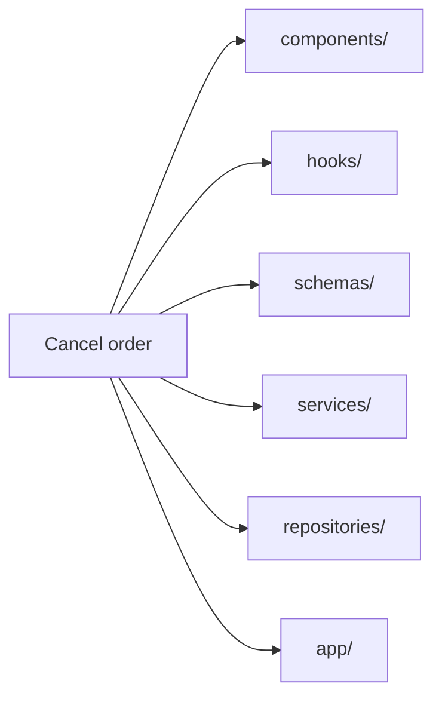
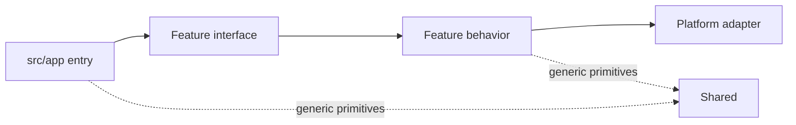

# Background & Motivation

**RFAStack — An Opinionated React Fullstack Architecture for Next.js Applications** starts from a recurring failure mode: a product can remain easy to deploy while becoming increasingly difficult to change.

RFAStack is a feature-based modular architecture for Next.js. Business capabilities are organized as vertical full-stack slices, while framework code and integrations stay at explicit boundaries.

## The application still works. The structure stops helping.

A young Next.js application rarely needs elaborate boundaries. A page reads data, a form writes it, and a few utility files smooth the edges. The code is close enough that developers can hold most of it in their heads.

Then the product acquires behavior.

An order is no longer a database row displayed on a page. It has totals, permissions, transitions, notifications, audit events, payment state, and several presentations. One change to cancellation policy can cross a route, a component directory, a global service, a validation directory, an API handler, and an infrastructure module.

The repository may look tidy by technical category:

```text
src/
  components/
  hooks/
  services/
  repositories/
  schemas/
  utils/
  app/
```

But the folder tree answers the wrong question. It says what kind of file something is. It does not say which business capability owns it.

### A change-footprint test

Imagine adding “cancel an order before fulfillment.” Find every file that must change.

- Where is the rule that decides whether cancellation is allowed?
- Which schema validates the input?
- Which server operation performs the transition?
- Which UI belongs specifically to orders?
- Where does the database adapter end and the business decision begin?
- Can another feature import order internals, or only a public contract?

If the answer requires repository-wide search and oral history, the architecture is no longer carrying enough information. The code may still compile. The change path is hidden.

## Horizontal layers scatter one reason to change

Technical layers are useful inside a boundary. They become expensive when they define the whole application.



This creates three pressures.

### Ownership becomes ambiguous

A generic `services/` folder can contain order policy, email delivery, database access, and third-party billing code. Those responsibilities change for different reasons, yet their physical location suggests they belong together.

### Reuse arrives before evidence

Once code enters `shared/`, `common/`, or `utils/`, every feature can reach it. A helper that began with order-specific assumptions gradually becomes an unofficial application API. Its name looks generic while its behavior still carries one feature’s policy.

### Framework details pull business behavior outward

Next.js gives an application routes, layouts, Server Components, Server Actions, and Route Handlers. Those are execution and delivery mechanisms. When the framework entry tree also becomes the home of business behavior, route structure starts deciding domain structure.

This creates coupling. Changing the delivery mechanism now risks changing the rule it delivers.

## The design target: local reasoning

RFAStack optimizes for a practical property: **a developer should be able to reason about one business capability mostly from one place**.

That requires four explicit responsibility boundaries:

1. **`app` receives.** It maps URLs and framework lifecycle to application operations.
2. **`features` owns behavior.** Each capability keeps its UI, rules, queries, mutations, and server implementation close.
3. **`platform` integrates.** Database clients, telemetry, email, storage, and vendor adapters stay free of business decisions.
4. **`shared` stays generic.** Reuse is deliberate, small, and unable to depend on a feature.

The structure makes the common change path visible:



Dependencies point from framework entry toward business capability, then outward through an explicit integration boundary. Platform and shared modules do not reach back into features.

## Thin entry does not mean empty entry

`src/app` remains important. It owns the URL space and the framework’s file conventions: `page.tsx`, `layout.tsx`, `loading.tsx`, `error.tsx`, and `route.ts`. These files decide how Next.js enters the application.

They should not quietly accumulate the application’s policy.

A page can compose a feature view. A Route Handler can adapt an HTTP request. A Server Action can adapt a form submission. The business operation they invoke belongs to the feature that owns the behavior.

This distinction keeps Next.js visible without letting Next.js become the domain model.

## Architecture is a set of constraints

A folder diagram alone cannot produce modularity. RFAStack is architectural because it adds constraints that affect real design decisions:

- a feature owns its behavior across server and client;
- imports have a declared direction;
- framework entry files delegate instead of becoming service containers;
- infrastructure performs integration work but does not decide policy;
- server-only ownership is visible;
- feature interfaces are smaller than feature implementations;
- shared code must earn its generic name;
- additional layers appear when complexity demands them, not before.

Those constraints are intentionally opinionated. They reduce the number of reasonable places a piece of code can live. That is the mechanism: fewer plausible locations, clearer ownership, and a smaller search surface during change.

## What this release covers

This first version focuses on two connected questions:

- **Where does code belong?** The [Folder Structure](./folder-structure) chapter maps business features, Next.js entries, integrations, and generic code.
- **How does data cross boundaries?** The [Data Fetching & Mutation](./data-fetching-and-mutation) chapter chooses among Server Components, Server Actions, Route Handlers, TanStack Query, and oRPC.

Detailed cache policy and protected-resource design deserve their own treatment and are outside this edition. The examples still validate untrusted input, keep secrets on the server, and require authorization at every public server boundary.

## What this architecture does not promise

RFAStack does not remove design work. It relocates it to explicit decisions.

Teams still have to decide what a feature is, when two features may coordinate, whether reuse is genuinely generic, and when a direct query has grown into a use case. Some duplication is healthier than a premature shared abstraction. Some small applications should remain simpler than the full structure shown here.

The architecture pays for itself when business changes routinely cross the full stack and multiple developers need the repository to communicate ownership without a guide standing beside them.

Next: [the concepts RFAStack synthesizes and adapts](./concepts).
