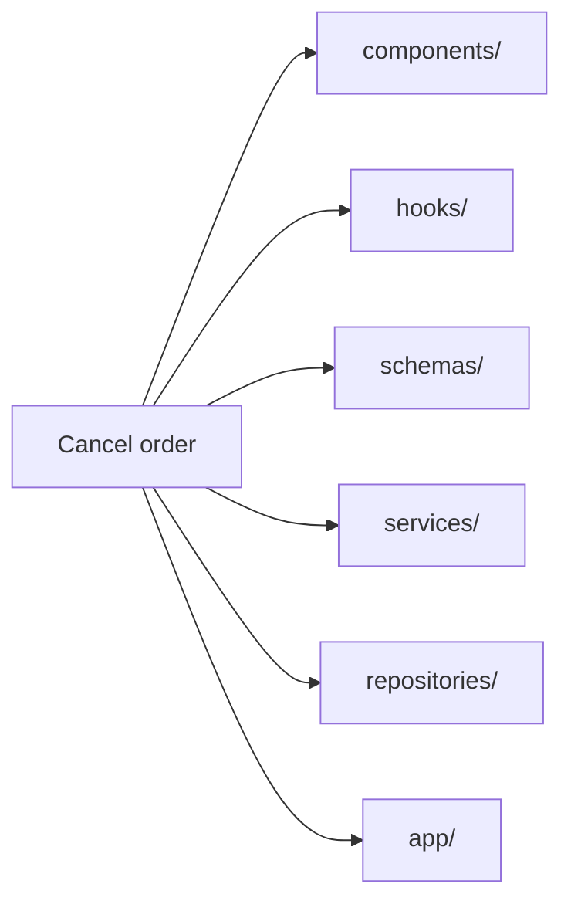
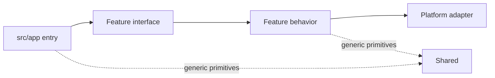

# Background & Motivation

A Next.js application can follow the framework’s conventions and still become difficult to maintain.

[React](https://react.dev/) is a UI library that leaves broader application architecture to the tools and teams built around it. [Next.js](https://nextjs.org/docs/app) provides conventions for routing, rendering, Server and Client Components, data fetching, mutations, and other framework concerns. Its documentation explains how those mechanisms work. A growing application still needs a consistent model for who owns business behavior, how data crosses boundaries, which modules may depend on each other, and where framework or infrastructure code should stop.

When those decisions are made one task at a time, individually reasonable implementations can produce an incoherent system. One route talks directly to the database, another delegates to a global service, and another contains business rules inside a component. Every part may work, but developers no longer have a reliable model for understanding the application as a whole.

**RFAStack** provides a shared reference for these decisions. It gives the whole application a consistent engineering model, covering concerns such as feature ownership, dependency direction, data flow, server and client boundaries, caching, access control, and infrastructure integration. Each guide applies that model to a different part of building and maintaining a full-stack Next.js application.

## The application still works. The structure stops helping.

A young Next.js application rarely needs elaborate boundaries. A page reads data, a form writes it, and a few utility files smooth the edges. The code is close enough that developers can hold most of it in their heads.

Then the product acquires behavior.

An order is no longer a database row displayed on a page. It has totals, permissions, transitions, notifications, audit events, payment state, and several presentations. One change to cancellation policy can cross a route, a component directory, a global service, a validation directory, an API handler, and an infrastructure module.

The repository may look tidy by technical category:

```text
src/
  components/
  hooks/
  services/
  repositories/
  schemas/
  utils/
  app/
```

But the folder tree answers the wrong question. It says what kind of file something is. It does not say which business capability owns it.

### A change-footprint test

Imagine adding “cancel an order before fulfillment.” Find every file that must change.

- Where is the rule that decides whether cancellation is allowed?
- Which schema validates the input?
- Which server operation performs the transition?
- Which UI belongs specifically to orders?
- Where does the database adapter end and the business decision begin?
- Can another feature import order internals, or only a public contract?

If the answer requires repository-wide search and oral history, the architecture is no longer carrying enough information. The code may still compile, but the change path is hidden.

The same uncertainty appears beyond file placement. Developers must reconstruct where data enters the application, where validation and authorization happen, which module owns a business decision, and whether a feature may depend on another feature’s internals.

This is how architectural debt enters everyday work. Changes require more searching, coordination, and caution. Developers worry that a local edit may break an unrelated flow because the application does not make its boundaries clear. Over time, ordinary maintenance becomes slower and more stressful than the product’s complexity should require.

## Horizontal layers scatter one reason to change

Technical layers are useful inside a boundary. They become expensive when they define the whole application.



This creates three pressures.

### Ownership becomes ambiguous

A generic `services/` folder can contain order policy, email delivery, database access, and third-party billing code. Those responsibilities change for different reasons, yet their physical location suggests they belong together.

### Reuse arrives before evidence

Once code enters `shared/`, `common/`, or `utils/`, every feature can reach it. A helper that began with order-specific assumptions gradually becomes an unofficial application API. Its name looks generic while its behavior still carries one feature’s policy.

### Framework details pull business behavior outward

Next.js gives an application routes, layouts, Server Components, Server Actions, and Route Handlers. Those are execution and delivery mechanisms. When the framework entry tree also becomes the home of business behavior, route structure starts deciding domain structure.

This creates coupling. Changing the delivery mechanism now risks changing the rule it delivers.

## The framework cannot choose the application boundaries

A Next.js application can use the correct framework APIs while making architectural decisions that become expensive later. A page can access the database without going through the feature that owns the data. A Server Action can mix validation, authorization, business rules, and persistence. A protected page can hide content while its underlying server operation still lacks resource-level authorization. A cache can improve response time while leaving ownership and invalidation unclear. One feature can depend directly on another feature’s private implementation.

These implementations may work independently, but together they determine how difficult the application will be to understand and change. Next.js provides the execution mechanisms. The application still needs rules for ownership, communication, access, state, and dependency direction.

RFAStack gives developers a reference for making those decisions consistently. Its guides explain how each concern fits into the same architecture, from organizing features and moving data to protecting resources, managing caches, and integrating external systems.

For developers new to full-stack Next.js, this provides a concrete starting point. For experienced teams, it provides shared language for reviewing decisions and keeping different parts of the application aligned.

## The design target: local reasoning

RFAStack optimizes for a practical property: **a developer should be able to reason about one business capability mostly from one place**.

That requires four explicit responsibility boundaries:

1. **`app` receives.** It maps URLs and framework lifecycle to application operations.
2. **`features` owns behavior.** Each capability keeps its UI, rules, queries, mutations, and server implementation close.
3. **`platform` integrates.** Database clients, telemetry, email, storage, and vendor adapters stay free of business decisions.
4. **`shared` stays generic.** Reuse is deliberate, small, and unable to depend on a feature.

The structure makes the common change path visible:



Dependencies point from framework entry toward business capability, then outward through an explicit integration boundary. Platform and shared modules do not reach back into features.

## Thin entry does not mean empty entry

`src/app` remains important. It owns the URL space and the framework’s file conventions: `page.tsx`, `layout.tsx`, `loading.tsx`, `error.tsx`, and `route.ts`. These files decide how Next.js enters the application.

They should not quietly accumulate the application’s policy.

A page can compose a feature view. A Route Handler can adapt an HTTP request. A Server Action can adapt a form submission. The business operation they invoke belongs to the feature that owns the behavior.

This distinction keeps Next.js visible without letting Next.js become the domain model.

## Architecture is a set of constraints

A folder diagram alone cannot produce modularity. RFAStack is architectural because it adds constraints that affect real design decisions:

- a feature owns its behavior across server and client;
- imports have a declared direction;
- framework entry files delegate instead of becoming service containers;
- infrastructure performs integration work but does not decide policy;
- server-only ownership is visible;
- feature interfaces are smaller than feature implementations;
- shared code must earn its generic name;
- additional layers appear when complexity demands them, not before.

Those constraints are intentionally opinionated. They reduce the number of reasonable places a piece of code can live. That is the mechanism: fewer plausible locations, clearer ownership, and a smaller search surface during change.

## What this architecture does not promise

No architecture is best for every Next.js application. A short-lived website and a growing full-stack product should not carry the same structural cost.

RFAStack supplies a coherent starting point while leaving teams responsible for their design decisions. They still have to define their business capabilities, decide how features coordinate, judge whether reuse is genuinely generic, and determine when a direct query needs a use case or integration contract. Some duplication is healthier than a premature shared abstraction.

The model becomes valuable when business changes cross the full stack, multiple developers work in the same application, and inconsistent local decisions begin creating system-wide costs. Teams can adopt the boundaries that answer their current problems and introduce more structure when real complexity appears.

Next: [the concepts RFAStack synthesizes and adapts](./concepts).
