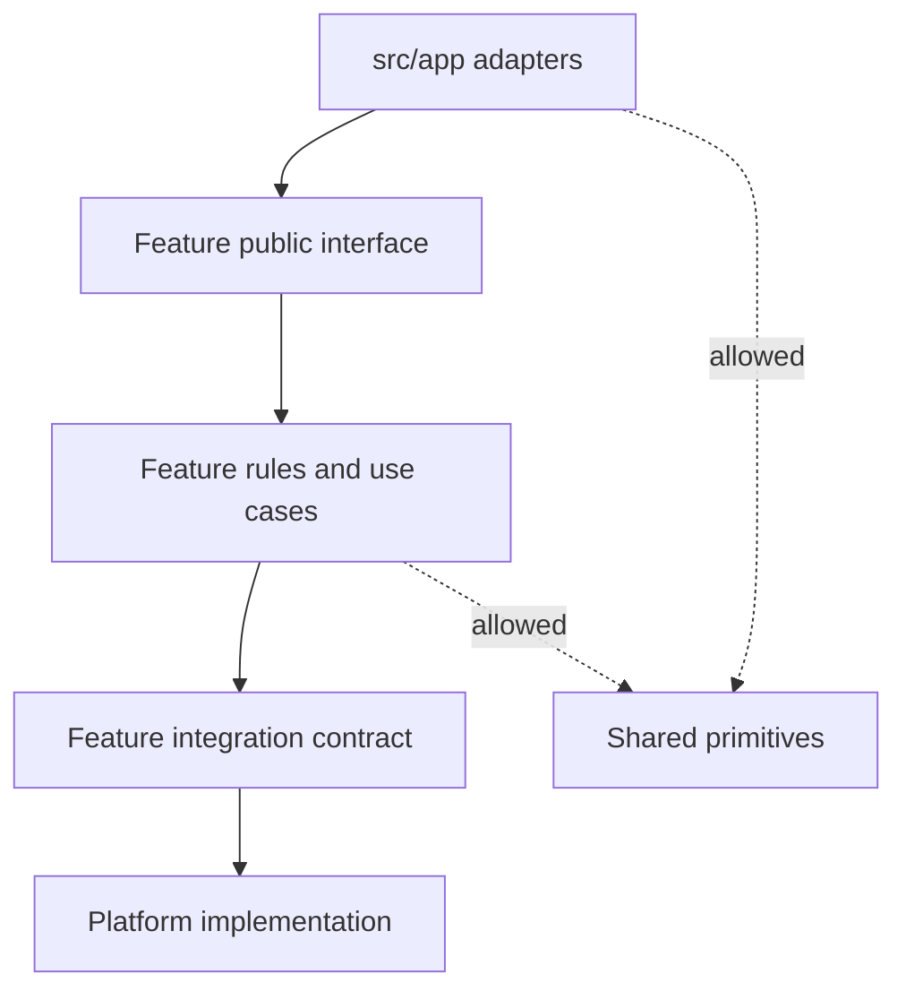

# Concepts

RFAStack adapts established architectural ideas to the constraints of a Next.js application.

It organizes the application by business capability, keeps each capability vertically complete, points dependencies toward behavior, and treats framework code as an adapter at the edge.

## Four foundations, one application model

### Screaming Architecture: reveal the business

Robert C. Martin’s [Screaming Architecture](https://blog.cleancoder.com/uncle-bob/2011/09/30/Screaming-Architecture.html) asks what a repository communicates at first glance. Does its top-level structure reveal a business domain, or only the frameworks and technical categories used to build it?

RFAStack applies that test through `src/features`:

```text
features/
  billing/
  identity/
  orders/
  reporting/
```

The directory names expose product capabilities. A reader can begin with what the system does before learning how a route or ORM delivers it.

Next.js remains visible in `src/app` as an explicit framework boundary. The repository presents stable business capabilities first and keeps delivery mechanics at the edge.

### Vertical Slice Architecture: keep a change together

[Vertical Slice Architecture](https://www.jimmybogard.com/vertical-slice-architecture/) is associated with Jimmy Bogard’s work on organizing code around use cases instead of horizontal technical layers. Its history also traces through earlier feature-folder and command/query ideas, documented by the [Vertical Slice Architecture project](https://verticalslicearchitecture.com/learn/cookbook/history.html).

RFAStack treats a feature as a vertical full-stack slice. An `orders` capability may own:

- order-specific UI;
- schemas and types;
- pure business rules;
- read and mutation interfaces;
- server-only use cases;
- its repository contract or implementation when that complexity is warranted.

A slice can contain only the layers its behavior needs while still owning that behavior end to end.

### Clean Architecture: control dependency direction

[Clean Architecture](https://blog.cleancoder.com/uncle-bob/2012/08/13/the-clean-architecture.html) separates policy from volatile delivery and infrastructure details. RFAStack borrows the dependency principle without reproducing the concentric-circle template folder for folder.

The business rule should not need to import Next.js to decide whether an order can be cancelled. Database configuration should not decide that policy. A route or form action can depend on the feature operation, while the pure rule remains framework-free.



Dependency direction should clarify a real boundary without adding empty layers. A direct feature query can be enough. Introduce a port and adapter when the business operation needs isolation, substitution, or independent testing. A box in a diagram is not a reason to create one.

### Domain-Driven Design: name and protect capabilities

Eric Evans’ [Domain-Driven Design reference](https://www.domainlanguage.com/ddd/reference/) provides language for modeling a domain, separating bounded contexts, and aligning code with business concepts.

RFAStack uses selected DDD habits:

- name features in the language of the product;
- keep rules near the capability that owns them;
- make cross-feature coordination explicit;
- avoid a universal model that every part of the application mutates;
- distinguish domain behavior from technical integration.

It does not require tactical DDD patterns everywhere. An entity, aggregate, repository, or domain service should exist because it clarifies real behavior. A read-only dashboard card does not need an aggregate root to qualify as architecture.

## How RFAStack uses these concepts

Each foundation answers a different architectural question:

| Foundation | Question it answers | RFAStack mechanism |
| --- | --- | --- |
| Screaming Architecture | What does this system do? | Top-level feature names reveal business capabilities. |
| Vertical Slice Architecture | What changes together? | UI, rules, reads, mutations, and server work live with the feature. |
| Clean Architecture | Which direction may dependencies point? | Framework and integration details depend on feature contracts and behavior. |
| Domain-Driven Design | Who owns this concept? | Product language defines boundaries and cross-feature relationships. |

Together, these rules determine where code belongs and which modules may depend on it.

## Seven operating principles

| Principle | What it requires |
| --- | --- |
| 1. Organize business behavior by feature | A business capability is the primary unit of ownership. Technical categories can exist inside the feature when they improve navigation. |
| 2. Keep framework entries thin | Pages, layouts, Route Handlers, and Server Actions adapt framework inputs and outputs, then delegate business policy to the owning feature. |
| 3. Separate integration from decision | Platform modules connect to databases, queues, email providers, and observability services. Features decide when and why those integrations are used. |
| 4. Share deliberately | Shared code must be generic in both name and behavior. Repeated feature code can remain repeated until a stable common concept emerges. |
| 5. Expose small feature interfaces | Other parts of the application import only the operations and components a feature intentionally exposes, keeping its internal layout private. |
| 6. Make server and client ownership visible | Server-only code sits behind an obvious boundary and imports `server-only` when appropriate. Client components use `'use client'` at the smallest useful interactive boundary. |
| 7. Add layers for observed complexity | A feature can begin with a component and a query, then add a model, use case, repository contract, or adapter when its behavior requires them. |

A small public interface lets callers use a feature without learning its internal layout:

```ts
// preferred: the feature chooses its public surface
import { getOrderDetails } from '@/features/orders/order.queries'

// avoid: another module couples itself to implementation layout
import { getOrderDetails } from '@/features/orders/server/internal/query-builder'
```

## Cross-feature coordination

Business capabilities interact through explicit relationships.

When `checkout` needs a price from `catalog`, choose an explicit relationship:

- import a small public query exposed by `catalog`;
- pass data from an orchestrating entry or application operation;
- publish an event when temporal decoupling is real;
- extract a genuinely shared domain concept only when both capabilities own the same stable meaning.

Avoid deep cross-feature imports. They make private structure part of an accidental public API and turn a local refactor into a repository-wide event.

## The architecture test

A structure is doing useful work when it can answer these questions without guesswork:

1. Which feature owns this behavior?
2. Which module is allowed to call it?
3. Where does the framework stop and application behavior begin?
4. Which code is server-only?
5. Which integration detail can change without rewriting the rule?
6. What is intentionally public to another feature?

If the answers come only from team memory, the boundaries are conceptual but not yet encoded.

## When the model fits and when it does not

RFAStack is useful when an application has multiple business capabilities, full-stack changes, a mix of server and client execution, and enough contributors that discoverability matters.

A short-lived campaign page, narrow prototype, or small read-only site can keep a more direct structure. Add RFAStack’s additional boundaries when repeated full-stack changes or coordination costs justify them.

The tradeoff is ongoing discipline. Teams must review dependency direction, resist vague shared folders, and move code when ownership becomes clearer. Without that discipline, four boundaries become four more junk drawers.

Next: [map these concepts onto a concrete Next.js folder structure](./folder-structure).
