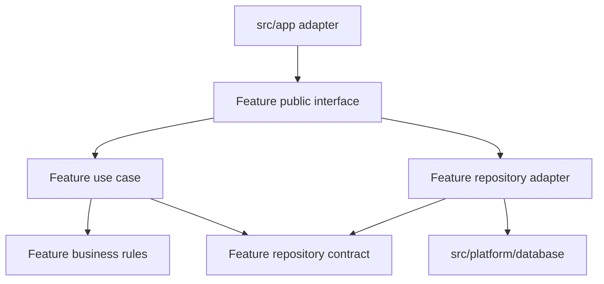

# Concepts

When an order’s cancellation rule changes, you should know where to start. The rule, the mutation that uses it, and the order-specific UI belong in `src/features/orders`. You can follow the behavior there without searching through unrelated routes, services, and helpers.

RFAStack organizes business behavior by feature. Next.js entry points handle routing and framework conventions. Platform code connects the application to databases and outside services. Each part has a responsibility, and its imports should follow that responsibility.

## Keep business behavior together as the application grows

### Screaming Architecture: make the business visible

Open a repository organized around `components`, `services`, and `utils`, and you still need to inspect the files to discover what the application does.

Robert C. Martin’s [Screaming Architecture](https://blog.cleancoder.com/uncle-bob/2011/09/30/Screaming-Architecture.html) asks whether the structure reveals the system’s use cases. RFAStack applies that idea inside `src/features`:

```text
src/features/
  billing/
  identity/
  orders/
  reporting/
```

These names give you a starting point. For an order change, open `orders`. For a billing change, open `billing`.

Next.js conventions remain in `src/app`. Business capabilities have their own place alongside that framework structure.

### Vertical Slice Architecture: keep the parts of a change nearby

Changing order cancellation can involve a form, input validation, a business rule, and a server operation. Keep those parts with the orders feature so you can trace the change without moving between application-wide technical folders.

Jimmy Bogard’s [Vertical Slice Architecture](https://www.jimmybogard.com/vertical-slice-architecture/) groups concerns around individual use cases across the stack. RFAStack borrows that approach at the feature level: an `orders` feature contains several related operations and the order-specific code they use.

A feature may own:

- UI;
- schemas and types;
- pure business rules;
- read and mutation interfaces;
- server-only use cases;
- repository code when persistence needs its own module.

Start with the parts the feature needs. A component and a query can be enough. Add more structure when you need to separate behavior that has become difficult to follow or test.

### Clean Architecture: keep business rules independent of integrations

The rule that decides whether an order can be cancelled should work without Next.js or a database connection.

[Clean Architecture](https://blog.cleancoder.com/uncle-bob/2012/08/13/the-clean-architecture.html) describes a dependency rule that keeps business policy independent of framework and infrastructure details. RFAStack applies that separation to pure feature rules while allowing feature server code to use platform integrations directly.

For a straightforward read, a feature query can call the database client. Keep any pure calculations or business rules in modules that can run without that client.

When an operation needs persistence that you can substitute or test independently, introduce a repository contract. The feature owns both the contract and the adapter that implements it.

The arrows below show source-code dependencies for that optional arrangement:



The public interface connects the use case to the repository adapter. The use case depends on the contract, and the adapter uses the platform database client to implement it. Platform code remains independent of the feature.

Introduce this separation when it solves a specific testing or integration problem. A direct feature query remains a valid starting point.

### Domain-Driven Design: give business concepts a clear owner

A shared model can gradually collect rules from several features. Once every feature can change it, you have to understand all its callers before changing one business rule.

Keep rules with the feature that owns their meaning. Eric Evans’ [Domain-Driven Design reference](https://www.domainlanguage.com/ddd/reference/) describes how domain language and bounded contexts help define those relationships.

RFAStack uses selected DDD practices:

- name features in the language of the product;
- keep rules near the feature that owns them;
- make relationships between features explicit;
- separate models when their business meanings differ;
- keep domain behavior separate from technical integration.

Add an entity, aggregate, repository, or domain service when it clarifies behavior you need to model. A read-only dashboard card does not need an aggregate root to qualify as architecture.

## Use seven rules to place code and review imports

| Principle | What to do |
| --- | --- |
| 1. Organize business behavior by feature | Keep related UI, rules, reads, mutations, and server work together. Add technical subfolders inside the feature when they improve navigation. |
| 2. Keep framework entries thin | Let pages, layouts, Route Handlers, and Server Actions adapt inputs and outputs. Delegate business rules to the owning feature. |
| 3. Separate integration from decisions | Put database connections, email clients, and similar integrations in `platform`. Decide when and why to use them inside the feature. |
| 4. Share deliberately | Move code into `shared` when its behavior is generic across features. Allow duplication while the common behavior is still unclear. |
| 5. Expose small feature interfaces | Give callers explicit operations and components to import. Keep implementation details behind those interfaces. |
| 6. Make runtime boundaries visible | Mark server-only implementation with `import 'server-only'`. Place `'use client'` at the smallest useful interactive boundary. |
| 7. Add layers for observed complexity | Start with the files you need. Add a model, use case, repository contract, or adapter when you can explain the problem it solves. |

A public interface gives callers a stable import while the implementation changes:

```ts
// Import the feature's public query.
import { getOrderDetails } from '@/features/orders/order.queries'

// Avoid reaching into its private implementation.
import { getOrderDetails } from '@/features/orders/server/internal/query-builder'
```

Next.js documents how [`'use client'` and `server-only` establish and protect runtime boundaries](https://nextjs.org/docs/app/getting-started/server-and-client-components). Folder names help you recognize those boundaries; the directives and imports express them to the framework.

## Start cross-feature work with a direct public call

When `checkout` needs a price from `catalog`, call a public query exposed by `catalog`. Keep the pricing rule in `catalog`, and let checkout use the result.

If a workflow coordinates several features, give that workflow an owner. A checkout operation can coordinate inventory and orders while each feature retains its own business rules. The [folder structure guide](./folder-structure) shows where that operation belongs.

Use an event when the receiving feature can process the work later and the workflow allows it to fail independently. An operation that needs a price before continuing still needs a way to obtain that price before proceeding.

Extract a shared domain concept only when the participating features use it with the same meaning. Similar names alone are not enough.

Avoid importing another feature’s private files. Once callers depend on those paths, moving an internal module requires changing code outside its owner.

## Check whether a change has a clear owner

Pick a behavior in your application and answer these questions from the code:

1. Which feature owns it?
2. Which modules are allowed to call it?
3. Where does the framework entry delegate to the feature?
4. Which code is server-only?
5. Which integration can change without rewriting the business rule?
6. Which operations and components are public to another feature?

If you need someone’s memory to answer, document the decision and make the relevant files or imports reflect it.

## Add these boundaries when changes need them

RFAStack fits applications with several business capabilities, changes that span server and client code, and contributors who need to understand one another’s work.

A short-lived campaign page, narrow prototype, or small read-only site can keep a more direct structure. Add boundaries when repeated changes make ownership or dependencies difficult to trace.

You will still need to review imports, question code placed in shared folders, and move files when their ownership becomes clearer. The folder structure gives you rules to enforce; maintaining those rules remains part of the work.

Next: [map these concepts onto a concrete Next.js folder structure](./folder-structure).
