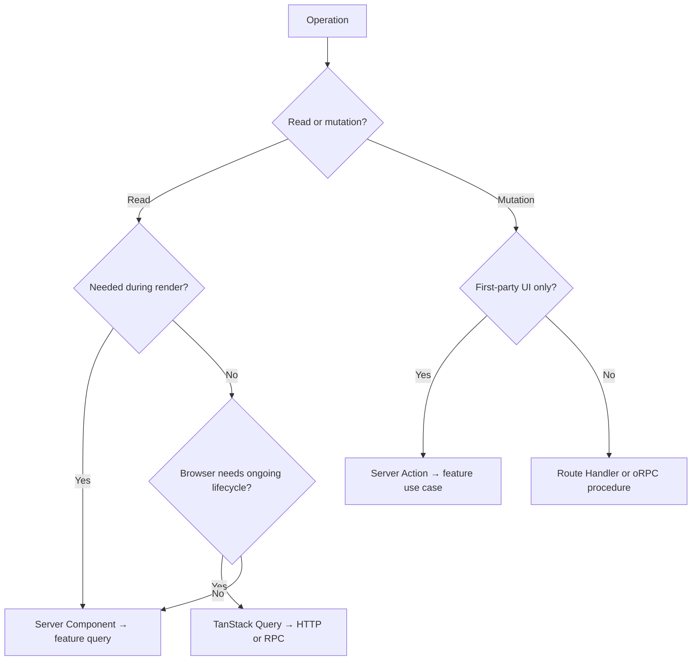

# Data Fetching & Mutation

Choose a data boundary from the operation, the execution location, and the consumer. The library comes after those three decisions.

This prevents a common inversion: adopting a client cache or RPC layer first, then forcing every server render, form, and endpoint through it whether the runtime needs that path or not.

## The three-question model

For every operation, ask:

1. **Is it a read or a mutation?** A read observes state. A mutation changes state or triggers an effect.
2. **Where must it execute?** During server rendering, after browser interaction, or behind a public HTTP boundary?
3. **Who consumes it?** One Server Component, first-party interactive UI, several application clients, or an external caller?



Filters, pagination, and search parameters are reads even when the user changes them. Classify by effect on system state, not by the presence of a button.

## Reads during render: Server Components first

Server Components can perform asynchronous I/O while rendering. The current [Next.js data-fetching guide](https://nextjs.org/docs/app/getting-started/fetching-data) explicitly supports `fetch`, an ORM, or a database client in Server Components. [React’s Server Components reference](https://react.dev/reference/rsc/server-components) explains the underlying server-rendered model.

In RFAStack, the page calls a feature-owned query directly:

```ts
// src/features/orders/order.queries.ts
import 'server-only'
import { database } from '@/platform/database/client'
import { toOrderSummary } from './server/order.dto'

export async function listOrdersForAccount(accountId: string) {
  const rows = await database.order.findMany({
    where: { accountId },
    orderBy: { createdAt: 'desc' },
  })

  return rows.map(toOrderSummary)
}
```

```tsx
// src/app/(authenticated)/orders/page.tsx
import { listOrdersForAccount } from '@/features/orders/order.queries'
import { OrderList } from '@/features/orders/ui/OrderList'
import { requireAccount } from '@/features/identity/server/require-account'

export default async function OrdersPage() {
  const account = await requireAccount()
  const orders = await listOrdersForAccount(account.id)

  return <OrderList orders={orders} />
}
```

This path has no internal HTTP request:

```text
Server Component → feature query → database or external service
```

The [Next.js Backend for Frontend guide](https://nextjs.org/docs/app/guides/backend-for-frontend) warns that fetching a Route Handler from a Server Component adds an HTTP round trip and can fail at build time for prerendered routes. Call the data source or application function directly when both caller and implementation already execute on the server.

### Why this is the default read path

- credentials and query logic remain outside the client bundle;
- the component receives exactly the DTO it renders;
- there is no client loading effect for data required by the initial view;
- the feature owns the read even when several routes present it;
- the call remains ordinary TypeScript rather than an invented internal transport.

Server Components do not create type safety by themselves. TypeScript, ORM-generated types, shared contracts, or runtime schemas provide that. Data from an external service remains untrusted and should be parsed before the feature relies on it.

### Start independent reads together

Do not create a waterfall when two reads are independent:

```tsx
export default async function DashboardPage() {
  const account = await requireAccount()
  const ordersPromise = listRecentOrders(account.id)
  const balancePromise = getAccountBalance(account.id)

  const [orders, balance] = await Promise.all([
    ordersPromise,
    balancePromise,
  ])

  return <Dashboard orders={orders} balance={balance} />
}
```

When one read is slow and the surrounding page can be useful without it, move that work into a smaller async Server Component behind `<Suspense>`. The data still belongs to the feature; streaming changes when its presentation arrives.

## Passing server data into client interaction

A Client Component does not need to refetch data merely because it is interactive. Pass a serializable DTO from the Server Component:

```tsx
// Server Component
const order = await getOrderDetails(orderId)
return <OrderEditor initialOrder={order} />
```

Use this when the browser needs an initial snapshot and local interaction, but not a long-lived server-state lifecycle.

Next.js also documents streaming a promise to a Client Component, where React’s [`use` API](https://react.dev/reference/react/use) reads it inside a Suspense boundary:

```tsx
// Server Component
export function OrdersPanel() {
  const orders = listOrders()

  return (
    <Suspense fallback={<OrderListSkeleton />}>
      <InteractiveOrderList orders={orders} />
    </Suspense>
  )
}
```

```tsx
'use client'

import { use } from 'react'
import type { OrderSummary } from '../model/order.types'

export function InteractiveOrderList({
  orders,
}: {
  orders: Promise<OrderSummary[]>
}) {
  const items = use(orders)
  return <OrderTable items={items} />
}
```

Prefer an awaited serializable prop when streaming does not improve the experience. A Promise crossing the boundary is useful, but it adds Suspense behavior that the screen must design intentionally.

## Reads after browser interaction

Some reads truly belong to the browser lifecycle:

- live search after typing;
- polling or background refresh;
- infinite scrolling;
- client-owned pagination without navigation;
- browser API input;
- data shared among several mounted interactive views.

These reads need a transport because the browser cannot import server implementation. Use a Route Handler, an external API, or an RPC client.

### Route Handler: an actual HTTP boundary

[Next.js Route Handlers](https://nextjs.org/docs/app/getting-started/route-handlers) use the standard Web `Request` and `Response` APIs. Place the handler in `app`; let it adapt HTTP to a feature query.

```ts
// src/app/api/orders/route.ts
import { listOrdersForAccount } from '@/features/orders/order.queries'
import { requireAccount } from '@/features/identity/server/require-account'

export async function GET(request: Request) {
  const account = await requireAccount()
  const url = new URL(request.url)
  const cursor = url.searchParams.get('cursor') ?? undefined
  const result = await listOrdersForAccount(account.id, { cursor })

  return Response.json(result)
}
```

The handler owns HTTP concerns: query strings, status codes, headers, and response encoding. The feature query owns what listing orders means.

Use a Route Handler when HTTP is part of the requirement:

- browser code must fetch after hydration;
- a webhook calls the application;
- a mobile app or external integration consumes the endpoint;
- the response is a non-UI format such as a file or feed.

Do not add a handler solely to make server code “look like an API.” That creates a network boundary without a consumer that needs one.

## Mutations from first-party UI: Server Actions

Next.js implements mutations through React Server Functions. The [Next.js mutation guide](https://nextjs.org/docs/app/getting-started/mutating-data) uses the term Server Action when a Server Function is invoked in an action context such as a form or transition.

A feature mutation file is a clear public entry:

```ts
// src/features/orders/order.mutations.ts
'use server'

import { cancelOrderInput } from './model/order.schema'
import { cancelOrderUseCase } from './server/cancel-order.use-case'
import { requireAccount } from '@/features/identity/server/require-account'

export async function cancelOrder(formData: FormData) {
  const account = await requireAccount()
  const input = cancelOrderInput.parse({
    orderId: formData.get('orderId'),
  })

  await cancelOrderUseCase({
    accountId: account.id,
    orderId: input.orderId,
  })
}
```

```tsx
// src/features/orders/ui/CancelOrderForm.tsx
import { cancelOrder } from '../order.mutations'

export function CancelOrderForm({ orderId }: { orderId: string }) {
  return (
    <form action={cancelOrder}>
      <input type="hidden" name="orderId" value={orderId} />
      <button type="submit">Cancel order</button>
    </form>
  )
}
```

This path fits first-party UI because forms integrate with React transitions and can progressively enhance. A Client Component can import the action from a dedicated `'use server'` file when it needs pending state, optimistic state, or event-handler invocation.

### A Server Action is still a public server boundary

The mutation guide states that Server Functions are reachable through direct POST requests, not only through the rendered button. Every action must:

1. authenticate the caller;
2. authorize the operation against the target resource;
3. validate untrusted input at runtime;
4. return only data safe for that caller;
5. keep secrets and server implementation behind a server-only boundary.

Hiding an identifier in a form is not authorization. TypeScript is not runtime validation. UI visibility is not access control.

The example keeps these checks at the public entry and use-case boundary. A full protected-resource design is larger than this chapter, but omitting the minimum would teach an unsafe execution model.

### Do not use Server Actions as a general read transport

A Server Function can technically return data, but action semantics are designed around mutations, POST requests, and action dispatch. Use Server Components for reads during rendering. Use HTTP or RPC for ongoing browser reads. This keeps operation semantics visible and avoids turning every data need into an imperative action call.

## Mutations for HTTP consumers: Route Handlers

When a mutation must be consumed as HTTP, adapt the request in `app` and delegate:

```ts
// src/app/api/orders/[orderId]/cancel/route.ts
import { cancelOrderRequest } from '@/features/orders/model/order.schema'
import { cancelOrderUseCase } from '@/features/orders/server/cancel-order.use-case'
import { requireAccount } from '@/features/identity/server/require-account'

export async function POST(
  request: Request,
  context: RouteContext<'/api/orders/[orderId]/cancel'>,
) {
  const account = await requireAccount()
  const { orderId } = await context.params
  const input = cancelOrderRequest.parse({ orderId, ...(await request.json()) })

  await cancelOrderUseCase({ accountId: account.id, ...input })
  return new Response(null, { status: 204 })
}
```

The same feature use case can sit behind a Server Action and a Route Handler. The entry adapters differ because their consumers differ; business behavior remains one implementation.

## TanStack Query: client server-state lifecycle

[TanStack Query](https://tanstack.com/query/latest/docs/framework/react/overview) manages asynchronous server state in the browser: request status, deduplication, retries, background refetching, and a client cache. It is not a transport and does not replace the server operation.

The query function still calls HTTP or RPC:

```tsx
'use client'

import { useQuery } from '@tanstack/react-query'

async function getOrder(orderId: string) {
  const response = await fetch(`/api/orders/${orderId}`)
  if (!response.ok) throw new Error('Unable to load order')
  return response.json() as Promise<OrderDetailsDTO>
}

export function LiveOrderDetails({ orderId }: { orderId: string }) {
  const order = useQuery({
    queryKey: ['orders', orderId],
    queryFn: () => getOrder(orderId),
  })

  if (order.isPending) return <OrderDetailsSkeleton />
  if (order.isError) return <OrderError />
  return <OrderDetails order={order.data} />
}
```

Add TanStack Query when the browser owns a meaningful data lifecycle. Do not add it merely to render server data once.

The [TanStack Query advanced server-rendering guide](https://tanstack.com/query/latest/docs/framework/react/guides/advanced-ssr) documents prefetching, dehydration, and Server Component integration. Those techniques are useful when one query should be server-prefetched and then continue living in the client cache. They also introduce coordination between server rendering and client cache ownership. Start with the direct Server Component path; adopt hydration when the ongoing browser behavior pays for it.

TanStack Query mutations can call a Server Action, Route Handler, or RPC procedure. Choose from the consumer and contract requirements, then let TanStack Query manage the browser-side mutation lifecycle.

## oRPC: a reusable typed application API

oRPC becomes useful when an application needs a durable end-to-end typed API surface across multiple calls or consumers. Define procedures with runtime input/output contracts, expose them through a Route Handler, and call them through the generated client.

For TanStack Query, the official [oRPC integration](https://orpc.dev/docs/integrations/tanstack-query) builds query and mutation options from that typed client:

```tsx
'use client'

import { useQuery } from '@tanstack/react-query'
import { orpc } from '@/platform/rpc/client'

export function LiveOrderDetails({ orderId }: { orderId: string }) {
  const order = useQuery(
    orpc.orders.details.queryOptions({
      input: { orderId },
    }),
  )

  if (order.isPending) return <OrderDetailsSkeleton />
  if (order.isError) return <OrderError />
  return <OrderDetails order={order.data} />
}
```

Keep procedure ownership with the feature:

```text
features/orders/server/order.rpc.ts   # order procedures and contracts
platform/rpc/client.ts                # browser/client wiring
app/api/rpc/route.ts                  # Next.js HTTP adapter
```

oRPC adds a contract layer, transport wiring, and another abstraction for the team to understand. It earns that cost when the typed API is reused, when client interaction is substantial, or when procedure-level middleware and error contracts make the boundary clearer. A single Server Component query does not need RPC to remain well designed.

## Decision matrix

| Operation | Execution | Consumer | Default boundary | Add when needed |
| --- | --- | --- | --- | --- |
| Read required for initial render | Server | Server Component | Direct feature query | Suspense for streaming; cache policy when requirements are known |
| Read passed into local interaction | Server → browser | One Client Component | Serializable prop | Promise + `use` when streaming has a designed fallback |
| Read after browser interaction | Browser → server | First-party UI | Route Handler + `fetch` | TanStack Query for sustained cache/lifecycle needs |
| Read shared across a typed interactive client | Browser → server | Several client views | oRPC procedure | TanStack Query integration for client lifecycle |
| Mutation from a form or first-party control | Server | React UI | Server Action | Client transition or TanStack mutation for richer feedback |
| Mutation consumed over HTTP | Server | Browser, mobile, webhook, external client | Route Handler | oRPC when a reusable typed procedure contract is valuable |
| Pure local UI update | Browser | One interactive view | Component state | A state library only when ownership spans a wider client tree |

## A compact rule set

1. Read during render through a feature query in a Server Component.
2. Do not call the application’s own Route Handler from a Server Component.
3. Pass serializable server results into client interaction when no continuing remote lifecycle exists.
4. Give browser-owned reads an HTTP or RPC transport.
5. Use Server Actions for first-party UI mutations.
6. Use Route Handlers when the consumer needs HTTP.
7. Use TanStack Query for client cache and asynchronous lifecycle, not as a transport.
8. Use oRPC when a reusable typed application API justifies a contract layer.
9. Validate, authenticate, and authorize at every public server entry.
10. Keep the operation owned by its feature regardless of delivery mechanism.

The point is not to minimize the number of tools. It is to make each boundary explain why it exists.
