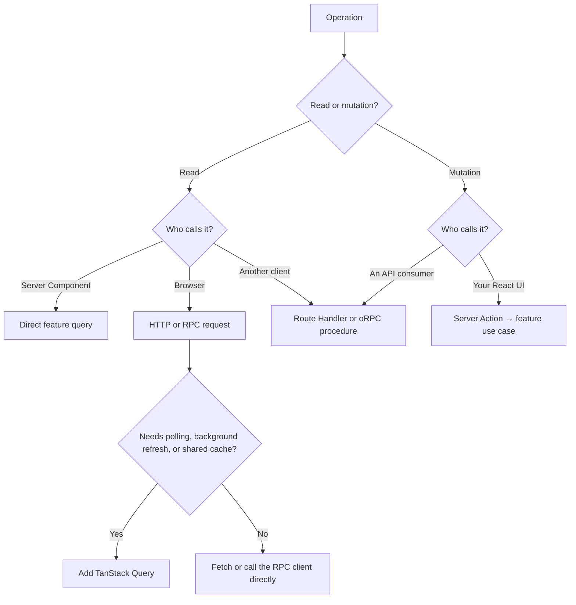

# Data Fetching & Mutation

An orders page needs data, so you add `/api/orders` and fetch from it in a Server Component. The handler calls a feature query, which calls the database. Both the page and the query already run on the server, but you’ve put an HTTP request between them. That extra request adds a round trip and can fail during prerendering at build time. [Next.js Backend for Frontend guide](https://nextjs.org/docs/app/guides/backend-for-frontend#server-components)

In RFAStack, start with direct feature queries for server rendering and Server Actions for mutations from your own UI. Use HTTP or RPC for browser reads and APIs consumed by other clients. Choose a library after you know which calls the application needs.

## Choose the data path from the operation

Before adding a query or mutation, answer three questions:

1. **What does it do?** A read retrieves data. A mutation changes application state or triggers an effect.
2. **Who calls it?** A Server Component, browser code, or another client such as a mobile app or external integration?
3. **What does the caller need afterward?** One result, a refreshed page, or data that stays updated through polling, background refresh, or a shared client cache?



Changing a filter, page number, or search parameter usually selects different data to read. Classify the operation by what it does to application state. Opening a menu or changing an unsaved form field can stay in component state.

## Read during rendering through a Server Component

If the orders page needs orders to render, call the orders query from the page.

Server Components support asynchronous reads through `fetch`, an ORM, or a database client. [Next.js data-fetching guide](https://nextjs.org/docs/app/getting-started/fetching-data)

```ts
// src/features/orders/order.queries.ts
import 'server-only'
import { database } from '@/platform/database/client'
import { toOrderSummary } from './server/order.dto'

export async function listOrdersForAccount(accountId: string) {
  const rows = await database.order.findMany({
    where: { accountId },
    orderBy: { createdAt: 'desc' },
  })

  return rows.map(toOrderSummary)
}
```

```tsx
// src/app/(authenticated)/orders/page.tsx
import { listOrdersForAccount } from '@/features/orders/order.queries'
import { OrderList } from '@/features/orders/ui/OrderList'
import { requireAccount } from '@/features/identity/server/require-account'

export default async function OrdersPage() {
  const account = await requireAccount()
  const orders = await listOrdersForAccount(account.id)

  return <OrderList orders={orders} />
}
```

The call goes directly from the page to the feature:

```text
Server Component → feature query → database or external service
```

The page handles rendering. The feature decides which orders the account can see and which fields to return. When another route needs the same read, it calls the same query.

`toOrderSummary` returns a data transfer object, or DTO: the fields the UI needs and the caller is allowed to receive. Keep database credentials and query implementation in server-only code. React’s [Server Components reference](https://react.dev/reference/rsc/server-components) explains how server execution keeps those dependencies outside the client bundle.

TypeScript and ORM-generated types help check the code that calls the query. Parse data from external services with a runtime schema before relying on its shape.

### Start independent reads together

An orders query and an account-balance query can both start once you know the account. Awaiting one before starting the other makes the second read wait unnecessarily.

```tsx
export default async function DashboardPage() {
  const account = await requireAccount()
  const ordersPromise = listRecentOrders(account.id)
  const balancePromise = getAccountBalance(account.id)

  const [orders, balance] = await Promise.all([
    ordersPromise,
    balancePromise,
  ])

  return <Dashboard orders={orders} balance={balance} />
}
```

If one read is slow and the surrounding page is useful without it, move that read into a smaller async Server Component behind `<Suspense>`. The rest of the page can appear while that component waits for its data. [Next.js streaming guide](https://nextjs.org/docs/app/getting-started/fetching-data#streaming)

## Pass server data into client interaction

A Client Component does not need to refetch data merely because it is interactive. Pass a serializable DTO from the Server Component:

```tsx
// Server Component
const order = await getOrderDetails(orderId)
return <OrderEditor initialOrder={order} />
```

This fits an editor that loads an order and lets the user change fields locally before saving. Add browser fetching when the editor also needs fresh server data while it stays open.

You can also pass a promise to a Client Component and read it with React’s [`use` API](https://react.dev/reference/react/use). A Suspense boundary shows the fallback while the promise resolves:

```tsx
// Server Component
import { Suspense } from 'react'
import { listOrdersForAccount } from '@/features/orders/order.queries'
import { InteractiveOrderList } from '@/features/orders/ui/InteractiveOrderList'
import { OrderListSkeleton } from '@/features/orders/ui/OrderListSkeleton'

export function OrdersPanel({ accountId }: { accountId: string }) {
  const orders = listOrdersForAccount(accountId)

  return (
    <Suspense fallback={<OrderListSkeleton />}>
      <InteractiveOrderList orders={orders} />
    </Suspense>
  )
}
```

Here, the parent supplies `accountId` from the authenticated session.

```tsx
// src/features/orders/ui/InteractiveOrderList.tsx
'use client'

import { use } from 'react'
import type { OrderSummary } from '../model/order.types'
import { OrderTable } from './OrderTable'

export function InteractiveOrderList({
  orders,
}: {
  orders: Promise<OrderSummary[]>
}) {
  const items = use(orders)
  return <OrderTable items={items} />
}
```

Await the data and pass a serializable prop by default. Pass a promise when showing the surrounding UI earlier helps the user, and choose a fallback that makes sense for the waiting component.

## Fetch from the browser when the interaction needs it

Some screens need more data after the initial render:

- Search results change as the user types.
- Order status refreshes while the page stays open.
- Infinite scrolling loads another batch.
- Pagination updates the list without navigation.
- A request depends on input from a browser API.
- Several mounted views use the same cached data.

Browser code reaches server data through HTTP or RPC. Use a Route Handler, an external API, or an RPC client for those requests.

A one-off request can use `fetch` directly. Add a query library when you need to coordinate caching, retries, background refresh, or requests shared by several components.

### Let Route Handlers adapt HTTP to feature queries

[Next.js Route Handlers](https://nextjs.org/docs/app/getting-started/route-handlers) use the standard Web `Request` and `Response` APIs. Put the handler in `app` and call the feature query from it:

```ts
// src/app/api/orders/route.ts
import { listOrdersForAccount } from '@/features/orders/order.queries'
import { requireAccount } from '@/features/identity/server/require-account'

export async function GET() {
  const account = await requireAccount()
  const orders = await listOrdersForAccount(account.id)

  return Response.json(orders)
}
```

The handler handles the HTTP request and response. The query scopes the read to the account and returns the order summaries.

If you add pagination, extend the query with validated pagination input. Let the handler read query-string values and translate them into that input.

Route Handlers also fit webhooks, mobile clients, external integrations, and responses such as files or feeds. Keep each handler focused on translating its request into a feature operation and returning the appropriate response.

## Use Server Actions for mutations from your own UI

A cancellation form needs to submit an order ID, check whether the account can cancel that order, and update the screen.

Use a Server Action for this path. Next.js uses that term for a React Server Function invoked in an action context, such as a form or transition. [Next.js mutation guide](https://nextjs.org/docs/app/getting-started/mutating-data)

```ts
// src/features/orders/order.mutations.ts
'use server'

import { refresh } from 'next/cache'
import { cancelOrderInput } from './model/order.schema'
import { cancelOrderUseCase } from './server/cancel-order.use-case'
import { requireAccount } from '@/features/identity/server/require-account'

export async function cancelOrder(formData: FormData) {
  const account = await requireAccount()
  const input = cancelOrderInput.parse({
    orderId: formData.get('orderId'),
  })

  await cancelOrderUseCase({
    accountId: account.id,
    orderId: input.orderId,
  })

  refresh()
}
```

```tsx
// src/features/orders/ui/CancelOrderForm.tsx
import { cancelOrder } from '../order.mutations'

export function CancelOrderForm({ orderId }: { orderId: string }) {
  return (
    <form action={cancelOrder}>
      <input type="hidden" name="orderId" value={orderId} />
      <button type="submit">Cancel order</button>
    </form>
  )
}
```

The action authenticates the caller and validates the submitted ID. `cancelOrderUseCase` must verify that the account owns the order and that the order can still be cancelled before changing it. That implementation is omitted here; passing an `accountId` alone does not perform those checks.

A form rendered in a Server Component can submit before JavaScript loads or when JavaScript is disabled. A Client Component can import an action from a dedicated `'use server'` file when it needs pending feedback, optimistic state, or event-handler invocation. [Next.js Server Function examples](https://nextjs.org/docs/app/getting-started/mutating-data#server-components)

### Update the screen after the mutation succeeds

The example calls [`refresh()`](https://nextjs.org/docs/app/api-reference/functions/refresh) after cancellation succeeds. This refreshes the client router so the page can render the updated result from the direct database query.

If you cache the order query, also revalidate the affected cached data. Refreshing the page alone does not invalidate tagged data. Choose the revalidation behavior that matches how you cached the read. [Next.js mutation guide](https://nextjs.org/docs/app/getting-started/mutating-data#refresh-data)

The example shows a successful submission. For expected failures, such as invalid input or an order that can no longer be cancelled, return a result the form can display. Adapt the action for `useActionState` to show that message and pending feedback beside the control. [Next.js error-handling guide](https://nextjs.org/docs/app/getting-started/error-handling#server-functions)

### Check access inside every Server Action

Server Functions are reachable through direct POST requests. A caller can submit a request without using the rendered form. [Next.js mutation guide](https://nextjs.org/docs/app/getting-started/mutating-data#what-are-server-functions)

Every action must:

1. Authenticate callers when the operation requires an account.
2. Authorize the operation against the target resource.
3. Validate untrusted input at runtime.
4. Return only data safe for that caller.
5. Keep secrets and server implementation in server-only modules.

Treat the hidden `orderId` field as user input. Check ownership and cancellation rules on the server, even when the UI only shows the button for orders that appear eligible.

### Keep independent reads out of Server Actions

Server Functions can return data, but Server Actions are designed for mutations from the UI. Next.js queues action calls, so using them to fetch independent data introduces sequential execution. [Next.js Backend for Frontend guide](https://nextjs.org/docs/app/guides/backend-for-frontend#server-actions)

Read through feature queries during server rendering. Use HTTP or RPC when browser code needs to request data.

## Use Route Handlers for mutations consumed through an API

A mobile app or external integration needs an endpoint with a defined request and response. Let the Route Handler validate the request and call the same cancellation use case:

```ts
// src/app/api/orders/[orderId]/cancel/route.ts
import { cancelOrderInput } from '@/features/orders/model/order.schema'
import { cancelOrderUseCase } from '@/features/orders/server/cancel-order.use-case'
import { requireAccount } from '@/features/identity/server/require-account'

export async function POST(
  _request: Request,
  context: RouteContext<'/api/orders/[orderId]/cancel'>,
) {
  const account = await requireAccount()
  const { orderId } = await context.params
  const input = cancelOrderInput.parse({ orderId })

  await cancelOrderUseCase({
    accountId: account.id,
    orderId: input.orderId,
  })

  return new Response(null, { status: 204 })
}
```

For this example, `cancelOrderUseCase` is an explicitly public server operation of the orders feature. Its database access and cancellation-rule implementation remain private.

The action and handler both call that operation, so they enforce the same ownership and cancellation rules. Each entry handles the response its caller needs: the action refreshes the page, while the handler returns an HTTP response.

This example shows the successful response. Translate validation failures, denied access, and rejected cancellations into deliberate HTTP status codes and safe response bodies. Use authentication appropriate to the API consumer; the example assumes the caller uses the application’s account session.

## Add TanStack Query for caching and background updates

If an order screen needs to refetch in the background, retry failed requests, or share data with other mounted views, use [TanStack Query](https://tanstack.com/query/latest/docs/framework/react/overview). It tracks request status and cached server data in the browser.

The query function still makes the HTTP or RPC call:

```tsx
'use client'

import { useQuery } from '@tanstack/react-query'
import type { OrderDetailsDTO } from '../model/order.types'

async function getOrder(orderId: string) {
  const response = await fetch(`/api/orders/${orderId}`)
  if (!response.ok) throw new Error('Unable to load order')
  return response.json() as Promise<OrderDetailsDTO>
}

export function LiveOrderDetails({ orderId }: { orderId: string }) {
  const order = useQuery({
    queryKey: ['orders', orderId],
    queryFn: () => getOrder(orderId),
  })

  if (order.isPending) return <OrderDetailsSkeleton />
  if (order.isError) return <OrderError />
  return <OrderDetails order={order.data} />
}
```

This example assumes a `QueryClientProvider` is configured and `/api/orders/[orderId]` returns `OrderDetailsDTO`. The type assertion describes the expected response to TypeScript; use a runtime schema when the response also needs validation.

Start with a Server Component query when the page only needs data for rendering. Add TanStack Query when you need its caching and request behavior while the screen stays open.

### Prefetch when the client needs the same data afterward

An order screen may need data during server rendering and then keep it updated in the browser. TanStack Query supports prefetching on the server and hydrating the client cache with the result. Its [advanced server-rendering guide](https://tanstack.com/query/latest/docs/framework/react/guides/advanced-ssr) covers that setup.

Use this when the browser will continue using the query after the initial render. Decide which UI reads from the client cache and which reads from Server Components, so a client refetch does not leave two versions of the same information on screen.

TanStack Query mutations can call a Server Action, Route Handler, or RPC procedure. After a successful mutation, update or invalidate the affected client queries so mounted views can show the new data. [TanStack Query mutation invalidation guide](https://tanstack.com/query/latest/docs/framework/react/guides/invalidations-from-mutations)

## Add oRPC when callers need a shared typed API

Several interactive views may call the same order operations. You then need to keep request inputs, response types, and error handling consistent across those calls.

Use oRPC when maintaining that shared API justifies defining procedures and their contracts. Keep the procedures with the feature, expose them through an HTTP adapter, and call them through a typed client.

The official [oRPC TanStack Query integration](https://orpc.dev/docs/integrations/tanstack-query) builds query and mutation options from that client:

```tsx
'use client'

import { useQuery } from '@tanstack/react-query'
import { orpc } from '@/platform/rpc/client'

export function LiveOrderDetails({ orderId }: { orderId: string }) {
  const order = useQuery(
    orpc.orders.details.queryOptions({
      input: { orderId },
    }),
  )

  if (order.isPending) return <OrderDetailsSkeleton />
  if (order.isError) return <OrderError />
  return <OrderDetails order={order.data} />
}
```

Here, `orpc` exposes the query utilities created from the typed client. The application still needs its client and server transport setup.

Keep order-specific procedures and contracts in the orders feature:

```text
features/orders/server/order.rpc.ts   # order procedures and contracts
platform/rpc/client.ts                # client transport setup
app/api/rpc/route.ts                  # Next.js HTTP adapter
```

oRPC adds procedure definitions, contracts, and transport configuration to maintain. That cost can pay off when several callers reuse the API or when shared middleware and typed errors remove repeated work. A page that calls one server query directly can keep that simpler path.

## Choose the default that matches the caller

| Situation | Start with | Add when needed |
| --- | --- | --- |
| A Server Component needs data to render | Direct feature query | Suspense when part of the page can appear earlier |
| A Client Component needs initial data for local interaction | Serializable prop from the server | A promise and `use` when streaming improves the screen |
| Browser code needs a one-off read | `fetch` to a Route Handler or existing API | RPC when the application already uses a shared typed API |
| Browser views need polling, background refresh, or shared cached data | TanStack Query over HTTP or RPC | Server prefetching and hydration when the initial render needs the same query |
| A form or control in your React UI changes server data | Server Action calling a feature operation | Pending feedback, expected-error messages, and optimistic updates |
| A mobile app, webhook, or external integration needs an operation | Route Handler calling a feature operation | oRPC when callers benefit from shared typed procedures |
| An interaction only changes local UI state | Component state | A state library when several parts of the client need to coordinate that state |
