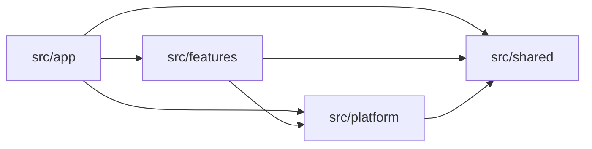

# Folder Structure

An order rule, a database client, and a route-specific header have different reasons to change. Place each in the directory that matches its responsibility.

Use four directories at the top of `src`:

```text
src/
  app/          # Next.js routes and page composition
  features/     # Business capabilities across server and client
  platform/     # Database connections and external integrations
  shared/       # Code with generic behavior across features
```

Next.js also requires some framework entry files outside these directories. Put `src/proxy.ts` beside `src/app` for [early route redirects](./protected-resources#use-proxy-for-early-redirects). Keep its work limited to the request boundary. [Next.js Proxy convention](https://nextjs.org/docs/app/api-reference/file-conventions/proxy)

Review imports as well as file placement.

Follow the ownership, placement, and dependency rules from the first feature. Put operation modules directly in the feature root, with presentation in `ui/` and schemas and pure rules in `model/`. Repositories and separate mappers are additional abstractions with their own conditions for use.

## Give each directory a responsibility

### `src/app`: handle routes and compose pages

Keep the URL tree and Next.js lifecycle files in `app`:

```text
src/app/
  layout.tsx
  page.tsx
  (authenticated)/
    layout.tsx
    orders/
      page.tsx
      loading.tsx
      error.tsx
      [orderId]/
        page.tsx
    dashboard/
      page.tsx
      _components/
        DashboardHeader.tsx
  api/
    health/
      route.ts
```

The [Next.js project-structure reference](https://nextjs.org/docs/app/getting-started/project-structure) defines the routing conventions. Keep ownership explicit: route files use feature interfaces to assemble the application.

| File or convention | Responsibility |
| --- | --- |
| `page.tsx` | Read route inputs and compose feature UI for that URL. |
| `layout.tsx` | Compose presentation shared by part of the route tree. |
| `loading.tsx` | Show loading UI while the route segment is waiting. |
| `error.tsx` | Provide an error boundary and recovery UI; Next.js requires this file to be a Client Component. |
| `route.ts` | Adapt HTTP requests and responses, such as a health check or an order API. |
| `(authenticated)/` | Group routes without adding a URL segment. The name itself does not enforce authentication. |
| `[orderId]/` | Make an order ID available as a route parameter. |
| `_components/DashboardHeader.tsx` | Hold UI used only to compose that dashboard route. |

Keep the order-cancellation rule in the orders feature, even when only one route calls it.

### `src/features`: keep a business capability together

A feature contains the code that changes when its business behavior changes. It can include server and client code. Use product names such as `orders`, `billing`, and `membership` so you know where to start a change.

Keep authentication in `auth`: sign-in UI, session verification, and authentication tables. Keep account membership, roles, account-scope resolution, and membership preferences in `membership`, which calls auth's public session query. Add `user` when personal profiles and user-level settings need their own operations, and `account` when business account details and lifecycle need theirs. A linked login account in Better Auth is part of authentication; it does not represent a business account.

A read-only feature can begin with a component and a server query. For a business mutation, put the operation in a use case and let its action or HTTP adapter handle the request and response. The orders example below shows the files for those responsibilities.

### `src/platform`: connect to databases and outside services

Keep integration setup and clients in `platform`:

```text
src/platform/
  database/
    client.ts          # Configure the database connection
    transaction.ts     # Provide a shared transaction helper, if needed
  email/
    client.ts          # Configure the email provider
  observability/
    logger.ts          # Configure application logging
    metrics.ts         # Configure metric recording
  storage/
    object-storage.ts  # Wrap the object-storage provider
```

The implementation depends on your database and providers. Platform modules can open a transaction, send a message, or record a metric. The orders feature decides whether an order may be cancelled and which customer qualifies for a refund.

Feature server code imports the platform modules it needs. Platform code must not import features. Keep feature-specific database queries and repository adapters with the feature that owns them.

For authentication, put the browser SDK client in `platform/auth/client.ts` and the provider factory in `platform/auth/server.ts`. The auth feature supplies its own tables to that factory and assembles the configured instance in `auth.provider.ts`. This lets auth own persistence without making platform import the feature. A typed client that binds membership's RPC procedures remains in `features/membership/membership.client.ts`; the common RPC transport belongs in `platform/rpc/client.ts`.

### `src/shared`: share code with generic behavior

Use `shared` for code whose behavior is independent of a particular business feature:

```text
src/shared/
  ui/
    Button.tsx              # Generic button behavior and presentation
    Dialog.tsx              # Generic dialog behavior and presentation
  types/
    result.ts               # A generic success-or-failure result type
  validation/
    primitives.ts           # Reusable Zod schemas without business policy
  utils/
    currency.ts             # Format currency values for display
    assert-unreachable.ts   # Report an unexpected exhaustive-branch value
```

Name a utility by the work it performs. Use `utils/currency.ts` with a `formatCurrency()` export for display formatting. The runnable examples accept an amount in cents and display it as USD, matching their single-currency scope.

Keep pricing, tax, and order-specific rounding rules in the owning feature's `model/`. A formatter displays a supplied amount; the feature decides what amount to charge. The same boundary applies to UI: a `StatusBadge` that knows fulfillment statuses belongs in that feature.

Use two checks before moving code into shared:

1. Can you describe the module without naming a feature?
2. Can you change it without changing or negotiating one feature’s business rules?

If either answer is no, keep it with the feature. Allow some duplication while the common behavior is unclear. Once several features depend on a shared abstraction, changing it requires checking all those callers.

## Start the orders feature with the files it uses

Suppose an order page reads from this application’s database and uses a Next.js Server Action to cancel an order. That feature starts with these files:

```text
src/features/orders/
  ui/
    OrderDetails.tsx
    CancelOrderForm.tsx
  model/
    order.schema.ts
    order-cancellation.ts
  order.queries.ts
  order.actions.ts
  cancel-order.use-case.ts
```

Keep the query, action, and use case beside the feature’s UI and model. A Server Component in `ui/` can call `order.queries.ts` directly, and a form can submit through `order.actions.ts`. Both Server and Client Components belong in `ui/`; place `'use client'` at the interactive boundary. These directories organize responsibilities within one feature. Next.js defines the server and client module graphs through imports and directives. [Next.js component composition](https://nextjs.org/docs/app/getting-started/server-and-client-components#interleaving-server-and-client-components)

| File | What belongs here | Who uses it |
| --- | --- | --- |
| `ui/OrderDetails.tsx` | Presentation of an order’s details. | An order page or another feature view. |
| `ui/CancelOrderForm.tsx` | The control that submits an order cancellation. | The order details view. |
| `model/order.schema.ts` | Zod schemas and the types inferred from them. | Forms, actions, queries, and other feature modules. |
| `model/order-cancellation.ts` | The pure rule that decides whether a supplied order status permits cancellation. | The cancellation UI and server use case. |
| `order.queries.ts` | Implement and export related server reads, such as `getOrderDetails` and `listOrders`. | Server Components and server adapters. |
| `order.actions.ts` | Parse a Next.js Server Action request, call the protected use case, and refresh or revalidate the UI. | Forms and controls that submit through Server Actions. |
| `cancel-order.use-case.ts` | Verify the caller, check ownership and cancellation eligibility against the stored order, then perform the update. | The action, a Route Handler, or another feature’s server operation. |

`order.actions.ts` is optional. Reserve `.actions.ts` for Next.js Server Actions defined with `'use server'`. A mutation is any operation that changes data or triggers an effect; a Server Action is one way for the UI to invoke it. [Next.js mutation guide](https://nextjs.org/docs/app/getting-started/mutating-data)

When the browser calls an API directly, put the feature’s requests in [`order.api.ts`](#put-browser-api-requests-in-order-api-ts). Those requests do not need an actions file.

A read-only feature can omit the cancellation form, policy, action, and use case. A repository, RPC procedure, or TanStack Query configuration has its own reason to exist; none is required by this example.

### Keep presentation and interaction in `ui/`

A feature component can be a Server Component or a Client Component. Its location identifies which business capability it presents.

Place `'use client'` at the smallest useful interactive boundary. An order page can remain a Server Component while an interactive control handles browser state. A form that submits a Server Action can also be rendered by a Server Component. [Next.js Server and Client Components](https://nextjs.org/docs/app/getting-started/server-and-client-components), [Next.js Server Actions](https://nextjs.org/docs/app/getting-started/mutating-data#server-components)

When a view grows, keep its internal parts together:

```text
ui/OrderDetails/
  OrderDetails.tsx    # Compose the order details view
  OrderItems.tsx      # Render this view’s order lines
  useOrderDetails.ts  # Coordinate React interaction state, if needed
```

The runnable checkout forms use the same arrangement: `ui/CheckoutForm/` contains `CheckoutForm.tsx`, `CheckoutItem.tsx`, and `CheckoutSummary.tsx`. The form owns draft quantities and passes values and callbacks to its children. Use context when deeper consumers need it; immediate children can receive props. Component names describe their behavior and match their filenames. They do not have to repeat the feature directory's name.

### Put browser API requests in `order.api.ts`

A full-stack Next.js application can also use an existing backend. If the orders UI calls that backend directly, its feature can start with:

```text
src/features/orders/
  ui/
    OrderDetails.tsx
    CancelOrderButton.tsx
  model/
    order.schema.ts
  order.api.ts          # HTTP/RPC requests for order reads and mutations
```

Use `order.api.ts` for ordinary request functions such as `fetchOrderDetails` and `cancelOrder`. They call an HTTP endpoint or RPC client, check the response, and parse returned data with Zod. The API may belong to an existing backend or to this Next.js application’s Route Handlers.

A component can call these functions directly. When the feature uses TanStack Query, its options factories can call the same functions. Group related reads and mutations in this file; its responsibility stays the same with or without a query library. The [API mutation example](./data-fetching-and-mutation#call-an-existing-api-for-mutations) shows both consumers.

Add `order.queries.ts` when a server caller needs a direct feature read, and `order.actions.ts` when the UI submits through a Next.js Server Action. Put business mutations implemented by this application in server use cases. The feature needs only the files for the paths it uses.

Keep `order.api.ts` safe for browser imports. A shared HTTP or RPC client’s setup belongs in `platform`; the order-specific requests belong here. Calls that require private credentials stay in the feature’s server implementation and use server-only platform clients. [Next.js server and client responsibilities](https://nextjs.org/docs/app/getting-started/server-and-client-components#when-to-use-server-and-client-components)

## Put definitions and pure business behavior in `model/`

A cancellation input schema can accept a valid order ID while the order itself is already shipped. Valid input is only one part of deciding whether the operation can proceed.

Use `model/` for Zod schemas, types, constants, calculations, and rules that work from supplied values. These modules should work without Next.js, a database, or a network connection. An ORM record describes persistence; the feature model describes the business data and behavior you need.

| Responsibility | Question it answers | Example |
| --- | --- | --- |
| Zod schema | Does this data satisfy its constraints? | Is an order-line quantity a positive integer? |
| Type | What values does this code work with? | Which fields make up an internal `OrderTotals` result? |
| Constant | Which fixed value does this business rule use? | How many lines may one order contain? |
| Calculation | What result follows from these values? | What is the total price of these lines? |
| Business decision | Given these facts, is the operation allowed? | Does the current status permit cancellation? |

### Use Zod schemas and infer their types

Use [Zod](https://zod.dev/basics) for runtime schemas and validation. Keep schemas with the feature that owns their meaning, and parse untrusted input at the boundary where it enters your operation.

```ts
// src/features/orders/model/order.schema.ts
import { z } from 'zod'

export const orderStatusSchema = z.enum([
  'pending',
  'confirmed',
  'shipped',
  'cancelled',
])

export const cancelOrderInputSchema = z.object({
  orderId: z.string().min(1),
})

export const orderLineSchema = z.object({
  quantity: z.number().int().positive(),
  unitPriceInCents: z.number().int().nonnegative(),
})

export type OrderStatus = z.infer<typeof orderStatusSchema>
export type CancelOrderInput = z.infer<typeof cancelOrderInputSchema>
export type OrderLine = z.infer<typeof orderLineSchema>
```

`orderStatusSchema` defines the allowed status values and validates them at runtime. Infer `OrderStatus` from that schema so the values have one definition. This example needs no separate status constants object or TypeScript enum. [Zod enums](https://zod.dev/api#enums)

The cancellation input schema checks that the ID is a nonempty string. The server operation still needs to find that order and authorize the caller.

Keep schema-backed types beside their schemas by default. Add `order.types.ts` when other feature types need their own module, such as an internal calculation result:

```ts
// src/features/orders/model/order.types.ts
export type OrderTotals = {
  subtotalInCents: number
  discountInCents: number
  totalInCents: number
}
```

This type describes a result produced inside the feature. If the same shape later needs runtime validation, define a Zod schema and infer the type from it. Zod’s [`z.infer` API](https://zod.dev/basics#inferring-types) keeps the type aligned with the schema; transforms can use `z.input` and `z.output` when input and output differ.

### Extract business behavior when it needs its own module

Keep a short calculation used once near its caller inside the owning feature while it is easy to follow. A sum of order-line prices alone does not justify creating a model file. When pricing includes discount eligibility, rounding, or other order-specific decisions, group that behavior in `order-pricing.ts` so you can understand and test it together.

Another reason to extract a module is a rule shared by UI and server code. Suppose the order form should hide cancellation for shipped orders, and the server must enforce the same eligibility rule. Put that shared behavior in `model/order-cancellation.ts`:

```ts
// src/features/orders/model/order-cancellation.ts
import type { OrderStatus } from './order.schema'

export function canCancelOrder(status: OrderStatus) {
  return status === 'pending' || status === 'confirmed'
}
```

`shipped` is a valid status, but it does not permit cancellation under this example’s rule. The [cancellation walkthrough](#follow-a-cancellation-from-the-form-to-the-stored-order) uses this function in both the form and the server operation. The form uses the displayed status; the server checks the current stored order before changing data.

This follows the [concepts guide](./concepts#clean-architecture-keep-business-rules-independent-of-integrations): keep order behavior with orders and let an extracted business rule work without database or framework access. The module exists to share the cancellation policy between those callers.

Name an extracted module after the business concern it owns. Use `order-cancellation.ts` for cancellation policy or `order-pricing.ts` for pricing behavior. Keep related functions together; creating a function does not require creating a file. Feature-wide `order.utils.ts` or `order.rules.ts` files give readers less information about which concern to open.

Zod supports [custom refinements](https://zod.dev/api#refinements). If parsing needs to enforce an existing pure rule, call that rule from the refinement. Keep database lookups and authorization in the server operation so parsing a model schema does not perform hidden I/O.

### Place constants with the rules they belong to

Keep a constant beside its only consumer. Add `order.constants.ts` when related fixed business values are shared by several order modules:

```ts
// src/features/orders/model/order.constants.ts
export const MAX_ORDER_LINES = 100
```

For an application with that limit, a create-order schema could use `z.array(orderLineSchema).min(1).max(MAX_ORDER_LINES)`, while the editor uses the same limit to decide when to stop adding lines. That shared product limit earns a separate definition. The value `100` is an example; choose the limit your application needs.

Keep the status values in `orderStatusSchema`; this example has no separate need for a status constants file. A label used by one component can stay in `ui/`. Provider URLs and credentials belong with server or platform configuration.

## Keep operation modules at the feature root

Put queries, Server Actions, use cases, and supporting modules directly in the feature root. Use filenames such as `order.queries.ts`, `order.actions.ts`, and `cancel-order.use-case.ts` to identify their responsibilities. Browser request functions and query options live alongside them when the feature needs those paths.

Sharing a directory does not make every module safe to import in the browser or public to other features. Keep runtime protection in the modules and import only the operations intended for each caller. As a feature grows, group a concern when its files become difficult to follow; keep the same runtime and public-import rules within that group.

Expose queries and use cases as the feature’s public server operations. Routes and other features may import those functions directly. Keep repositories, internal DTO mappers, and helpers private to the feature. The [public-interface example](#expose-the-operations-and-components-callers-need) shows the allowed imports.

When using RPC, expose the procedure exports from `order.rpc.ts` for the application's router to mount. Cross-feature business calls still use public queries and use cases.

Mount a provider's HTTP API directly in its application entry point. The auth Route Handler imports the configured instance from `auth.provider.ts` and exports its `handler` as `GET` and `POST`. The separate backend mounts that handler in `backend/server.ts`. Keep provider imports limited to these auth entry points; other features call `auth.queries.ts` for session verification. The HTTP frontend forwards auth requests through `platform/auth/server.ts`.

Mark ordinary server modules with `import 'server-only'`, including public queries and use cases. Next.js uses that marker to reject accidental Client Component imports. A Server Action module uses `'use server'` so the UI can invoke its exports through Next.js. Keep browser API and query-option modules free of server-only dependencies. [Next.js runtime boundaries](https://nextjs.org/docs/app/getting-started/server-and-client-components#preventing-environment-poisoning), [Server Functions](https://nextjs.org/docs/app/api-reference/directives/use-server)

A query retrieves data. A use case owns a business mutation or workflow, which may include reads, writes, and calls to other features. Cancellation already needs a use case because it checks ownership, applies eligibility rules, and coordinates an update. Keep that work in the use case even when the function is short. Actions and Route Handlers parse inputs, invoke the operation, and adapt the response. Public protected operations verify the caller through the membership feature and enforce resource access internally; follow the [protected-resources guide](./protected-resources#put-data-protection-in-the-feature-s-server-operations) for that boundary.

| Server file | Responsibility | When to create it |
| --- | --- | --- |
| `order.queries.ts` | Implement related public server reads, with access scoping and safe result fields. | The feature provides a direct server read. |
| `order.actions.ts` | Adapt Next.js Server Action submissions to use cases and UI responses. | The UI uses Server Actions. |
| `create-order.use-case.ts` | Own order creation, including business checks and persistence. | This application implements order creation. |
| `cancel-order.use-case.ts` | Own cancellation against current order state and the caller’s account. | This application implements order cancellation; shown below. |
| `order.dto.ts` | Map internal records into data transfer objects (DTOs) that callers may receive. | Mapping is shared or needs a separate module to make field selection and conversion clear. |
| `order.repository.ts` | Encapsulate order-specific persistence operations. | `findOrderForAccount`, `cancelOrderIfUnchanged`; add when several operations reuse persistence behavior or need a substitute for testing. |
| `order.rpc.ts` | Adapt RPC requests to feature queries and use cases. | The application exposes these operations through RPC. |

Related functions can share a file. `order.queries.ts` can contain several reads, and `order.repository.ts` can contain both reads and writes. Split by responsibility when the code needs it; there is no one-function-per-file rule.

Always select the fields a caller may receive. A query can select and map those fields directly. Keep browser-consumed DTO schemas and types in `model/`; put a separate server mapper in `order.dto.ts` when the mapping meets the condition above. Safe result data is required even when there is no mapper file.

The runnable order examples reuse `toOrderDto()` for list and detail results, so their mapper lives in `order.dto.ts`. It selects public fields and converts the stored date to an ISO string. Adding a column to the table does not automatically add it to the response.

A repository uses the platform database client. Keep business decisions in the model or use case. If you need a replaceable repository, the feature owns both its contract and the adapter implementing it. The [concepts guide](./concepts#clean-architecture-keep-business-rules-independent-of-integrations) explains that optional separation.

### Follow a cancellation from the form to the stored order

This example uses a Next.js Server Action. The form uses the shared cancellation policy to decide whether to show the control, then submits an ID to the public action:

```tsx
// src/features/orders/ui/CancelOrderForm.tsx
import { canCancelOrder } from '../model/order-cancellation'
import type { OrderStatus } from '../model/order.schema'
import { cancelOrder } from '../order.actions'

export function CancelOrderForm({
  orderId,
  status,
}: {
  orderId: string
  status: OrderStatus
}) {
  if (!canCancelOrder(status)) return null

  return (
    <form action={cancelOrder}>
      <input type="hidden" name="orderId" value={orderId} />
      <button type="submit">Cancel order</button>
    </form>
  )
}
```

The action parses the input with Zod and calls the protected use case:

```ts
// src/features/orders/order.actions.ts
'use server'

import { refresh } from 'next/cache'
import { cancelOrderInputSchema } from './model/order.schema'
import { cancelOrderUseCase } from './cancel-order.use-case'

export async function cancelOrder(formData: FormData) {
  const input = cancelOrderInputSchema.parse({
    orderId: formData.get('orderId'),
  })

  await cancelOrderUseCase(input)
  refresh()
}
```

The form supplies only the order ID. The use case obtains the account through `requireAccount`, the membership feature’s public operation for verifying the session and resolving an account the caller may use. It validates its own input, loads the order within that account, and applies the pure rule:

```ts
// src/features/orders/cancel-order.use-case.ts
import 'server-only'
import { requireAccount } from '@/features/membership/membership.queries'
import { database } from '@/platform/database/client'
import { canCancelOrder } from './model/order-cancellation'
import { cancelOrderInputSchema, orderStatusSchema } from './model/order.schema'
import type { CancelOrderInput } from './model/order.schema'

export async function cancelOrderUseCase(input: CancelOrderInput) {
  const account = await requireAccount()
  const { orderId } = cancelOrderInputSchema.parse(input)
  const order = await database.order.findFirst({
    where: { id: orderId, accountId: account.id },
    select: { id: true, status: true },
  })

  if (!order) throw new Error('Order not found')

  const status = orderStatusSchema.parse(order.status)
  if (!canCancelOrder(status)) {
    throw new Error('This order can no longer be cancelled')
  }

  const result = await database.order.updateMany({
    where: { id: orderId, accountId: account.id, status },
    data: { status: 'cancelled' },
  })

  if (result.count !== 1) {
    throw new Error('The order changed before cancellation completed')
  }
}
```

The database examples use a Prisma-style client supplied by `platform/database/client`. The update includes the account and the status that was checked, so a concurrent shipment cannot be overwritten by this cancellation. The sample assumes eligibility depends on ownership and status; additional rules may need a transaction or other concurrency control.

This use case calls the database directly. Introduce a repository when persistence needs to be shared or substituted. The use case owns the operation in both arrangements.

The walkthrough shows where each responsibility lives. In the UI, translate expected failures into messages beside the form. If the read is cached, invalidate the relevant cached data as well as refreshing the page. The [data-fetching guide](./data-fetching-and-mutation#update-the-screen-after-the-mutation-succeeds) covers those response and cache decisions.

## Expose the operations and components callers need

A public feature interface consists of the operations and components intended for other application modules. Public server queries and use cases are ordinary server functions; exporting them does not create an HTTP endpoint or make them callable from a browser.

Import server reads and use cases directly from their implementing modules. Use the action module when invoking a Next.js Server Action, and the UI module when composing a view:

```ts
import { getOrderDetails } from '@/features/orders/order.queries'
import { cancelOrderUseCase } from '@/features/orders/cancel-order.use-case'
import { cancelOrder } from '@/features/orders/order.actions'
import { OrderDetails } from '@/features/orders/ui/OrderDetails'
```

Implement the feature’s server reads in `order.queries.ts`. Keep related reads together and export the operations callers need directly from that module. The [data-fetching guide](./data-fetching-and-mutation#read-during-rendering-through-a-server-component) shows a query that calls the database and returns a DTO.

The route obtains its inputs and calls that public query:

```tsx
// src/app/(authenticated)/orders/[orderId]/page.tsx
import { requireAccount } from '@/features/membership/membership.queries'
import { getOrderDetails } from '@/features/orders/order.queries'
import { OrderDetails } from '@/features/orders/ui/OrderDetails'

export default async function OrderPage({
  params,
}: {
  params: Promise<{ orderId: string }>
}) {
  const account = await requireAccount()
  const { orderId } = await params
  const order = await getOrderDetails({ accountId: account.id, orderId })

  return <OrderDetails order={order} />
}
```

Here, the page obtains an account to identify the requested scope. The [query verifies that account selection internally](./data-fetching-and-mutation#verify-the-requested-account-in-a-detail-read) and scopes the read to both IDs. For server rendering, call it directly. Calling the application’s own Route Handler adds an HTTP round trip and can fail during build-time prerendering. Use a Route Handler when a browser or other HTTP consumer needs an endpoint. [Next.js Backend for Frontend guide](https://nextjs.org/docs/app/guides/backend-for-frontend#server-components)

### Add query options when the feature uses TanStack Query

A server read and a TanStack query definition have different jobs:

| File | What calling its export does | When to create it |
| --- | --- | --- |
| `order.queries.ts` | `getOrderDetails(input)` executes a server read and returns data. | A server caller needs the read. |
| `order.actions.ts` | `cancelOrder(formData)` invokes a Next.js Server Action that calls a use case. | Your UI uses a Server Action for that mutation. |
| `order.api.ts` | `fetchOrderDetails(input)` or `cancelOrder(input)` makes an HTTP/RPC request. | Feature-specific request functions need a module. |
| `order.query-options.ts` | `orderDetailsOptions(input)` returns the query key, request function, and cache settings. | The feature uses TanStack Query. |
| `order.mutation-options.ts` | Returns shared TanStack mutation configuration. | Sharing configuration between consumers earns a separate module. |

These files are added for the callers you have. A form using a Server Action does not need TanStack mutation options. A component can call `order.api.ts` without any options files. Add query options for a client query cache, and extract mutation options when sharing their configuration is useful.

Prefer exported options factories over hooks that only wrap `useQuery` or `useMutation`. Components can consume the options directly; add a custom hook when it coordinates React behavior. TanStack documents [query options](https://tanstack.com/query/latest/docs/framework/react/guides/query-options) and [mutation options](https://tanstack.com/query/latest/docs/framework/react/typescript#typing-mutation-options) as reusable definitions.

Shared options must be safe to import in both environments. Keep database imports out of them. For server prefetching, use the direct feature read; browser refetches use HTTP or RPC. Both paths must return the same authorized data shape for the same cache key. The [prefetching example](./data-fetching-and-mutation#prefetch-when-the-client-needs-the-same-data-afterward) shows how to populate the client cache from the server result.

### Keep imports within the allowed boundaries

The arrows show allowed dependencies between the four directories:



| From | May depend on | Must not depend on |
| --- | --- | --- |
| `app` | Feature public interfaces, platform setup, shared primitives | Private feature implementation |
| `features` | Its own implementation, another feature’s explicit public interface, platform, shared | `app`, another feature’s private implementation |
| `platform` | External packages, application configuration, shared primitives | Business policy, `app`, features |
| `shared` | Other generic shared primitives | `app`, features, business-specific platform behavior |

Table declarations may reference another feature's table columns to define a foreign key. For example, membership's table references auth's user ID, preserving the database constraint between them. Keep these imports inside table declarations and use them only for schema relationships. Queries, use cases, routes, and UI still use public feature operations to access another feature's data. The example boundary checks allow column references inside `.references()` declarations and reject queries or re-exports through those imports.

`app` may use platform code for framework concerns such as observability setup or a health endpoint. Keep business operations inside their owning feature, including the calls those operations make to integrations.

These permissions apply alongside runtime boundaries. Next.js reports a build error when a Client Component imports a module marked with `import 'server-only'`. A dedicated `'use server'` file exposes Server Functions through the framework; use it for actions, while keeping query-option factories in ordinary modules. [Next.js runtime boundaries](https://nextjs.org/docs/app/getting-started/server-and-client-components#preventing-environment-poisoning), [Server Functions](https://nextjs.org/docs/app/api-reference/directives/use-server)

```ts
// ✅ Use the feature’s public server read from server code.
import { getOrderDetails } from '@/features/orders/order.queries'

// ❌ Reaching into private persistence couples callers to its implementation.
import { orderRepository } from '@/features/orders/order.repository'
```

Keep server reads, actions, and UI imports explicit. A single root barrel that mixes them with private persistence makes their runtime and ownership boundaries harder to follow:

```ts
// ❌ This import combines public UI and actions with a private repository.
import { OrderDetails, cancelOrder, orderRepository } from '@/features/orders'
```

## Naming Conventions

These filenames are our recommended conventions. Preserve Next.js’s own special filenames, such as `page.tsx`, `layout.tsx`, and `route.ts`.

| Kind | Convention | Example |
| --- | --- | --- |
| Feature directory | Product capability, usually plural for a collection of entities. | `orders/`; `membership/` for the capability. |
| Feature file prefix | Singular entity name when the file describes that entity. | `order.schema.ts` inside `orders/`. |
| Component | PascalCase matching its exported component. | `OrderDetails.tsx` exports `OrderDetails`. |
| React hook | `use` followed by a descriptive camelCase name. | `useOrderDetails.ts`. |
| Extracted business module | Kebab-case describing the concern that needs its own module; related functions may share it. | `order-cancellation.ts`, `order-pricing.ts`. |
| Schema | `.schema.ts` for Zod schemas; inferred types may stay here. | `order.schema.ts` exports `cancelOrderInputSchema`. |
| Types | `.types.ts` when separate TypeScript definitions need a module. | `order.types.ts` exports `OrderTotals`. |
| Constants | `.constants.ts` for related constants shared by multiple files; uppercase names for fixed values. | `order.constants.ts` exports `MAX_ORDER_LINES`. |
| Public server reads | `*.queries.ts`; functions describe the operation. | `order.queries.ts` exports `getOrderDetails`. |
| Next.js Server Actions | `*.actions.ts`, only when using Server Actions. | `order.actions.ts` exports `cancelOrder`. |
| Business mutations and workflows | `<operation>.use-case.ts`; export the operation directly. | `cancel-order.use-case.ts` exports `cancelOrderUseCase`. |
| Browser API requests | `.api.ts` for feature-specific HTTP/RPC requests; related reads and writes may share it. | `order.api.ts` exports `fetchOrderDetails` and `cancelOrder`. |
| TanStack options | `.query-options.ts` or `.mutation-options.ts`. | `order.query-options.ts` exports `orderDetailsOptions`. |
| RPC procedures | `*.rpc.ts` for feature procedures exposed to the application's RPC router. | `order.rpc.ts`. |
| Private supporting server modules | An entity or responsibility with a role suffix, at the feature root. | `order.repository.ts`, `order.dto.ts`. |

Use a suffix when it helps readers distinguish a role. Name business behavior directly instead of collecting it in feature-level `helpers`, `common`, `misc`, or `utils` files. Keep related small functions together, and split a file when a responsibility becomes difficult to find or follow.

### Name reads by their result and responsibility

Use `list` for a feature operation that returns a collection and `get` for one resource or an aggregate result. Use `fetch` for a request helper whose responsibility is retrieving data over HTTP or RPC. This lets a caller distinguish `getOrderDetails` in the server query module from `fetchOrderDetails` in the browser API module.

| Kind of function | Convention | Example |
| --- | --- | --- |
| Collection read | `list` + plural noun; an empty collection is a valid result. | `listProducts`, `listOrders`, `listCurrentProducts`. |
| Single resource or aggregate read | `get` + the result's name; document how absence is handled. | `getOrder`, `getOrderDetails`, `getAccountBalance`. |
| HTTP/RPC read helper | `fetch` + the requested data. | `fetchProducts`, `fetchOrderDetails`, `fetchDeliveryEstimate`. |
| Optional repository lookup | `find` + the lookup target; return `null` or `undefined` when absent. | `findOrderForAccount`. |
| Required membership or access check | `require` + the required context; throw when the check fails. | `requireAccount`, `requireMembership`. |
| Mutation | A verb describing the business operation. | `createOrder`, `cancelOrder`, `savePreferences`. |

These are project conventions. Google's API guidelines use [`Get` for one resource](https://google.aip.dev/131) and [`List` for a collection](https://google.aip.dev/132). Next.js also uses `getPosts` in its [data-fetching examples](https://nextjs.org/docs/app/getting-started/fetching-data#streaming-data-with-the-use-api), so `getProducts` is a valid choice in a codebase that consistently uses `get` for reads. Here, `listProducts` makes the collection explicit.

“Data fetching” describes loading data. It does not require a `fetch` prefix or an HTTP call: Server Components can use an ORM or database client directly. [Next.js data fetching](https://nextjs.org/docs/app/getting-started/fetching-data)

A feature query may use a database, cache, or external service internally and keep its `get` or `list` name. Keep library-defined names such as `findMany` and generated RPC methods as provided. A TanStack `queryFn` can call any function that returns a promise for data and rejects on failure; the function's name does not control that behavior. [TanStack query functions](https://tanstack.com/query/latest/docs/framework/react/guides/query-functions)

## Put components with the behavior they represent

| Component | Location | Reason |
| --- | --- | --- |
| `OrderStatusBadge` | `features/orders/ui` | Knows order statuses and their meaning. |
| `DashboardHeader` | `app/(authenticated)/dashboard/_components` | Exists only to compose that route. |
| `Button` | `shared/ui` | Provides generic interaction with no product policy. |
| `CheckoutSummary` | `features/checkout/ui` | Represents checkout behavior, even if one route displays it today. |

Move a route-local component into a feature when it begins expressing that feature’s business behavior. Move a feature component into shared when its inputs and behavior no longer depend on the feature’s rules.

The number of routes using a component does not determine its owner.

## Give a cross-feature workflow its own owner

A checkout flow can read inventory and create an order. Put that coordination in the checkout feature. For a UI that submits through a Next.js Server Action:

```text
src/features/checkout/
  checkout.actions.ts                # Handle a Next.js Server Action submission
  complete-checkout.use-case.ts       # Coordinate inventory and orders
```

Expose the UI mutation through `checkout.actions.ts`. Keep the workflow in `complete-checkout.use-case.ts`, where it calls public server operations exposed by inventory and orders. Each participating feature retains its own rules. Checkout coordinates the workflow; orders still owns order behavior.

A Route Handler or another feature calls the public use case directly. The [API mutation example](./data-fetching-and-mutation#use-route-handlers-for-mutations-consumed-through-an-api) shows that import. A use case must remain independent of an action’s refresh or form-handling behavior.

Simple composition of several feature views can remain in an `app` page. Start cross-feature operations with direct, typed calls. Add events when the receiving feature can act later and the workflow allows independent failure. Keep business coordination out of `shared`.

## File Placement

| Question | Placement |
| --- | --- |
| Is it a Next.js route, layout, handler, or route-only composition? | `src/app` |
| Does it express or present one business capability? | `src/features/<feature>` |
| Does it define feature data or compute a rule from supplied values? | That feature’s `model/` |
| Is it a public server read? | The feature’s `*.queries.ts` file |
| Is it a Next.js Server Action? | The feature’s `*.actions.ts` file |
| Does it implement a business mutation or workflow? | A `<operation>.use-case.ts` module at the feature root |
| Does it make a feature-specific HTTP/RPC request from browser code? | The feature’s `.api.ts` file |
| Is it supporting server implementation? | A module at the feature root, private to the feature |
| Does it configure TanStack Query for the feature? | A feature options file, when needed |
| Does it coordinate a business workflow across features? | The feature that owns that workflow |
| Does it configure an integration client or connection shared across the application? | `src/platform` |
| Is its behavior generic across features and free of business policy? | `src/shared` |
| Must several applications reuse it as a stable package? | A workspace package |

When two locations seem plausible, keep the code with the more specific owner until you can explain what the other callers would share.

## Enforce the boundaries from the first feature

Check ownership, placement, and imports whenever you add a feature operation. Some features will repeat similar internal roles, and some duplication will remain while you work out whether the behavior is truly shared. Those choices do not relax the public-import or runtime rules.

Review those decisions alongside the code:

1. Identify the business owner and intended callers of a new file.
2. Use explicit public imports across feature boundaries.
3. Check runtime boundaries as well as directory dependencies.
4. Create the required roles and justify additional abstractions such as repositories and separate mappers.
5. Add dependency linting when manual review no longer catches violations reliably.

Next: [choose execution and transport boundaries for reads and mutations](./data-fetching-and-mutation).
