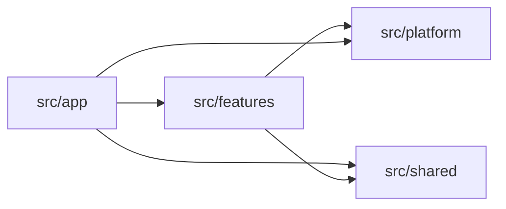

# Folder Structure

The folder tree should make ownership legible. Routes belong to the framework, business behavior belongs to features, integrations belong to the platform boundary, and only deliberately generic code belongs in shared.

The shape is compact at the top level:

```text
src/
  app/          # Next.js entry adapters and route composition
  features/     # Business capabilities as vertical full-stack slices
  platform/     # App-local infrastructure and vendor integration
  shared/       # Generic application primitives
```

This is a dependency model expressed through folders. Copying the names without enforcing their responsibilities produces four new junk drawers.

## The four responsibility boundaries

### `src/app`: receive, adapt, compose

`app` owns the URL tree and Next.js lifecycle files. Keep the framework conventions obvious:

```text
src/app/
  layout.tsx
  page.tsx
  (auth)/
    login/
      page.tsx
    signup/
      page.tsx
  (authenticated)/
    layout.tsx
    dashboard/
      page.tsx
      loading.tsx
      error.tsx
      _components/
        DashboardHeader.tsx
      profile/
        page.tsx
      settings/
        page.tsx
  api/
    health/
      route.ts
    rpc/
      route.ts
```

The [Next.js project-structure reference](https://nextjs.org/docs/app/getting-started/project-structure) defines the routing conventions. RFAStack adds an ownership rule: route files adapt those conventions to feature interfaces.

Good work for `app` includes:

- mapping a URL parameter into a feature query;
- composing several feature views into a page;
- defining metadata, layouts, loading UI, and error boundaries;
- adapting an HTTP request in a Route Handler;
- keeping UI that exists only to assemble one route in `_components`.

Business policy does not become route code merely because the request entered through a route.

### `src/features`: own a business capability

A feature contains the code that changes when its capability changes. It can span server and client while remaining one ownership boundary.

```text
src/features/orders/
  ui/
    OrderList.tsx
    OrderDetails/
      OrderDetails.tsx
      OrderItems.tsx
      useOrderDetails.ts
  model/
    order.schema.ts
    order.types.ts
    order-status.ts
    calculate-order-total.ts
  order.queries.ts
  order.mutations.ts
  server/
    order.rpc.ts
    get-order-details.query.ts
    order.dto.ts
    create-order.use-case.ts
    cancel-order.use-case.ts
    order.repository.ts
```

That is a mature example, not a minimum template. A small feature can start here:

```text
src/features/announcements/
  ui/
    AnnouncementBanner.tsx
  announcement.queries.ts
```

Add `model`, `server`, or repository files when behavior justifies them. An empty directory communicates nothing.

### `src/platform`: integrate without deciding policy

Platform code owns app-local integration with the environment:

```text
src/platform/
  database/
    client.ts
    transaction.ts
  email/
    client.ts
  observability/
    logger.ts
    metrics.ts
  storage/
    object-storage.ts
```

This boundary may know how to open a transaction, send a message, or record a span. It should not decide whether an order may be cancelled or which customer qualifies for a refund.

Feature server code imports platform capabilities. Platform code does not import a feature to discover what to do.

### `src/shared`: generic by behavior, not by hope

Shared code has no business owner because its meaning is genuinely generic across the application:

```text
src/shared/
  ui/
    Button.tsx
    Dialog.tsx
  types/
    result.ts
  validation/
    primitives.ts
  utils/
    assert-unreachable.ts
```

`Money` may look generic while encoding order-specific rounding. `StatusBadge` may look reusable while knowing every status in fulfillment. Names do not prove generality; behavior does.

Use two checks before moving code into shared:

1. Can the module be described without naming a feature?
2. Can it evolve without negotiating with one feature’s business rules?

If either answer is no, keep it with the feature. Duplication is reversible. A shared dependency with the wrong abstraction is not.

## Dependency direction

The allowed imports form a small graph:



| From | May depend on | Must not depend on |
| --- | --- | --- |
| `app` | feature public interfaces, platform bootstrap, shared primitives | feature internals reached by convenience |
| `features` | its own internals, explicit interfaces of another feature, platform, shared | `app`, deep internals of another feature |
| `platform` | external packages, app configuration, shared primitives | business policy, `app`, features |
| `shared` | other generic shared primitives | `app`, features, business-specific platform behavior |

`app` may use platform code for framework-level concerns such as observability setup or a health endpoint. Business operations should reach integrations through their owning feature.

## A feature’s public surface

A feature interface should be obvious and smaller than its implementation. RFAStack uses named top-level files for server operations and explicit UI paths:

```ts
import { getOrderDetails } from '@/features/orders/order.queries'
import { cancelOrder } from '@/features/orders/order.mutations'
import { OrderDetails } from '@/features/orders/ui/OrderDetails/OrderDetails'
```

Avoid a single root barrel that re-exports server and client modules together. A client import can accidentally pull a server dependency toward the browser boundary, and the barrel makes that path harder to inspect.

```ts
// Avoid a mixed environment surface.
import { OrderDetails, cancelOrder, orderRepository } from '@/features/orders'
```

The public file can delegate to a deeper implementation while protecting it from unrelated callers:

```ts
// src/features/orders/order.queries.ts
import 'server-only'
import { getOrderDetailsQuery } from './server/get-order-details.query'

export const getOrderDetails = getOrderDetailsQuery
```

The route imports the contract it needs:

```tsx
// src/app/(authenticated)/orders/[orderId]/page.tsx
import { getOrderDetails } from '@/features/orders/order.queries'
import { OrderDetails } from '@/features/orders/ui/OrderDetails/OrderDetails'

export default async function OrderPage({
  params,
}: {
  params: Promise<{ orderId: string }>
}) {
  const { orderId } = await params
  const order = await getOrderDetails(orderId)

  return <OrderDetails order={order} />
}
```

The page understands routing and rendering. The feature understands what an order detail read means.

## The `orders` slice, file by file

### `ui/`

Feature-specific presentation and interaction live here. A component can be a Server Component or a Client Component; placement expresses ownership, not runtime.

Keep `'use client'` at the smallest useful interactive boundary. An order page can remain server-rendered while `CancelOrderButton.tsx` owns the browser interaction.

### `model/`

Pure concepts belong here: runtime schemas, TypeScript types, state transitions, value calculations, and domain vocabulary. Prefer modules that can run without Next.js, a database, or the network.

```ts
// src/features/orders/model/can-cancel-order.ts
import type { OrderStatus } from './order-status'

export function canCancelOrder(status: OrderStatus) {
  return status === 'pending' || status === 'confirmed'
}
```

### `order.queries.ts` and `order.mutations.ts`

These are intentional entry surfaces. Queries expose reads used by server renderers or other authorized server callers. Mutations expose state changes, often as Server Actions for first-party UI.

Their names encode operation semantics. A caller does not need to know which repository, ORM, or transport sits behind them.

### `server/`

This folder makes the runtime boundary hard to miss. It can contain use cases, query implementations, DTO shaping, RPC contracts, and repository code. Add `import 'server-only'` to modules that must never cross into a client bundle.

A feature-distributed data-access layer is still a data-access layer. It keeps access near the capability instead of placing every query in a global DAL folder.

## Component ownership rules

Use the narrowest truthful owner:

| Component | Location | Reason |
| --- | --- | --- |
| `OrderStatusBadge` | `features/orders/ui` | Knows order statuses and their meaning. |
| `DashboardHeader` | `app/(authenticated)/dashboard/_components` | Exists only to compose that route. |
| `Button` | `shared/ui` | Generic interaction primitive with no product policy. |
| `CheckoutSummary` | `features/checkout/ui` | Represents a business capability even if shown on one route today. |

A route-local component may graduate into a feature when its behavior gains a durable business identity. A feature component may move to shared only after its API and semantics become genuinely generic.

## Naming rules

Names should expose ownership and runtime without requiring file inspection.

- Name feature directories with product language: `orders`, `billing`, `identity`.
- Use role suffixes where they add signal: `.query.ts`, `.use-case.ts`, `.repository.ts`, `.schema.ts`.
- Use `server/` and `import 'server-only'` for server-owned implementation.
- Use `'use client'` only in modules that establish a client boundary.
- Name entry surfaces by capability: `order.queries.ts`, not `queries.ts` at repository root.
- Avoid `helpers`, `common`, `misc`, and `utils` for modules that carry business meaning.
- Avoid repeating the feature name in every nested file when the directory already supplies the context.

Consistency matters more than finding a suffix for every file. The naming system should shorten discovery, not simulate a framework within the framework.

## How Next.js files map to `src/app`

Next.js special files map cleanly to RFAStack responsibilities:

| Next.js file | RFAStack role |
| --- | --- |
| `page.tsx` | Route entry that reads and composes feature UI. |
| `layout.tsx` | Route-tree composition and persistent presentation. |
| `loading.tsx` | Route-level pending presentation. |
| `error.tsx` | Route-level recovery boundary. |
| `route.ts` | HTTP adapter for an external or browser client. |
| Server Action | Mutation adapter for first-party UI, usually exposed by a feature. |
| `_components/` | Private route composition with no independent business owner. |

The [Next.js Backend for Frontend guide](https://nextjs.org/docs/app/guides/backend-for-frontend) treats Route Handlers as public HTTP endpoints and warns against adding an internal HTTP hop from Server Components. RFAStack preserves that distinction: server rendering calls the feature’s server interface directly; HTTP exists when a consumer actually needs HTTP.

## Cross-feature work

One user workflow can touch several capabilities. Do not hide that coordination in shared code.

For a checkout flow that reads inventory and creates an order, pick an explicit orchestrator:

- a checkout feature owns the workflow and calls public interfaces from inventory and orders;
- an application-level operation coordinates them when no single feature truthfully owns the process;
- an event links them when asynchronous delivery and independent failure are required.

Start with direct, typed calls. Add messaging or abstraction when the runtime behavior requires it, not for aesthetic symmetry.

## Placement guide

When a new file has no obvious home, ask in this order:

| Question | Placement |
| --- | --- |
| Is it a Next.js route, layout, handler, or route-only composition? | `src/app` |
| Does it express or present one business capability? | `src/features/<feature>` |
| Does it integrate this application with an external system? | `src/platform` |
| Is it generic across features and free of business policy? | `src/shared` |
| Must several applications reuse it as a stable product? | A workspace package, not `src/shared` |

When two answers seem plausible, choose the more specific owner. Moving stable generic code outward later is easier than recovering feature policy from a global abstraction.

## Tradeoffs and enforcement

The structure improves locality, but it creates work:

- feature boundaries require product understanding;
- code moves as ownership becomes clearer;
- a mature feature may contain repeated internal roles;
- dependency direction needs review or lint rules;
- cross-feature workflows must be designed explicitly;
- developers must tolerate some duplication while an abstraction is still unstable.

Those costs buy visible decisions. The repository can be inspected, reviewed, and tested against them.

A practical enforcement path is incremental:

1. document the four boundaries;
2. use TypeScript path aliases for readable imports;
3. expose feature interfaces intentionally;
4. reject deep cross-feature imports in review;
5. add dependency linting when the repository is large enough to need automation.

Next: [choose execution and transport boundaries for reads and mutations](./data-fetching-and-mutation).
