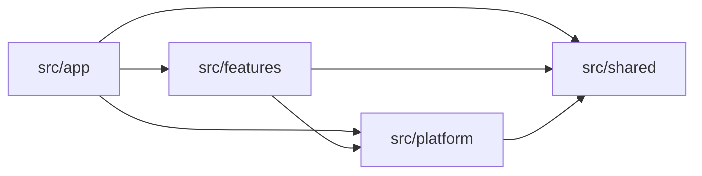

# Folder Structure

An order rule, a database client, and a route-specific header have different reasons to change. Give each one a home that reflects its responsibility.

RFAStack uses four directories at the top of `src`:

```text
src/
  app/          # Next.js routes and page composition
  features/     # Business capabilities across server and client
  platform/     # Database connections and external integrations
  shared/       # Code with generic behavior across features
```

Review imports as well as file placement. Copying the names without enforcing their responsibilities produces four new junk drawers.

## Give each directory a responsibility

### `src/app`: handle routes and compose pages

Keep the URL tree and Next.js lifecycle files in `app`:

```text
src/app/
  layout.tsx
  page.tsx
  (auth)/
    login/
      page.tsx
    signup/
      page.tsx
  (authenticated)/
    layout.tsx
    dashboard/
      page.tsx
      loading.tsx
      error.tsx
      _components/
        DashboardHeader.tsx
      profile/
        page.tsx
      settings/
        page.tsx
  api/
    health/
      route.ts
    rpc/
      route.ts
```

The [Next.js project-structure reference](https://nextjs.org/docs/app/getting-started/project-structure) defines the routing conventions. RFAStack adds an ownership rule: route files use feature interfaces to assemble the application.

Use `app` to:

- pass a URL parameter to a feature query;
- compose several feature views into a page;
- define metadata, layouts, loading UI, and error boundaries;
- adapt an HTTP request in a Route Handler;
- keep UI used only to assemble one route in `_components`.

Keep the order-cancellation rule in the orders feature, even when only one route calls it.

### `src/features`: keep a business capability together

A feature contains the code that changes when its business behavior changes. It can include server and client code.

A small feature can start with a component and a query:

```text
src/features/announcements/
  ui/
    AnnouncementBanner.tsx
  announcement.queries.ts
```

Add folders as the feature grows. You might need `model` for schemas and pure rules, or `server` for query implementations and use cases.

An orders feature with those responsibilities could look like this:

```text
src/features/orders/
  ui/
    OrderList.tsx
    OrderDetails/
      OrderDetails.tsx
      OrderItems.tsx
      useOrderDetails.ts
  model/
    order.schema.ts
    order.types.ts
    order-status.ts
    calculate-order-total.ts
    can-cancel-order.ts
  order.queries.ts
  order.mutations.ts
  server/
    order.rpc.ts
    get-order-details.query.ts
    order.dto.ts
    create-order.use-case.ts
    cancel-order.use-case.ts
    order.repository.ts
```

Each file represents work this feature needs to do. Create repository or RPC files when the feature needs those responsibilities.

### `src/platform`: connect to databases and outside services

Keep integration setup and clients in `platform`:

```text
src/platform/
  database/
    client.ts
    transaction.ts
  email/
    client.ts
  observability/
    logger.ts
    metrics.ts
  storage/
    object-storage.ts
```

Platform modules can open a transaction, send a message, or record a span. The orders feature decides whether an order may be cancelled and which customer qualifies for a refund.

Feature server code imports the platform modules it needs. Platform code must not import features.

When a feature needs a repository contract, keep the contract and its adapter inside that feature. The adapter imports the platform database client. This keeps feature-specific persistence code with its owner.

### `src/shared`: share code with generic behavior

Use `shared` for code whose behavior is independent of a particular business feature:

```text
src/shared/
  ui/
    Button.tsx
    Dialog.tsx
  types/
    result.ts
  validation/
    primitives.ts
  utils/
    assert-unreachable.ts
```

`Money` may look generic while encoding order-specific rounding. `StatusBadge` may look reusable while knowing every status in fulfillment.

Use two checks before moving code into shared:

1. Can you describe the module without naming a feature?
2. Can you change it without changing or negotiating one feature’s business rules?

If either answer is no, keep it with the feature. Allow some duplication while the common behavior is unclear. Once several features depend on a shared abstraction, changing it requires checking all those callers.

## Keep imports within the allowed boundaries

The arrows show allowed dependencies between the four directories:



| From | May depend on | Must not depend on |
| --- | --- | --- |
| `app` | Feature public interfaces, platform setup, shared primitives | Private feature implementation |
| `features` | Its own implementation, another feature’s explicit public interface, platform, shared | `app`, another feature’s private implementation |
| `platform` | External packages, application configuration, shared primitives | Business policy, `app`, features |
| `shared` | Other generic shared primitives | `app`, features, business-specific platform behavior |

`app` may use platform code for framework concerns such as observability setup or a health endpoint. Keep business operations inside their owning feature, including the calls those operations make to integrations.

These permissions apply alongside runtime boundaries. An allowed directory dependency does not make a server-only module safe to import into browser code.

## Expose the operations and components callers need

Use named files for public queries and mutations, and explicit paths for public UI components:

```ts
import { getOrderDetails } from '@/features/orders/order.queries'
import { cancelOrder } from '@/features/orders/order.mutations'
import { OrderDetails } from '@/features/orders/ui/OrderDetails/OrderDetails'
```

Avoid a single root barrel that re-exports server and client modules together. That makes it harder to follow which imports reach server-only implementation.

```ts
// Avoid combining public UI, mutations, and private repository code.
import { OrderDetails, cancelOrder, orderRepository } from '@/features/orders'
```

The public query file can delegate to an implementation inside `server`:

```ts
// src/features/orders/order.queries.ts
import 'server-only'
import { getOrderDetailsQuery } from './server/get-order-details.query'

export const getOrderDetails = getOrderDetailsQuery
```

Callers continue importing `order.queries.ts` if you move or reorganize the query implementation.

The route uses that public interface:

```tsx
// src/app/(authenticated)/orders/[orderId]/page.tsx
import { getOrderDetails } from '@/features/orders/order.queries'
import { OrderDetails } from '@/features/orders/ui/OrderDetails/OrderDetails'

export default async function OrderPage({
  params,
}: {
  params: Promise<{ orderId: string }>
}) {
  const { orderId } = await params
  const order = await getOrderDetails(orderId)

  return <OrderDetails order={order} />
}
```

The page reads the route parameter and renders the result. Keep the query and its order-specific behavior in the feature.

## Place each part of the orders feature

### Keep presentation and interaction in `ui/`

Feature-specific components live here. A component can be a Server Component or a Client Component; the folder identifies which feature owns it.

Place `'use client'` at the smallest useful interactive boundary. The order page can remain a Server Component while `CancelOrderButton.tsx` handles the browser interaction.

The [Next.js Server and Client Components guide](https://nextjs.org/docs/app/getting-started/server-and-client-components) explains how these boundaries affect the module graph.

### Put pure rules and types in `model/`

Keep runtime schemas, TypeScript types, state transitions, and calculations here. These modules should work without Next.js, a database, or a network connection.

```ts
// src/features/orders/model/can-cancel-order.ts
import type { OrderStatus } from './order-status'

export function canCancelOrder(status: OrderStatus) {
  return status === 'pending' || status === 'confirmed'
}
```

You can test this rule with an order status as its only input.

### Expose reads and changes through named public files

`order.queries.ts` exposes reads for server rendering and other server callers. `order.mutations.ts` exposes state changes, often as Server Actions for your application’s UI.

The names tell you whether an operation reads or changes data. Callers use those operations without importing the repository or transport implementation behind them.

### Keep server implementation in `server/`

Use this folder for use cases, query implementations, data transfer objects (DTOs), RPC contracts, and repository code.

Add `import 'server-only'` to implementation modules that must stay out of a client bundle. Next.js reports a build error when a Client Component imports a module marked this way. [Next.js documentation](https://nextjs.org/docs/app/getting-started/server-and-client-components#preventing-environment-poisoning).

Keep data-access code near the feature that uses it. You can apply consistent data-access rules across the application while keeping each feature’s queries in its own directory.

## Put components with the behavior they represent

| Component | Location | Reason |
| --- | --- | --- |
| `OrderStatusBadge` | `features/orders/ui` | Knows order statuses and their meaning. |
| `DashboardHeader` | `app/(authenticated)/dashboard/_components` | Exists only to compose that route. |
| `Button` | `shared/ui` | Provides generic interaction with no product policy. |
| `CheckoutSummary` | `features/checkout/ui` | Represents checkout behavior, even if one route displays it today. |

Move a route-local component into a feature when it begins expressing that feature’s business behavior. Move a feature component into shared when its inputs and behavior no longer depend on the feature’s rules.

The number of routes using a component does not determine its owner.

## Name files so callers can find them

- Name feature directories with product language: `orders`, `billing`, `identity`.
- Use role suffixes when they distinguish responsibilities: `.query.ts`, `.use-case.ts`, `.repository.ts`, `.schema.ts`.
- Keep public operation files with their feature: `order.queries.ts` and `order.mutations.ts`.
- Use `server/` to make server implementation easy to find, and `import 'server-only'` to enforce its runtime boundary.
- Put `'use client'` in modules that establish a client boundary.
- Give business logic a descriptive name instead of putting it in `helpers`, `common`, `misc`, or `utils`.

Use the same naming conventions across features. Add a suffix when it helps you find a role or distinguish two files.

## Keep framework adapters focused on their inputs and outputs

Next.js defines the framework conventions. RFAStack assigns the feature behavior those conventions call.

| File or convention | Location | RFAStack responsibility |
| --- | --- | --- |
| `page.tsx` | `app` | Read route inputs and compose feature UI. |
| `layout.tsx` | `app` | Compose shared presentation for part of the route tree. |
| `loading.tsx` | `app` | Provide loading UI for a route segment. |
| `error.tsx` | `app` | Provide an error boundary and recovery UI. |
| `route.ts` | `app` | Adapt HTTP requests and responses. |
| Server Action | Usually a feature’s mutation file | Adapt a UI mutation to feature behavior. |
| `_components/` | Inside an `app` route directory | Hold components used only to assemble that route. |

A Server Action is a function, so it can live in a feature mutation file without adding a routing file to `app`. Next.js documents its role in the [mutation guide](https://nextjs.org/docs/app/getting-started/mutating-data).

For server rendering, call the feature query directly. The [Next.js Backend for Frontend guide](https://nextjs.org/docs/app/guides/backend-for-frontend) warns that calling the application’s own Route Handler from a Server Component adds an HTTP round trip and can fail during prerendering at build time.

Use a Route Handler when a browser, webhook, mobile application, or other HTTP consumer needs an endpoint.

## Give a cross-feature workflow its own owner

A checkout flow can read inventory and create an order. Put that coordination in the checkout feature:

```text
src/features/checkout/
  checkout.mutations.ts
  server/
    complete-checkout.use-case.ts
```

Expose the mutation through `checkout.mutations.ts`. Keep the workflow in `complete-checkout.use-case.ts`, where it calls the public interfaces of inventory and orders.

Each participating feature retains its own rules. Checkout coordinates the workflow; orders still owns order behavior.

When a business workflow spans several existing features, use the workflow’s name to identify its owner. Simple composition of several feature views can remain in an `app` page.

Start with direct, typed calls. Add events when the receiving feature can act later and the workflow allows independent failure. Keep business coordination out of `shared`.

## Choose a home for a new file

| Question | Placement |
| --- | --- |
| Is it a Next.js route, layout, handler, or route-only composition? | `src/app` |
| Does it express or present one business capability? | `src/features/<feature>` |
| Does it coordinate a business workflow across features? | The feature that owns that workflow |
| Does it connect the application to an external system? | `src/platform` |
| Is its behavior generic across features and free of business policy? | `src/shared` |
| Must several applications reuse it as a stable package? | A workspace package |

When two locations seem plausible, keep the code with the more specific owner until you can explain what the other callers would share.

## Enforce the boundaries as the codebase grows

You will need to move code when you understand its ownership better. Some features will repeat similar internal roles, and some duplication will remain while you work out whether the behavior is truly shared.

Review those decisions alongside the code:

1. Document the responsibilities of `app`, `features`, `platform`, and `shared`.
2. Use TypeScript path aliases to make imports readable.
3. Identify the operations and components each feature exposes.
4. Reject imports into another feature’s private implementation.
5. Add dependency linting when manual review no longer catches violations reliably.

Next: [choose execution and transport boundaries for reads and mutations](./data-fetching-and-mutation).
