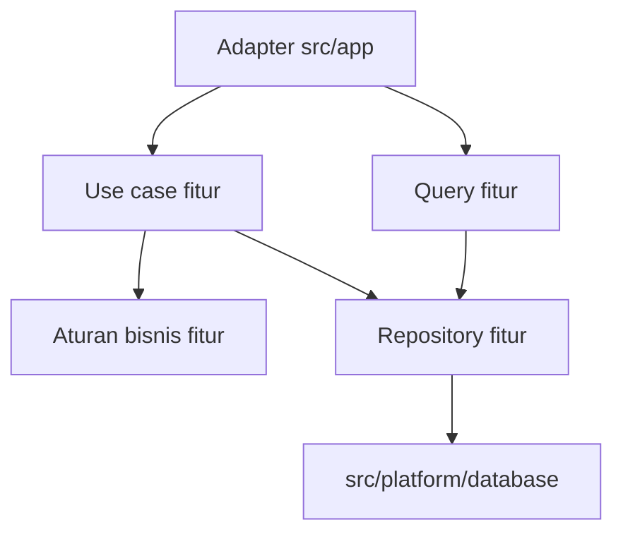

# Konsep

Mengubah aplikasi jadi sulit ketika kita tidak tahu suatu aturan ditulis di mana atau kode mana yang memakainya. Permintaan kecil pun bisa membuat kita membuka banyak folder, mencari aturan yang berulang, lalu menebak bagian lain yang akan terkena dampaknya.

Mulai dengan membagi tanggung jawab. Dekatkan kode yang mengurus hal yang sama, lalu tentukan bagian mana yang boleh bergantung pada bagian lain. Konsep berikut memberi dasar untuk mengambil keputusan itu sebelum memilih struktur folder.

## Satukan kode yang mengurus fitur bisnis yang sama {#keep-business-behavior-together-as-the-application-grows}

### Screaming Architecture: struktur harus memperlihatkan fungsi aplikasi {#screaming-architecture-make-the-business-visible}

Kalau folder utama hanya bernama `components`, `services`, dan `utils`, kita masih harus membuka file-nya untuk tahu aplikasi ini mengerjakan apa.

Dalam [Screaming Architecture](https://blog.cleancoder.com/uncle-bob/2011/09/30/Screaming-Architecture.html), Robert C. Martin mengajak kita melihat apakah struktur aplikasi sudah mencerminkan use case-nya. Terapkan ide itu di `src/features`:

```text
src/features/
  billing/
  membership/
  orders/
  reporting/
```

Dari nama folder saja, sudah ada petunjuk harus mulai dari mana. Mau mengubah pesanan, buka `orders`. Mau mengubah penagihan, buka `billing`.

File yang mengikuti konvensi Next.js tetap di `src/app`. Kode bisnis punya tempat sendiri di sampingnya.

### Vertical Slice Architecture: dekatkan kode yang berubah bersama {#vertical-slice-architecture-keep-the-parts-of-a-change-nearby}

Perubahan aturan pembatalan pesanan bisa menyentuh form, validasi input, aturan bisnis, dan operasi server. Simpan semuanya di fitur orders supaya alurnya bisa diikuti tanpa berpindah-pindah folder teknis di seluruh aplikasi.

[Vertical Slice Architecture](https://www.jimmybogard.com/vertical-slice-architecture/) dari Jimmy Bogard mengelompokkan kode di seluruh stack berdasarkan use case. Gunakan pendekatan ini di tingkat fitur: `orders` berisi operasi yang berkaitan dengan pesanan beserta kode yang dibutuhkan operasi tersebut.

Satu fitur bisa berisi:

- UI;
- schema dan tipe;
- aturan bisnis murni;
- fungsi untuk membaca dan mengubah data;
- use case yang hanya berjalan di server;
- repository, jika kode akses database perlu dipisahkan.

Tidak semuanya harus dibuat sekaligus. Fitur yang hanya menampilkan data bisa mulai dengan komponen dan query server. Kalau ada mutasi bisnis, buat use case yang menangani operasinya. Route dan action tetap mengurus request serta response, walaupun operasinya pendek.

### Clean Architecture: aturan bisnis tidak perlu bergantung pada integrasi {#clean-architecture-keep-business-rules-independent-of-integrations}

Untuk menentukan apakah status pesanan mengizinkan pembatalan, kita tidak perlu menjalankan Next.js atau membuka koneksi database.

[Clean Architecture](https://blog.cleancoder.com/uncle-bob/2012/08/13/the-clean-architecture.html) menjelaskan arah dependensi yang menjaga aturan bisnis tetap terpisah dari detail framework dan infrastruktur. Terapkan ini pada aturan murni di fitur. Kode server fitur tetap boleh memakai integrasi platform secara langsung.

Query sederhana boleh langsung memanggil klien database. Namun, perhitungan atau aturan bisnis murninya harus tetap bisa dijalankan tanpa klien tersebut.

Tambahkan repository ketika beberapa operasi perlu memakai kode persistensi yang sama atau ketika implementasinya perlu diganti. Jika dibutuhkan kontrak untuk penggantian itu, letakkan kontrak dan adapter implementasinya di dalam fitur.

Diagram berikut menunjukkan arah dependensi kode untuk pilihan tersebut:



Query dan use case menjadi fungsi server yang boleh dipanggil dari luar fitur. Repository tetap internal dan memakai klien database dari platform. Aturan bisnis murni cukup menerima nilai yang akan diperiksa, sedangkan platform tidak perlu mengetahui fitur yang memakainya.

Gunakan pemisahan ini untuk kebutuhan pengujian atau integrasi yang jelas. Sebelum ada kebutuhan itu, query fitur yang langsung mengakses database sudah cukup.

### Domain-Driven Design: perjelas fitur yang bertanggung jawab atas konsep bisnis {#domain-driven-design-give-business-concepts-a-clear-owner}

Model yang dipakai bersama bisa lama-lama menampung aturan dari banyak fitur. Akibatnya, untuk mengubah satu aturan saja, kita harus memahami semua kode yang memakai model tersebut.

Simpan aturan di fitur yang mengurus konsep bisnisnya. [Referensi Domain-Driven Design](https://www.domainlanguage.com/ddd/reference/) dari Eric Evans membahas bagaimana bahasa domain dan bounded context membantu menentukan pembagian ini.

Beberapa praktik DDD yang bisa dipakai:

- beri nama fitur dengan istilah yang dipakai dalam produk;
- simpan aturan dekat dengan fitur yang mengurusnya;
- perjelas hubungan antarfitur;
- pisahkan model jika maknanya berbeda dalam tiap fitur;
- pisahkan perilaku bisnis dari kode integrasi.

Gunakan entity, aggregate, repository, atau domain service ketika membantu menjelaskan perilaku yang sedang dimodelkan. Kartu dashboard yang hanya menampilkan data tidak otomatis membutuhkan aggregate root.

## Tujuh aturan untuk menempatkan kode dan memeriksa import {#use-seven-rules-to-place-code-and-review-imports}

| Prinsip | Penerapan |
| --- | --- |
| 1. Kelompokkan kode berdasarkan fitur bisnis | Satukan UI, aturan, query, mutasi, dan kode server yang saling berkaitan. Pakai aturan penempatan yang sama di setiap fitur. |
| 2. Batasi pekerjaan entry point framework | Halaman, layout, Route Handler, dan Server Action mengurus input serta output. Panggil fitur terkait untuk menjalankan aturan bisnis. |
| 3. Pisahkan koneksi layanan dari keputusan bisnis | Koneksi database, klien email, dan integrasi sejenis masuk ke `platform`. Fitur menentukan kapan dan untuk apa integrasi itu dipakai. |
| 4. Pindahkan kode ke shared dengan alasan yang jelas | Gunakan `shared` untuk kode yang tidak bergantung pada aturan fitur. Duplikasi masih boleh selama belum jelas perilaku mana yang benar-benar sama. |
| 5. Batasi bagian fitur yang bisa dipanggil dari luar | Ekspor query dan use case langsung dari modulnya. Repository, mapper internal, dan helper tetap privat di dalam fitur. |
| 6. Perjelas kode yang boleh berjalan di server dan browser | Tandai implementasi server dengan `import 'server-only'`. Letakkan `'use client'` pada bagian terkecil yang membutuhkan interaksi. |
| 7. Bedakan tanggung jawab wajib dari abstraksi tambahan | Terapkan pembagian tanggung jawab dan aturan dependensi sejak awal. Tambahkan repository atau mapper terpisah ketika ada kebutuhan konkret. |

Antarmuka publik fitur adalah operasi dan komponen yang boleh dipakai oleh kode di luar fitur. Ekspor langsung dari modul implementasinya. Modul ini bisa dimulai di root fitur, berdampingan dengan kode pendukung internal:

```ts
// ✅ Import the feature's public server query.
import { getOrderDetails } from '@/features/orders/order.queries'

// ❌ This import couples the caller to private implementation.
import { getOrderDetails } from '@/features/orders/internal/query-builder'
```

Server Component dan Client Component sama-sama berada di `ui/`, sedangkan aturan murni berada di `model/`. Saat modul operasi mulai besar, [kelompokkan query pesanan yang berkaitan di dalam fitur](./folder-structure#group-growing-order-reads-inside-the-feature). Server Component boleh langsung memanggil query, sementara form mengirim lewat Server Action. [`'use client'` dan `server-only`](https://nextjs.org/docs/app/getting-started/server-and-client-components) mengatur batas server dan browser. Batas ini mengikuti import dan directive, bukan nama folder.

## Mulai integrasi antarfitur dengan panggilan langsung {#start-cross-feature-work-with-a-direct-public-call}

Ketika `checkout` butuh harga produk dari `catalog`, panggil query publik `catalog`. Aturan harga tetap di `catalog`; checkout cukup memakai hasilnya.

Alur yang melibatkan beberapa fitur juga perlu jelas penanggung jawabnya. Checkout bisa mengoordinasikan inventory dan orders, sementara setiap fitur tetap mengurus aturan bisnisnya sendiri. [Panduan struktur folder](./folder-structure) menunjukkan tempat kode koordinasi itu.

Gunakan event jika fitur penerima boleh memproses pekerjaan belakangan dan kegagalannya tidak harus menggagalkan alur utama. Kalau operasi harus tahu harga sebelum bisa lanjut, harga itu tetap harus didapatkan saat itu juga.

Buat model domain bersama hanya jika fitur-fitur yang memakainya memang memberi makna yang sama pada konsep tersebut. Nama yang mirip belum cukup.

Jangan impor file internal fitur lain. Kalau kode luar sudah bergantung pada path internal itu, memindahkan satu modul pun akan memaksa perubahan di luar fiturnya.

## Periksa apakah tanggung jawab kode sudah jelas {#check-whether-a-change-has-a-clear-owner}

Ambil satu perilaku aplikasi, lalu cari jawaban berikut dari kodenya:

1. Fitur mana yang mengurusnya?
2. Modul mana yang boleh memanggilnya?
3. Di mana entry point framework menyerahkan pekerjaan ke fitur?
4. Bagian mana yang hanya boleh berjalan di server?
5. Integrasi mana yang bisa diganti tanpa menulis ulang aturan bisnis?
6. Operasi dan komponen mana yang boleh dipakai fitur lain?

Kalau jawabannya harus mengandalkan ingatan seseorang, catat keputusan itu dan perjelas lewat penempatan file atau import-nya.

## Fitur kecil dan besar tetap mengikuti aturan yang sama {#use-the-same-rules-in-small-and-large-features}

Aturan ini berguna ketika aplikasi punya beberapa fitur bisnis, perubahan sering melibatkan server dan klien, dan para kontributornya perlu memahami kode satu sama lain.

Fitur kecil tetap mengikuti pembagian tanggung jawab, penempatan kode, dan batas runtime yang sama. Fitur read-only tidak perlu use case mutasi. Query boleh memilih field hasil tanpa mapper terpisah. Use case juga boleh memanggil database langsung tanpa repository. Buat modul untuk pekerjaan yang memang sudah ada.

Tetap tinjau import, periksa alasan kode masuk ke shared, dan pindahkan kode jika tanggung jawab bisnisnya berubah. [Panduan struktur folder](./folder-structure) menjelaskan aturan penempatan dan import publik yang dipakai sejak fitur pertama.

Selanjutnya: [lihat penerapannya dalam struktur folder Next.js](./folder-structure).
