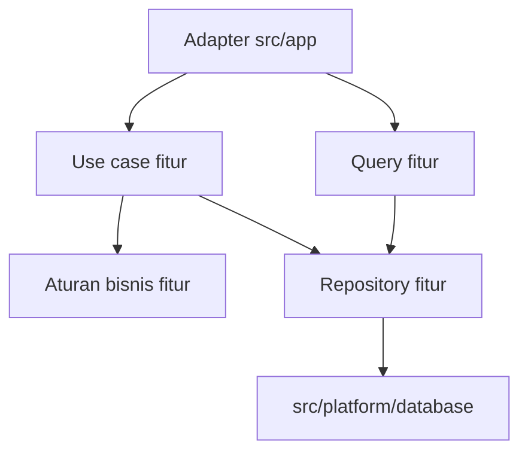

# Konsep

Aplikasi semakin sulit diubah ketika Anda tidak bisa menemukan tempat suatu perilaku didefinisikan atau kode yang bergantung padanya. Permintaan kecil bisa membawa Anda ke berbagai bagian basis kode, memeriksa aturan yang berulang dan memperkirakan bagian lain yang mungkin terpengaruh.

Mulai dengan tanggung jawab yang jelas. Tempatkan perilaku yang berkaitan bersama dan tentukan bagaimana setiap bagian boleh bergantung pada bagian lain. Konsep arsitektur berikut menjelaskan alasan di balik pilihan tersebut, sehingga Anda punya dasar untuk menempatkan kode sebelum memilih struktur folder.

## Satukan perilaku bisnis seiring pertumbuhan aplikasi {#keep-business-behavior-together-as-the-application-grows}

### Screaming Architecture: tampilkan bisnis dalam struktur {#screaming-architecture-make-the-business-visible}

Buka repositori yang disusun berdasarkan `components`, `services`, dan `utils`. Anda masih harus memeriksa file untuk mengetahui apa yang dilakukan aplikasi.

[Screaming Architecture](https://blog.cleancoder.com/uncle-bob/2011/09/30/Screaming-Architecture.html) dari Robert C. Martin mempertanyakan apakah struktur memperlihatkan use case sistem. Terapkan gagasan itu di dalam `src/features`:

```text
src/features/
  billing/
  membership/
  orders/
  reporting/
```

Nama-nama tersebut memberi Anda titik awal. Untuk perubahan pesanan, buka `orders`. Untuk perubahan penagihan, buka `billing`.

Konvensi Next.js tetap berada di `src/app`. Kapabilitas bisnis punya tempat sendiri di samping struktur framework tersebut.

### Vertical Slice Architecture: dekatkan bagian-bagian yang berubah bersama {#vertical-slice-architecture-keep-the-parts-of-a-change-nearby}

Mengubah pembatalan pesanan bisa melibatkan formulir, validasi input, aturan bisnis, dan operasi server. Simpan bagian-bagian itu di fitur pesanan agar Anda dapat menelusuri perubahan tanpa berpindah-pindah folder teknis yang mencakup seluruh aplikasi.

[Vertical Slice Architecture](https://www.jimmybogard.com/vertical-slice-architecture/) dari Jimmy Bogard mengelompokkan tanggung jawab berdasarkan use case individual di seluruh stack. Gunakan pendekatan itu pada tingkat fitur: fitur `orders` berisi beberapa operasi terkait dan kode khusus pesanan yang mereka gunakan.

Sebuah fitur dapat memiliki:

- UI;
- schema dan tipe;
- aturan bisnis murni;
- antarmuka pembacaan dan mutasi;
- use case khusus server;
- kode repository saat persistensi membutuhkan modul sendiri.

Buat bagian yang dibutuhkan oleh tanggung jawab fitur. Fitur yang hanya membaca data dapat dimulai dengan komponen dan query server. Fitur yang menjalankan mutasi bisnis membutuhkan use case sebagai pemilik operasi tersebut. Route dan action menyesuaikan request serta response, bahkan ketika operasinya kecil.

### Clean Architecture: pisahkan aturan bisnis dari integrasi {#clean-architecture-keep-business-rules-independent-of-integrations}

Aturan yang menentukan apakah pesanan boleh dibatalkan harus bisa berjalan tanpa Next.js atau koneksi database.

[Clean Architecture](https://blog.cleancoder.com/uncle-bob/2012/08/13/the-clean-architecture.html) menjelaskan aturan dependensi yang memisahkan kebijakan bisnis dari detail framework dan infrastruktur. Jaga agar aturan murni milik fitur tidak bergantung pada detail tersebut. Kode server fitur boleh menggunakan integrasi platform secara langsung.

Untuk pembacaan sederhana, query fitur dapat memanggil klien database. Simpan perhitungan murni atau aturan bisnis dalam modul yang dapat berjalan tanpa klien tersebut.

Tambahkan repository ketika operasi fitur perlu berbagi atau mengganti perilaku persistensi. Jika penggantian membutuhkan kontrak, fitur memiliki kontrak sekaligus adapter yang mengimplementasikannya.

Panah berikut menunjukkan dependensi kode sumber untuk susunan opsional tersebut:



Query dan use case adalah operasi server publik. Repository-nya tetap privat di dalam fitur dan menggunakan klien database platform. Aturan bisnis murni bekerja dari nilai yang diberikan, sementara kode platform tetap tidak bergantung pada fitur.

Tambahkan pemisahan ini saat menyelesaikan masalah pengujian atau integrasi tertentu. Query fitur yang langsung mengakses data tetap menjadi titik awal yang valid.

### Domain-Driven Design: tetapkan pemilik konsep bisnis {#domain-driven-design-give-business-concepts-a-clear-owner}

Model bersama bisa perlahan mengumpulkan aturan dari beberapa fitur. Setelah semua fitur dapat mengubahnya, Anda harus memahami seluruh pemanggilnya sebelum mengubah satu aturan bisnis.

Simpan aturan bersama fitur yang memiliki maknanya. [Referensi Domain-Driven Design](https://www.domainlanguage.com/ddd/reference/) dari Eric Evans menjelaskan bagaimana bahasa domain dan bounded context membantu menentukan hubungan tersebut.

Gunakan praktik DDD berikut untuk memperjelas kepemilikan:

- namai fitur dengan bahasa produk;
- dekatkan aturan dengan fitur pemiliknya;
- nyatakan hubungan antarfitur secara eksplisit;
- pisahkan model ketika makna bisnisnya berbeda;
- pisahkan perilaku domain dari integrasi teknis.

Tambahkan entity, aggregate, repository, atau domain service saat membantu memperjelas perilaku yang perlu dimodelkan. Kartu dashboard yang hanya membaca data tidak membutuhkan aggregate root agar memiliki arsitektur.

## Gunakan tujuh aturan untuk menempatkan kode dan meninjau import {#use-seven-rules-to-place-code-and-review-imports}

| Prinsip | Tindakan |
| --- | --- |
| 1. Susun perilaku bisnis berdasarkan fitur | Satukan UI, aturan, pembacaan, mutasi, dan pekerjaan server yang berkaitan. Ikuti aturan penempatan yang sama di setiap fitur. |
| 2. Jaga entry point framework tetap tipis | Biarkan halaman, layout, Route Handler, dan Server Action menyesuaikan input serta output. Delegasikan aturan bisnis kepada fitur pemiliknya. |
| 3. Pisahkan integrasi dari keputusan | Tempatkan koneksi database, klien email, dan integrasi serupa di `platform`. Tentukan kapan dan mengapa menggunakannya di dalam fitur. |
| 4. Bagikan kode dengan alasan yang jelas | Pindahkan kode ke `shared` ketika perilakunya generik lintas fitur. Izinkan duplikasi selama perilaku bersama belum jelas. |
| 5. Buka antarmuka fitur yang kecil | Ekspor query dan use case langsung sebagai operasi server publik. Jaga repository, mapper internal, dan fungsi bantu tetap privat di dalam fitur. |
| 6. Perlihatkan batas runtime | Tandai implementasi khusus server dengan `import 'server-only'`. Tempatkan `'use client'` pada batas interaktif terkecil yang berguna. |
| 7. Pisahkan peran wajib dari abstraksi opsional | Terapkan aturan kepemilikan dan dependensi sejak awal. Buat modul sesuai tanggung jawab yang ada; tambahkan abstraksi repository dan mapper terpisah untuk kebutuhan konkret. |

Antarmuka publik terdiri dari operasi dan komponen yang disediakan fitur bagi pemanggil. Ekspor operasi langsung dari modul implementasinya di dalam fitur. Mulai dengan modul tersebut di root fitur, tempat operasi publik dan kode pendukung privat dapat berada bersama:

```ts
// ✅ Import the feature's public server query.
import { getOrderDetails } from '@/features/orders/order.queries'

// ❌ This import couples the caller to private implementation.
import { getOrderDetails } from '@/features/orders/internal/query-builder'
```

Satukan Server Component dan Client Component di `ui/` milik fitur, dengan aturan murni di `model/`. Saat modul operasi membesar, [kelompokkan pembacaan pesanan yang berkaitan di dalam fitur](./folder-structure#group-growing-order-reads-inside-the-feature). Server Component dapat memanggil query langsung, sementara formulir dapat mengirim melalui Server Action. Next.js mendokumentasikan bagaimana [`'use client'` dan `server-only` menetapkan serta melindungi batas runtime](https://nextjs.org/docs/app/getting-started/server-and-client-components). Import, directive, dan penanda mengatur batas tersebut terlepas dari susunan folder.

## Mulai pekerjaan lintas fitur dengan panggilan publik langsung {#start-cross-feature-work-with-a-direct-public-call}

Ketika `checkout` membutuhkan harga dari `catalog`, panggil query publik yang disediakan `catalog`. Simpan aturan harga di `catalog`, lalu biarkan checkout menggunakan hasilnya.

Jika sebuah alur mengoordinasikan beberapa fitur, tetapkan pemilik alur tersebut. Operasi checkout dapat mengoordinasikan inventaris dan pesanan sementara setiap fitur tetap memiliki aturan bisnisnya sendiri. [Panduan struktur folder](./folder-structure) menunjukkan tempat operasi itu berada.

Gunakan event ketika fitur penerima boleh memproses pekerjaan nanti dan alurnya mengizinkan kegagalan secara independen. Operasi yang membutuhkan harga sebelum melanjutkan tetap harus memperoleh harga tersebut terlebih dahulu.

Ekstrak konsep domain bersama hanya ketika fitur-fitur yang terlibat menggunakannya dengan makna yang sama. Kesamaan nama saja tidak cukup.

Hindari mengimpor file privat fitur lain. Setelah pemanggil bergantung pada path tersebut, pemindahan modul internal mengharuskan perubahan kode di luar pemiliknya.

## Periksa apakah perubahan punya pemilik yang jelas {#check-whether-a-change-has-a-clear-owner}

Pilih satu perilaku dalam aplikasi dan jawab pertanyaan berikut dari kodenya:

1. Fitur mana yang memilikinya?
2. Modul mana yang boleh memanggilnya?
3. Di mana entry point framework mendelegasikan pekerjaan kepada fitur?
4. Kode mana yang khusus server?
5. Integrasi mana yang bisa berubah tanpa menulis ulang aturan bisnis?
6. Operasi dan komponen mana yang terbuka bagi fitur lain?

Jika jawabannya bergantung pada ingatan seseorang, dokumentasikan keputusan itu dan cerminkan dalam file atau import yang terkait.

## Gunakan aturan yang sama pada fitur kecil dan besar {#use-the-same-rules-in-small-and-large-features}

Aturan ini sesuai untuk aplikasi dengan beberapa kapabilitas bisnis, perubahan yang melibatkan kode server dan klien, serta kontributor yang perlu memahami pekerjaan satu sama lain.

Fitur kecil tetap mengikuti aturan kepemilikan, penempatan, dan runtime yang sama. Fitur yang hanya membaca data tidak membutuhkan use case mutasi. Query dapat memilih field hasil yang aman tanpa mapper terpisah, dan use case dapat memanggil klien database tanpa abstraksi repository. Buat setiap modul untuk tanggung jawab yang sudah ada hari ini.

Anda tetap perlu meninjau import, mempertanyakan kode yang ditempatkan di folder bersama, dan memindahkan kode ketika pemilik bisnisnya berubah. [Panduan struktur folder](./folder-structure) menetapkan aturan penempatan dan import publik yang berlaku sejak fitur pertama.

Selanjutnya: [terapkan konsep ini pada struktur folder Next.js yang konkret](./folder-structure).
