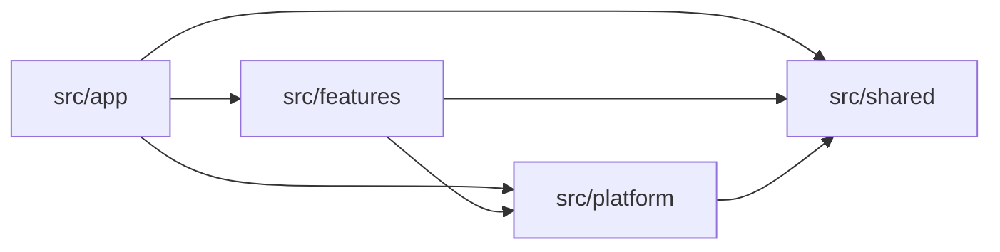

# Struktur Folder

Struktur folder membantu kamu menemukan kode yang perlu diubah. Aturan pesanan, koneksi database, dan header halaman punya tanggung jawab berbeda. Pisahkan ketiganya supaya perubahan di satu bagian tidak mengaburkan tugas bagian lain.

Mulai dengan empat direktori di dalam `src`:

```text
src/
  app/          # Next.js routes and page composition
  features/     # Business capabilities across server and client
  platform/     # Database connections and external integrations
  shared/       # Code with generic behavior across features
```

Beberapa file khusus Next.js tetap berada di luar direktori itu. Misalnya, letakkan `src/proxy.ts` di samping `src/app` untuk [redirect awal](./protected-resources#use-proxy-for-early-redirects). Batasi tugasnya pada penanganan request yang masuk. [Konvensi Proxy Next.js](https://nextjs.org/docs/app/api-reference/file-conventions/proxy)

Penempatan file perlu diperiksa bersama import-nya. Folder yang rapi belum cukup kalau dependensinya saling menembus batas.

Terapkan pembagian tanggung jawab ini sejak fitur pertama. Letakkan modul operasi langsung di root fitur, UI di `ui/`, serta schema dan aturan murni di `model/`. Kalau modul operasi mulai sulit dicari, kelompokkan yang berkaitan. Repository dan mapper terpisah baru ditambahkan ketika ada kebutuhan yang dijelaskan di bawah.

## Perjelas tugas setiap direktori {#give-each-directory-a-responsibility}

### `src/app`: urus route dan susun halaman {#src-app-handle-routes-and-compose-pages}

Letakkan struktur URL dan file khusus Next.js di `app`:

```text
src/app/
  layout.tsx
  page.tsx
  (authenticated)/
    layout.tsx
    orders/
      page.tsx
      loading.tsx
      error.tsx
      [orderId]/
        page.tsx
    dashboard/
      page.tsx
      _components/
        DashboardHeader.tsx
  api/
    health/
      route.ts
```

Ikuti konvensi routing dalam [referensi struktur proyek Next.js](https://nextjs.org/docs/app/getting-started/project-structure). File route menyusun halaman dengan memakai operasi dan komponen yang disediakan fitur.

| File atau konvensi | Tugasnya |
| --- | --- |
| `page.tsx` | Membaca input route dan menyusun UI untuk URL itu. |
| `layout.tsx` | Menyusun tampilan yang dipakai bersama oleh sejumlah route. |
| `loading.tsx` | Menampilkan loading saat segmen route masih menunggu. |
| `error.tsx` | Menyediakan error boundary dan tampilan pemulihan. Next.js mewajibkannya menjadi Client Component. |
| `route.ts` | Menangani request dan response HTTP, misalnya untuk health check atau API pesanan. |
| `(authenticated)/` | Mengelompokkan route tanpa menambah segmen URL. Nama folder ini tidak otomatis memeriksa autentikasi. |
| `[orderId]/` | Menyediakan ID pesanan sebagai parameter route. |
| `_components/DashboardHeader.tsx` | Menyimpan UI yang hanya dipakai untuk menyusun halaman dashboard ini. |

Aturan pembatalan pesanan tetap masuk fitur orders, meskipun baru satu route yang memakainya.

### `src/features`: kumpulkan kode untuk satu fitur bisnis {#src-features-keep-a-business-capability-together}

Satu fitur berisi kode yang perlu berubah saat aturan bisnisnya berubah, baik di server maupun di browser. Pakai nama seperti `orders`, `billing`, dan `membership` supaya tujuan foldernya langsung terbaca.

Letakkan UI login, verifikasi sesi, dan tabel autentikasi di `auth`. Keanggotaan akun, role, pemilihan akun yang boleh diakses, dan preferensi keanggotaan masuk `membership`. Fitur ini memanggil query sesi yang disediakan auth. Tambahkan `user` saat profil dan pengaturan pribadi perlu operasi sendiri, serta `account` saat data dan pengelolaan akun bisnis membutuhkannya. Akun login tertaut di Better Auth tetap bagian dari autentikasi; maknanya berbeda dari akun bisnis.

Fitur yang hanya menampilkan data bisa dimulai dengan komponen dan query server. Untuk mutasi bisnis, tulis operasinya dalam use case. Action atau adapter HTTP menangani request dan response-nya. Contoh orders di bawah memperlihatkan pembagian ini.

### `src/platform`: siapkan koneksi database dan layanan luar {#src-platform-connect-to-databases-and-outside-services}

Letakkan konfigurasi integrasi dan kliennya di `platform`:

```text
src/platform/
  database/
    client.ts          # Configure the database connection
    transaction.ts     # Provide a shared transaction helper, if needed
  email/
    client.ts          # Configure the email provider
  observability/
    logger.ts          # Configure application logging
    metrics.ts         # Configure metric recording
  storage/
    object-storage.ts  # Wrap the object-storage provider
```

Isinya mengikuti database dan provider yang kamu pakai. Modul platform bisa membuka transaksi, mengirim pesan, atau mencatat metrik. Keputusan seperti boleh tidaknya membatalkan pesanan dan siapa yang berhak mendapat refund tetap ada di fitur orders.

Kode server dalam fitur boleh mengimpor platform. Arah sebaliknya tidak boleh: platform tidak mengimpor fitur. Query database dan adapter repository yang khusus mengurus pesanan tetap berada di orders.

Untuk autentikasi, letakkan SDK browser di `platform/auth/client.ts` dan factory provider di `platform/auth/server.ts`. Fitur auth memasok tabel ke factory itu, lalu menyusun instance yang sudah dikonfigurasi di `auth.provider.ts`. Jadi, tabel autentikasi tetap di auth tanpa membuat platform bergantung pada fitur. Klien bertipe untuk prosedur RPC membership berada di `features/membership/membership.rpc-client.ts`; transport RPC yang dipakai bersama berada di `platform/rpc/client.ts`.

### `src/shared`: simpan kode yang tidak terikat aturan fitur {#src-shared-share-code-with-generic-behavior}

Gunakan `shared` untuk kode yang tetap masuk akal tanpa mengetahui fitur bisnis tertentu:

```text
src/shared/
  ui/
    Button.tsx              # Generic button behavior and presentation
    Dialog.tsx              # Generic dialog behavior and presentation
  types/
    result.ts               # A generic success-or-failure result type
  validation/
    primitives.ts           # Reusable Zod schemas without business policy
  utils/
    currency.ts             # Format currency values for display
    assert-unreachable.ts   # Report an unexpected exhaustive-branch value
```

Beri nama utilitas sesuai tugasnya. Misalnya, `utils/currency.ts` mengekspor `formatCurrency()` untuk menampilkan nominal. Contoh aplikasi menerima nilai dalam sen dan menampilkannya dalam USD karena hanya mendukung satu mata uang.

Aturan harga, pajak, dan pembulatan pesanan tetap di `model/` fitur terkait. Formatter cukup menampilkan nominal; fitur menentukan berapa yang harus ditagih. Hal yang sama berlaku untuk UI. `StatusBadge` yang memahami status pengiriman pesanan masuk fitur orders.

Sebelum memindahkan kode ke shared, periksa dua hal:

1. Bisa dijelaskan tanpa menyebut fitur tertentu?
2. Bisa diubah tanpa ikut mengubah atau menyepakati ulang aturan bisnis fitur?

Kalau salah satu jawabannya tidak, biarkan di fitur. Sedikit duplikasi masih wajar selama belum jelas perilaku mana yang benar-benar sama. Begitu beberapa fitur memakai satu abstraksi bersama, kamu perlu memeriksa semua pemakainya saat mengubah abstraksi itu.

## Mulai fitur orders dengan file yang memang dipakai {#start-the-orders-feature-with-the-files-it-uses}

Misalnya, halaman pesanan membaca database aplikasi dan memakai Server Action Next.js untuk membatalkan pesanan. Susunan awalnya seperti ini:

```text
src/features/orders/
  ui/
    OrderDetails.tsx
    CancelOrderForm.tsx
  model/
    order.schema.ts
    order-cancellation.ts
  order.queries.ts
  order.actions.ts
  cancel-order.use-case.ts
```

Query, action, dan use case berada di samping `ui/` dan `model/`. Server Component dalam `ui/` bisa langsung memanggil `order.queries.ts`, sedangkan form mengirim lewat `order.actions.ts`. Server Component dan Client Component sama-sama masuk `ui/`; tambahkan `'use client'` di komponen yang menjadi awal bagian interaktif. Folder membagi tanggung jawab fitur, sedangkan import dan directive menentukan hubungan modul server dan klien di Next.js. [Komposisi komponen Next.js](https://nextjs.org/docs/app/getting-started/server-and-client-components#interleaving-server-and-client-components)

| File | Isi | Dipakai oleh |
| --- | --- | --- |
| `ui/OrderDetails.tsx` | Tampilan detail pesanan. | Halaman pesanan atau tampilan fitur lain. |
| `ui/CancelOrderForm.tsx` | Form untuk membatalkan pesanan. | Tampilan detail pesanan. |
| `model/order.schema.ts` | Schema Zod beserta tipe hasil inferensinya. | Form, action, query, dan modul fitur lain. |
| `model/order-cancellation.ts` | Aturan murni untuk memeriksa apakah status pesanan masih mengizinkan pembatalan. | UI pembatalan dan use case server. |
| `order.queries.ts` | Query server yang berkaitan, seperti `getOrderDetails` dan `listOrders`. | Server Component dan adapter server. |
| `order.actions.ts` | Parsing input Server Action, memanggil use case yang memeriksa akses, lalu menjalankan refresh atau revalidasi. | Form dan kontrol yang memakai Server Actions. |
| `cancel-order.use-case.ts` | Memverifikasi pemanggil, memeriksa pemilik dan status pesanan di database, lalu membatalkannya jika diizinkan. | Action, Route Handler, atau operasi server fitur lain. |

`order.actions.ts` hanya diperlukan kalau UI memakai Server Actions Next.js. Gunakan akhiran `.actions.ts` khusus untuk fungsi dengan `'use server'` ini. Mutasi adalah operasi yang mengubah data atau memicu efek; Server Action menyediakan salah satu cara UI memanggilnya. [Panduan mutasi Next.js](https://nextjs.org/docs/app/getting-started/mutating-data)

Kalau browser memanggil API langsung, simpan request-nya di [`order.api.ts`](#put-browser-api-requests-in-order-api-ts). Jalur itu tidak memerlukan file actions.

Fitur yang hanya membaca data tidak perlu form pembatalan, aturan pembatalan, action, atau use case di atas. Repository, prosedur RPC, dan konfigurasi TanStack Query juga ditambahkan sesuai kebutuhan masing-masing.

### Simpan tampilan dan interaksi di `ui/` {#keep-presentation-and-interaction-in-ui}

Komponen tetap berada dalam fitur yang ditampilkannya, baik berupa Server Component maupun Client Component.

Pasang `'use client'` pada bagian interaktif sekecil yang masih masuk akal. Halaman pesanan bisa tetap menjadi Server Component, sementara kontrolnya mengurus state browser. Form yang mengirim Server Action pun bisa dirender oleh Server Component. [Server dan Client Components Next.js](https://nextjs.org/docs/app/getting-started/server-and-client-components), [Server Actions Next.js](https://nextjs.org/docs/app/getting-started/mutating-data#server-components)

Kalau satu tampilan mulai besar, kumpulkan bagian internalnya:

```text
ui/OrderDetails/
  OrderDetails.tsx    # Compose the order details view
  OrderItems.tsx      # Render this view’s order lines
  useOrderDetails.ts  # Coordinate React interaction state, if needed
```

Form checkout dalam contoh aplikasi memakai susunan serupa. Folder `ui/CheckoutForm/` berisi `CheckoutForm.tsx`, `CheckoutItem.tsx`, dan `CheckoutSummary.tsx`. Form menyimpan draft jumlah barang, lalu mengirim nilai dan callback ke komponen anak lewat props. Context baru diperlukan kalau komponen yang lebih jauh di bawahnya membutuhkan data itu. Samakan nama komponen dengan file-nya dan jelaskan tugasnya; nama tersebut tidak harus mengulang nama fitur.

### Simpan request API dari browser di `order.api.ts` {#put-browser-api-requests-in-order-api-ts}

Aplikasi full-stack Next.js bisa memakai backend yang sudah ada. Kalau UI orders menghubungi backend itu langsung, mulai dengan susunan ini:

```text
src/features/orders/
  ui/
    OrderDetails.tsx
    CancelOrderButton.tsx
  model/
    order.schema.ts
  order.api.ts          # HTTP/RPC requests for order reads and mutations
```

`order.api.ts` berisi fungsi request biasa seperti `fetchOrderDetails` dan `cancelOrder`. Fungsi ini memanggil endpoint HTTP atau klien RPC, memeriksa response, lalu melakukan parsing hasil dengan Zod. API-nya bisa berasal dari backend lain atau Route Handler dalam aplikasi Next.js ini.

Komponen bisa memanggil fungsi tersebut langsung. Jika memakai TanStack Query, factory options juga bisa memakai fungsi yang sama. Satukan request baca dan mutasi yang berkaitan di sini; tugas file ini tidak berubah karena pilihan library query. [Contoh mutasi API](./data-fetching-and-mutation#call-an-existing-api-for-mutations) menunjukkan keduanya.

Tambahkan `order.queries.ts` saat kode server perlu mengambil data fitur secara langsung, dan `order.actions.ts` saat UI memakai Server Action. Mutasi bisnis yang dikerjakan aplikasi ini tetap masuk use case server. Buat file sesuai jalur yang benar-benar dipakai.

Pastikan `order.api.ts` aman diimpor browser. Konfigurasi klien HTTP atau RPC bersama berada di `platform`, sedangkan request khusus pesanan berada di fitur. Request yang memakai kredensial privat harus tetap di server dan menggunakan klien platform khusus server. [Tanggung jawab server dan klien Next.js](https://nextjs.org/docs/app/getting-started/server-and-client-components#when-to-use-server-and-client-components)

## Pertahankan kepemilikan fitur antar-aplikasi dalam workspace {#keep-feature-ownership-across-workspace-applications}

Saat frontend dan backend berada dalam satu monorepo, terapkan pembagian tanggung jawab fitur, platform, dan shared di setiap aplikasi. Next.js tetap menyimpan route dan penyusunan halaman di `app`; backend memakai entry point framework-nya untuk memanggil operasi fitur.

Misalnya, fitur orders di `apps/web` mengurus UI, request API, dan kebijakan cache browser. Fitur yang sama di `apps/api` mengurus query dengan pemeriksaan akses, mutasi bisnis, dan penyimpanan data. Menyatukan keduanya dalam satu repository tidak mengubah aplikasi mana yang memeriksa izin pembatalan atau menyimpan pesanan.

Buat package seperti `packages/contracts` saat kedua aplikasi membutuhkan schema input atau response yang sama. Pastikan ekspornya aman diimpor browser dan kelompokkan menurut fitur yang menentukan makna datanya. Klien database dan operasi server tetap berada di backend. [README contoh HTTP](https://github.com/ishk-sftckz/RFAStack/tree/main/examples/react-query-http#readme) menjelaskan pengaturan Bun workspace dan Turborepo untuk susunan ini.

## Simpan definisi data dan aturan murni di `model/` {#put-definitions-and-pure-business-behavior-in-model}

ID pesanan bisa lolos validasi schema meskipun pesanannya sudah dikirim. Jadi, input yang valid belum cukup untuk mengizinkan pembatalan.

Gunakan `model/` untuk schema Zod, tipe, konstanta, perhitungan, dan aturan yang cukup bekerja dari nilai masukannya. Kode ini harus bisa berjalan tanpa Next.js, database, atau jaringan. Record ORM menggambarkan cara data disimpan; model fitur menggambarkan data dan perilaku yang dibutuhkan bisnis.

| Bagian | Yang diperiksa atau dijelaskan | Contoh |
| --- | --- | --- |
| Schema Zod | Bentuk dan batas nilai data. | Apakah jumlah barang berupa bilangan bulat positif? |
| Tipe | Nilai yang dipakai kode. | Field apa saja dalam hasil internal `OrderTotals`? |
| Konstanta | Nilai tetap dalam aturan bisnis. | Berapa banyak baris yang boleh ada dalam satu pesanan? |
| Perhitungan | Hasil dari nilai yang diberikan. | Berapa total harga seluruh baris pesanan? |
| Keputusan bisnis | Boleh tidaknya operasi berdasarkan fakta yang ada. | Apakah pesanan dengan status ini masih boleh dibatalkan? |

### Definisikan schema Zod, lalu ambil tipenya dari schema {#use-zod-schemas-and-infer-their-types}

Gunakan [Zod](https://zod.dev/basics) untuk validasi saat runtime. Simpan schema di fitur yang mengatur makna datanya. Lakukan parsing saat input dari luar masuk ke operasi.

```ts
// src/features/orders/model/order.schema.ts
import { z } from 'zod'

export const orderStatusSchema = z.enum([
  'pending',
  'confirmed',
  'shipped',
  'cancelled',
])

export const cancelOrderInputSchema = z.object({
  orderId: z.string().min(1),
})

export const orderLineSchema = z.object({
  quantity: z.number().int().positive(),
  unitPriceInCents: z.number().int().nonnegative(),
})

export type OrderStatus = z.infer<typeof orderStatusSchema>
export type CancelOrderInput = z.infer<typeof cancelOrderInputSchema>
export type OrderLine = z.infer<typeof orderLineSchema>
```

`orderStatusSchema` mendefinisikan sekaligus memvalidasi status yang diizinkan. Ambil tipe `OrderStatus` dari schema itu supaya daftar status cukup ditulis sekali. Contoh ini tidak perlu objek konstanta atau enum TypeScript terpisah. [Enum Zod](https://zod.dev/api#enums)

Schema input pembatalan hanya memeriksa bahwa ID berupa string yang tidak kosong. Operasi server tetap harus mencari pesanannya dan memeriksa hak akses pemanggil.

Letakkan tipe hasil inferensi di samping schema-nya. Buat `order.types.ts` kalau tipe lain perlu tempat sendiri, misalnya hasil perhitungan internal:

```ts
// src/features/orders/model/order.types.ts
export type OrderTotals = {
  subtotalInCents: number
  discountInCents: number
  totalInCents: number
}
```

Tipe ini menjelaskan hasil yang dibuat di dalam fitur. Kalau nanti hasil tersebut perlu divalidasi saat runtime, buat schema Zod dan ambil tipenya dari sana. [`z.infer`](https://zod.dev/basics#inferring-types) menjaga tipe mengikuti schema; gunakan `z.input` dan `z.output` saat transformasi membuat tipe input dan output berbeda.

### Pisahkan aturan bisnis saat perlu modul sendiri {#extract-business-behavior-when-it-needs-its-own-module}

Perhitungan singkat yang hanya dipakai sekali boleh tetap dekat dengan pemanggilnya. Menjumlahkan harga beberapa baris saja belum perlu file model baru. Namun, kalau perhitungan harga sudah mencakup syarat diskon, pembulatan, dan aturan pesanan lain, kumpulkan di `order-pricing.ts` agar mudah dibaca dan diuji bersama.

Alasan lain untuk membuat modul adalah aturan yang dipakai UI dan server. Misalnya, form harus menyembunyikan pembatalan untuk pesanan yang sudah dikirim, dan server harus memeriksa aturan yang sama. Letakkan di `model/order-cancellation.ts`:

```ts
// src/features/orders/model/order-cancellation.ts
import type { OrderStatus } from './order.schema'

export function canCancelOrder(status: OrderStatus) {
  return status === 'pending' || status === 'confirmed'
}
```

`shipped` adalah status yang valid, tetapi menurut aturan contoh ini pesanannya tidak boleh dibatalkan. [Alur pembatalan](#follow-a-cancellation-from-the-form-to-the-stored-order) di bawah memakai fungsi yang sama di form dan server. Form memeriksa status yang sedang ditampilkan; server memeriksa status terbaru di database sebelum mengubahnya.

Ini mengikuti [panduan konsep](./concepts#clean-architecture-keep-business-rules-independent-of-integrations): simpan aturan pesanan di orders dan buat aturan yang dipisahkan ini bisa berjalan tanpa database atau framework. Modul tersebut diperlukan karena UI dan server berbagi aturan pembatalan.

Beri nama berdasarkan tugas bisnisnya, seperti `order-cancellation.ts` atau `order-pricing.ts`. Beberapa fungsi yang berkaitan boleh berada dalam satu file. Nama umum seperti `order.utils.ts` atau `order.rules.ts` membuat pembaca harus membuka file dulu untuk tahu aturan apa yang ada di dalamnya.

Zod menyediakan [custom refinement](https://zod.dev/api#refinements). Kalau parsing perlu menerapkan aturan murni yang sudah ada, panggil aturan itu dari refinement. Pencarian database dan otorisasi tetap dikerjakan operasi server supaya parsing schema model tidak diam-diam menjalankan I/O.

### Letakkan konstanta dekat aturan yang memakainya {#place-constants-with-the-rules-they-belong-to}

Konstanta yang hanya dipakai satu modul cukup disimpan di sana. Tambahkan `order.constants.ts` saat beberapa modul orders memakai nilai bisnis tetap yang sama:

```ts
// src/features/orders/model/order.constants.ts
export const MAX_ORDER_LINES = 100
```

Dengan batas ini, schema pembuatan pesanan bisa memakai `z.array(orderLineSchema).min(1).max(MAX_ORDER_LINES)`. Editor memakai nilai yang sama untuk berhenti menambahkan baris. Karena keduanya mengikuti satu batas produk, konstanta bersama memang diperlukan. Angka `100` hanya contoh; pilih batas sesuai aplikasimu.

Daftar status tetap di `orderStatusSchema`. Label yang hanya dipakai satu komponen cukup di `ui/`. URL provider dan kredensial berada dalam konfigurasi server atau platform.

## Letakkan modul operasi langsung di root fitur {#keep-operation-modules-at-the-feature-root}

Mulai query, Server Action, use case, dan modul pendukung di root fitur. Nama seperti `order.queries.ts`, `order.actions.ts`, dan `cancel-order.use-case.ts` menjelaskan tugasnya. Tambahkan fungsi request browser dan query options di sana kalau diperlukan.

Berada dalam folder yang sama tidak berarti semua modul boleh diimpor browser atau fitur lain. Tetap pasang penanda runtime dan batasi import pada operasi yang memang disediakan untuk pemanggilnya. Kalau file mulai sulit ditelusuri, kelompokkan menurut tanggung jawabnya tanpa mengubah aturan tersebut.

Sediakan query dan use case sebagai operasi server publik fitur. Route dan fitur lain boleh mengimpornya langsung. Membership juga bisa mengekspor [wrapper pemeriksaan akses](#share-membership-checks-through-the-query-module) dari modul query. Repository, mapper DTO internal, dan helper implementasi tetap privat. [Contoh antarmuka publik](#expose-the-operations-and-components-callers-need) memperlihatkan import yang diizinkan.

Jika memakai RPC, ekspor prosedur dari `order.rpc.ts` untuk dipasang di router aplikasi. Operasi bisnis antarfitur tetap memanggil query dan use case publik secara langsung.

Pasang API HTTP provider di entry point aplikasi. Route Handler auth mengimpor instance dari `auth.provider.ts`, lalu mengekspor `handler`-nya sebagai `GET` dan `POST`. Untuk backend terpisah, pasang handler di `apps/api/src/app.ts`. Batasi import provider pada entry point auth ini. Fitur lain memakai `auth.queries.ts` untuk memverifikasi sesi, sementara frontend HTTP meneruskan request auth lewat `platform/auth/server.ts`.

Tandai modul server biasa, termasuk query dan use case publik, dengan `import 'server-only'`. Next.js akan menolak import yang tidak sengaja masuk ke Client Component. Modul Server Action memakai `'use server'` agar UI bisa memanggilnya melalui Next.js. Modul API browser dan query options harus bebas dependensi khusus server. [Batas runtime Next.js](https://nextjs.org/docs/app/getting-started/server-and-client-components#preventing-environment-poisoning), [Server Functions](https://nextjs.org/docs/app/api-reference/directives/use-server)

Query mengambil data. Use case menjalankan mutasi atau alur bisnis yang bisa mencakup query, penulisan, dan panggilan ke fitur lain. Pembatalan pesanan sudah perlu use case karena harus memeriksa pemilik, menerapkan aturan pembatalan, dan mengatur update. Tetap letakkan pekerjaan itu di use case meskipun fungsinya pendek. Action dan Route Handler melakukan parsing input, memanggil operasi, lalu menyiapkan response. Operasi publik yang dilindungi memverifikasi pemanggil lewat membership dan memeriksa akses resource di dalamnya. Ikuti [panduan perlindungan resource](./protected-resources#put-data-protection-in-the-feature-s-server-operations) untuk pembagian ini.

| File | Tugas | Kapan diperlukan |
| --- | --- | --- |
| `order.queries.ts` | Memverifikasi akses, mengambil data, dan memilih hasil yang boleh diterima pemanggil. | Kode server perlu membaca data pesanan. |
| `order.actions.ts` | Menerima input Server Action, memanggil use case, dan memperbarui UI. | UI memakai Server Actions. |
| `create-order.use-case.ts` | Menjalankan pembuatan pesanan, termasuk pemeriksaan bisnis dan penyimpanan. | Aplikasi membuat pesanan. |
| `cancel-order.use-case.ts` | Membatalkan pesanan berdasarkan status terbaru dan akun pemanggil. | Aplikasi menyediakan pembatalan, seperti contoh di bawah. |
| `order.dto.ts` | Mengubah record internal menjadi DTO yang boleh diterima pemanggil. | Beberapa query berbagi pemetaan, atau konversinya perlu dipisahkan agar mudah dibaca. |
| `order.repository.ts` | Menangani operasi penyimpanan khusus pesanan. | Operasi seperti `findOrderForAccount` dan `cancelOrderIfUnchanged` dipakai ulang atau perlu diganti saat pengujian. |
| `order.rpc.ts` | Menghubungkan request RPC dengan query dan use case fitur. | Aplikasi menyediakan operasi lewat RPC. |

Satu file boleh berisi beberapa fungsi yang berkaitan. `order.queries.ts` bisa memuat beberapa query; repository bisa memuat operasi baca dan tulis. Pisahkan saat tanggung jawabnya sulit diikuti, bukan setiap kali menambah fungsi.

Selalu pilih field yang boleh diterima pemanggil. Query bisa memilih dan memetakannya sendiri. Schema dan tipe DTO yang dipakai browser tetap di `model/`; mapper server baru dipisah ke `order.dto.ts` sesuai kebutuhan di atas. Hasil tetap harus aman meskipun mapper-nya tidak punya file sendiri.

Contoh aplikasi orders memakai `toOrderDto()` untuk hasil daftar dan detail, sehingga mapper ditempatkan di `order.dto.ts`. Fungsi ini memilih field publik dan mengubah tanggal menjadi string ISO. Penambahan kolom tabel pun tidak otomatis membocorkan field baru ke response.

Repository memakai klien database dari platform. Keputusan bisnis tetap di model atau use case. Jika repository perlu bisa diganti, simpan kontrak dan adapter implementasinya dalam fitur. [Panduan konsep](./concepts#clean-architecture-keep-business-rules-independent-of-integrations) membahas pilihan ini.

### Pakai ulang pemeriksaan membership dari modul query {#share-membership-checks-through-the-query-module}

Saat beberapa operasi membutuhkan pemeriksaan membership yang sama, ekspor `withMembership` di samping `requireMembership` dalam `membership.queries.ts`. Modul ini menyediakan query membership dan wrapper publik untuk menerapkannya. Wrapper tetap khusus server dan diimpor langsung dari modul itu.

Contoh native menyatukan query pesanan yang berkaitan dalam `order.queries.ts`:

```ts
import { withMembership } from '@/features/membership/membership.queries'

export const listOrders = withMembership(({ scopeId }) => listCachedOrders(scopeId))
```

Wrapper menghasilkan fungsi yang bisa dipanggil sebagai `listOrders(requestHeaders)`. Setiap panggilan memverifikasi membership lebih dulu, lalu mengirim data anggota yang sudah terverifikasi beserta argumen lainnya ke callback. Kalau verifikasi gagal, callback tidak dijalankan. Orders tetap mengurus izin terhadap pesanan, validasi input, field hasil, dan caching. Helper cache privat hanya menerima ID lingkup akses yang sudah diizinkan.

Lihat [implementasi wrapper](https://github.com/ishk-sftckz/RFAStack/blob/main/examples/next-native/src/features/membership/membership.queries.ts) dan [query pesanan](https://github.com/ishk-sftckz/RFAStack/blob/main/examples/next-native/src/features/orders/order.queries.ts). Kamu tetap bisa memanggil `requireMembership()` langsung kalau hasilnya dibutuhkan dalam alur operasi. Wrapper ini mengurangi pemeriksaan akses yang berulang; ia tidak otomatis mengatur cache. Perlu tidaknya memecah file tetap ditentukan oleh kemudahan membaca keseluruhan modul.

### Kelompokkan query orders kalau modulnya mulai besar {#group-growing-order-reads-inside-the-feature}

Pertahankan satu `order.queries.ts` selama query di dalamnya masih mudah dibaca bersama. Kalau filter daftar, detail, dan laporan masing-masing mulai panjang, pisahkan ke modul query sendiri. Saat file-file itu mulai memenuhi root fitur, kelompokkan dalam `queries/`:

```text
src/features/orders/
  queries/
    order-list.queries.ts       # List reads and their private helpers
    order-details.queries.ts    # Detail reads and their private helpers
    order-report.queries.ts     # Order reporting reads
  order.actions.ts
  cancel-order.use-case.ts
  model/
    order.schema.ts
    order-cancellation.ts
  ui/
    OrderDetails.tsx
    CancelOrderForm.tsx
```

Ini pilihan susunan untuk fitur yang sudah lebih besar. Tambahkan hanya bagian yang diperlukan aplikasi. Dua fungsi pendek belum menjadi alasan membuat folder baru. Pengelompokan menambah tingkat folder dan panjang import, jadi pastikan memang membantu menemukan query terkait.

Query publik yang memeriksa akses dan helper privatnya tetap bisa berada dalam satu modul. Contohnya, `order-list.queries.ts` mengekspor `listOrders(requestHeaders)`, sementara `listCachedOrders(scopeId)` tidak diekspor. Query publik memverifikasi membership sebelum memanggil helper. Tidak perlu menambah `.controller.ts` untuk pembagian ini: pemeriksaan akses, query data, dan pemilihan hasil aman masih menjadi tugas query publik. Action, Route Handler, dan prosedur RPC mengurus format request dan response masing-masing.

Setelah memindahkan file, perbarui import agar langsung menunjuk modul implementasinya:

```ts
import { listOrders } from '@/features/orders/queries/order-list.queries'
```

Modul tetap di bawah `features/orders/`. Folder global `src/queries/` justru menjauhkan query dari fitur yang mengurusnya. Pertahankan import langsung, penanda server-only, dan helper privat. Fitur lain boleh tetap memakai satu file query di root sampai memang perlu dipecah.

Susunan ini opsional. Contoh native masih menyatukan query daftar, detail, dan pengiriman dalam [order.queries.ts](https://github.com/ishk-sftckz/RFAStack/blob/main/examples/next-native/src/features/orders/order.queries.ts), dengan `withMembership` untuk pemeriksaan akses bersama.

### Ikuti alur pembatalan dari form sampai database {#follow-a-cancellation-from-the-form-to-the-stored-order}

Contoh ini memakai Server Action Next.js. Form memeriksa aturan pembatalan untuk menentukan apakah kontrol perlu ditampilkan, lalu mengirim ID pesanan ke action publik:

```tsx
// src/features/orders/ui/CancelOrderForm.tsx
import { canCancelOrder } from '../model/order-cancellation'
import type { OrderStatus } from '../model/order.schema'
import { cancelOrder } from '../order.actions'

export function CancelOrderForm({
  orderId,
  status,
}: {
  orderId: string
  status: OrderStatus
}) {
  if (!canCancelOrder(status)) return null

  return (
    <form action={cancelOrder}>
      <input type="hidden" name="orderId" value={orderId} />
      <button type="submit">Cancel order</button>
    </form>
  )
}
```

Action melakukan parsing input dengan Zod dan memanggil use case yang memeriksa akses:

```ts
// src/features/orders/order.actions.ts
'use server'

import { refresh } from 'next/cache'
import { cancelOrderInputSchema } from './model/order.schema'
import { cancelOrderUseCase } from './cancel-order.use-case'

export async function cancelOrder(formData: FormData) {
  const input = cancelOrderInputSchema.parse({
    orderId: formData.get('orderId'),
  })

  await cancelOrderUseCase(input)
  refresh()
}
```

Form hanya mengirim ID pesanan. Use case memanggil `requireAccount`, operasi publik membership yang memverifikasi sesi dan menentukan akun yang boleh diakses. Setelah memvalidasi input-nya sendiri, use case mengambil pesanan dalam akun itu dan memeriksa aturan pembatalan:

```ts
// src/features/orders/cancel-order.use-case.ts
import 'server-only'
import { requireAccount } from '@/features/membership/membership.queries'
import { database } from '@/platform/database/client'
import { canCancelOrder } from './model/order-cancellation'
import { cancelOrderInputSchema, orderStatusSchema } from './model/order.schema'
import type { CancelOrderInput } from './model/order.schema'

export async function cancelOrderUseCase(input: CancelOrderInput) {
  const account = await requireAccount()
  const { orderId } = cancelOrderInputSchema.parse(input)
  const order = await database.order.findFirst({
    where: { id: orderId, accountId: account.id },
    select: { id: true, status: true },
  })

  if (!order) throw new Error('Order not found')

  const status = orderStatusSchema.parse(order.status)
  if (!canCancelOrder(status)) {
    throw new Error('This order can no longer be cancelled')
  }

  const result = await database.order.updateMany({
    where: { id: orderId, accountId: account.id, status },
    data: { status: 'cancelled' },
  })

  if (result.count !== 1) {
    throw new Error('The order changed before cancellation completed')
  }
}
```

Contoh ini memakai klien database bergaya Prisma dari `platform/database/client`. Kondisi update menyertakan akun dan status yang sudah diperiksa. Dengan begitu, pembatalan tidak menimpa perubahan status pengiriman yang terjadi bersamaan. Contoh menganggap izin pembatalan hanya bergantung pada pemilik dan status; aturan tambahan bisa memerlukan transaksi atau kontrol konkurensi lain.

Use case di atas memanggil database langsung. Tambahkan repository kalau operasi penyimpanannya perlu dipakai bersama atau diganti. Tugas use case tetap sama.

Contoh ini memperlihatkan pembagian tugas sepanjang alur. Di UI, tampilkan kegagalan yang sudah diperkirakan sebagai pesan dekat form. Kalau query memakai cache, invalidasi data terkait selain me-refresh halaman. [Panduan pengambilan data](./data-fetching-and-mutation#update-the-screen-after-the-mutation-succeeds) membahas respons dan pembaruan cache tersebut.

## Sediakan operasi dan komponen untuk pemanggil lain {#expose-the-operations-and-components-callers-need}

Antarmuka publik fitur berisi operasi dan komponen yang boleh dipakai modul aplikasi lain. Query dan use case publik tetap fungsi server biasa. Mengekspor fungsi tidak otomatis membuat endpoint HTTP atau membuatnya bisa dipanggil browser.

Impor query dan use case langsung dari modul implementasinya. Gunakan modul action untuk Server Actions Next.js dan modul UI untuk menyusun tampilan:

```ts
import { getOrderDetails } from '@/features/orders/order.queries'
import { cancelOrderUseCase } from '@/features/orders/cancel-order.use-case'
import { cancelOrder } from '@/features/orders/order.actions'
import { OrderDetails } from '@/features/orders/ui/OrderDetails'
```

Mulai query server fitur di `order.queries.ts`. Satukan query yang berkaitan dan ekspor operasi dari modul implementasinya, termasuk setelah [query orders dipecah](#group-growing-order-reads-inside-the-feature). [Panduan pengambilan data](./data-fetching-and-mutation#read-during-rendering-through-a-server-component) menunjukkan query yang mengakses database lalu mengembalikan DTO.

Route membaca input-nya, lalu memanggil query publik:

```tsx
// src/app/(authenticated)/orders/[orderId]/page.tsx
import { requireAccount } from '@/features/membership/membership.queries'
import { getOrderDetails } from '@/features/orders/order.queries'
import { OrderDetails } from '@/features/orders/ui/OrderDetails'

export default async function OrderPage({
  params,
}: {
  params: Promise<{ orderId: string }>
}) {
  const account = await requireAccount()
  const { orderId } = await params
  const order = await getOrderDetails({ accountId: account.id, orderId })

  return <OrderDetails order={order} />
}
```

Halaman mengambil akun untuk menentukan lingkup data yang diminta. [Query memverifikasi akun itu lagi di dalam operasinya](./data-fetching-and-mutation#verify-the-requested-account-in-a-detail-read) dan membatasi pencarian pada ID akun serta pesanan. Saat rendering server, panggil query langsung. Melewati Route Handler aplikasi sendiri menambah request HTTP dan bisa gagal saat prerender pada waktu build. Route Handler diperlukan saat browser atau klien HTTP lain membutuhkan endpoint. [Panduan Backend for Frontend Next.js](https://nextjs.org/docs/app/guides/backend-for-frontend#server-components)

### Tambahkan query options saat memakai TanStack Query {#add-query-options-when-the-feature-uses-tanstack-query}

Query server dan query options TanStack punya tugas berbeda:

| File | Hasil pemanggilannya | Kapan dibuat |
| --- | --- | --- |
| `order.queries.ts` | `getOrderDetails(input)` menjalankan query server dan mengembalikan data. | Kode server perlu mengambil data. |
| `order.actions.ts` | `cancelOrder(formData)` menjalankan Server Action yang memanggil use case. | UI memakai Server Action untuk mutasi. |
| `order.api.ts` | `fetchOrderDetails(input)` atau `cancelOrder(input)` mengirim request HTTP/RPC. | Request fitur perlu modul sendiri. |
| `order.query-options.ts` | `orderDetailsOptions(input)` mengembalikan query key, fungsi request, dan pengaturan cache. | Fitur memakai TanStack Query. |
| `order.mutation-options.ts` | Mengembalikan konfigurasi mutasi TanStack yang dipakai bersama. | Beberapa pemakai perlu berbagi konfigurasi mutasi. |

Buat file sesuai kebutuhan pemanggil. Form dengan Server Action tidak memerlukan mutation options TanStack. Komponen juga bisa memakai `order.api.ts` tanpa file options. Query options diperlukan untuk konfigurasi cache query klien; pisahkan mutation options saat konfigurasinya perlu dipakai bersama.

Ekspor factory options daripada membuat hook yang hanya membungkus `useQuery` atau `useMutation`. Komponen bisa memakai options langsung. Custom hook berguna kalau ada perilaku React lain yang perlu diatur bersama. Dokumentasi TanStack membahas [query options](https://tanstack.com/query/latest/docs/framework/react/guides/query-options) dan [mutation options](https://tanstack.com/query/latest/docs/framework/react/typescript#typing-mutation-options) yang bisa dipakai ulang.

Options bersama harus aman diimpor server dan browser, jadi jangan masukkan import database. Saat prefetch di server, panggil query fitur langsung. Refetch dari browser memakai HTTP atau RPC. Kedua jalur harus memeriksa hak akses dan mengembalikan bentuk data yang sama untuk cache key yang sama. [Contoh prefetch](./data-fetching-and-mutation#prefetch-when-the-client-needs-the-same-data-afterward) menunjukkan cara mengisi cache klien dari hasil server.

### Patuhi arah import yang diizinkan {#keep-imports-within-the-allowed-boundaries}

Panah berikut menunjukkan arah dependensi antardirektori:



| Dari | Boleh mengimpor | Tidak boleh mengimpor |
| --- | --- | --- |
| `app` | Antarmuka publik fitur, setup platform, kode dasar shared | Implementasi privat fitur |
| `features` | Kode internalnya, antarmuka publik fitur lain, platform, shared | `app`, implementasi privat fitur lain |
| `platform` | Paket eksternal, konfigurasi aplikasi, kode dasar shared | Aturan bisnis, `app`, fitur |
| `shared` | Kode shared lain yang juga generik | `app`, fitur, kode platform yang terikat aturan bisnis |

Deklarasi tabel boleh merujuk kolom tabel fitur lain untuk foreign key. Misalnya, tabel membership merujuk ID pengguna auth agar hubungan keduanya dijaga database. Batasi import ini pada deklarasi hubungan schema. Query, use case, route, dan UI tetap mengakses data fitur lain melalui operasi publiknya. Pemeriksaan batas dalam contoh mengizinkan referensi kolom lewat `.references()`, tetapi menolak query atau ekspor ulang melalui import yang sama.

`app` boleh memakai platform untuk kebutuhan framework, seperti setup observabilitas atau health check. Operasi bisnis beserta panggilan integrasinya tetap di fitur yang mengurusnya.

Aturan import ini berjalan bersama aturan runtime. Next.js menolak build jika Client Component mengimpor modul bertanda `import 'server-only'`. File khusus `'use server'` menyediakan Server Functions lewat framework. Gunakan untuk action, sedangkan factory query options tetap berada dalam modul biasa. [Batas runtime Next.js](https://nextjs.org/docs/app/getting-started/server-and-client-components#preventing-environment-poisoning), [Server Functions](https://nextjs.org/docs/app/api-reference/directives/use-server)

```ts
// ✅ Use the feature’s public server read from server code.
import { getOrderDetails } from '@/features/orders/order.queries'

// ❌ Reaching into private persistence couples callers to its implementation.
import { orderRepository } from '@/features/orders/order.repository'
```

Impor query server, action, dan UI secara terpisah dan jelas. Barrel di root yang mencampur semuanya dengan kode penyimpanan privat akan menyulitkan pembaca melihat batas runtime dan tanggung jawab fitur:

```ts
// ❌ This import combines public UI and actions with a private repository.
import { OrderDetails, cancelOrder, orderRepository } from '@/features/orders'
```

## Konvensi Penamaan {#naming-conventions}

Gunakan konvensi berikut untuk file aplikasi. Nama khusus Next.js seperti `page.tsx`, `layout.tsx`, dan `route.ts` tetap mengikuti framework.

| Jenis | Konvensi | Contoh |
| --- | --- | --- |
| Direktori fitur | Nama fitur produk; biasanya jamak untuk kumpulan entity. | `orders/`; `membership/` untuk keanggotaan. |
| Awalan file fitur | Nama entity tunggal jika file menjelaskan entity itu. | `order.schema.ts` di dalam `orders/`. |
| Komponen | PascalCase, sama dengan nama komponen yang diekspor. | `OrderDetails.tsx` mengekspor `OrderDetails`. |
| Hook React | `use` diikuti nama camelCase yang menjelaskan tugasnya. | `useOrderDetails.ts`. |
| Modul aturan bisnis | Kebab-case sesuai tanggung jawab; fungsi terkait boleh disatukan. | `order-cancellation.ts`, `order-pricing.ts`. |
| Schema | `.schema.ts` untuk schema Zod dan tipe hasil inferensi. | `order.schema.ts` mengekspor `cancelOrderInputSchema`. |
| Tipe | `.types.ts` jika tipe TypeScript perlu file sendiri. | `order.types.ts` mengekspor `OrderTotals`. |
| Konstanta | `.constants.ts` untuk nilai terkait yang dipakai beberapa file; nilai tetap memakai huruf besar. | `order.constants.ts` mengekspor `MAX_ORDER_LINES`. |
| Query server publik | `*.queries.ts`; nama fungsi menjelaskan operasinya. | `order.queries.ts` mengekspor `getOrderDetails`. |
| Server Actions Next.js | `*.actions.ts`, hanya jika memakai Server Actions. | `order.actions.ts` mengekspor `cancelOrder`. |
| Mutasi dan alur bisnis | `<operation>.use-case.ts`; ekspor fungsi operasinya langsung. | `cancel-order.use-case.ts` mengekspor `cancelOrderUseCase`. |
| Request API browser | `.api.ts` untuk request HTTP/RPC fitur; operasi baca dan tulis terkait boleh disatukan. | `order.api.ts` mengekspor `fetchOrderDetails` dan `cancelOrder`. |
| Options TanStack | `.query-options.ts` atau `.mutation-options.ts`. | `order.query-options.ts` mengekspor `orderDetailsOptions`. |
| Prosedur RPC | `*.rpc.ts` untuk prosedur yang dipasang di router RPC aplikasi. | `order.rpc.ts`. |
| Modul server privat | Nama entity atau tugas, diikuti akhiran perannya; mulai di root fitur. | `order.repository.ts`, `order.dto.ts`. |

Akhiran nama berguna kalau membantu membedakan tugas file. Sebutkan aturan bisnisnya langsung daripada menumpuk kode di `helpers`, `common`, `misc`, atau `utils` dalam fitur. Satukan fungsi kecil yang berkaitan dan pisahkan ketika tugasnya mulai sulit dicari atau dibaca.

### Namai query sesuai hasil dan tugasnya {#name-reads-by-their-result-and-responsibility}

Gunakan `list` untuk operasi fitur yang mengembalikan kumpulan data, `get` untuk satu resource atau hasil agregat, dan `fetch` untuk helper request HTTP/RPC. Jadi, pembaca bisa membedakan `getOrderDetails` di modul query server dengan `fetchOrderDetails` di modul API browser.

| Jenis fungsi | Konvensi | Contoh |
| --- | --- | --- |
| Mengambil kumpulan data | `list` + kata benda jamak; hasil kosong tetap valid. | `listProducts`, `listOrders`, `listCurrentProducts`. |
| Mengambil satu resource atau agregat | `get` + nama hasil; jelaskan perilakunya jika data tidak ada. | `getOrder`, `getOrderDetails`, `getAccountBalance`. |
| Mengambil data lewat HTTP/RPC | `fetch` + data yang diminta. | `fetchProducts`, `fetchOrderDetails`, `fetchDeliveryEstimate`. |
| Pencarian opsional di repository | `find` + target; kembalikan `null` atau `undefined` jika tidak ditemukan. | `findOrderForAccount`. |
| Memeriksa akses yang wajib terpenuhi | `require` + konteks yang diperlukan; lempar error jika gagal. | `requireAccount`, `requireMembership`. |
| Mutasi | Kata kerja sesuai operasi bisnis. | `createOrder`, `cancelOrder`, `savePreferences`. |

Ini konvensi proyek. Panduan API Google memakai [`Get` untuk satu resource](https://google.aip.dev/131) dan [`List` untuk kumpulan data](https://google.aip.dev/132). Next.js memakai `getPosts` dalam [contoh pengambilan datanya](https://nextjs.org/docs/app/getting-started/fetching-data#streaming-data-with-the-use-api). Jadi, `getProducts` juga valid jika codebase konsisten memakai `get` untuk operasi baca. Di panduan ini, `listProducts` memperjelas bahwa hasilnya berupa kumpulan data.

Istilah “data fetching” berarti mengambil data. Tidak semua fungsinya harus berawalan `fetch` atau mengirim request HTTP. Server Component bisa langsung memakai ORM atau klien database. [Pengambilan data Next.js](https://nextjs.org/docs/app/getting-started/fetching-data)

Nama query fitur tetap bisa memakai `get` atau `list` meskipun di dalamnya mengakses database, cache, atau layanan luar. Pertahankan nama bawaan library seperti `findMany` dan metode RPC hasil generasi. TanStack menerima `queryFn` apa pun yang mengembalikan promise data dan melakukan reject saat gagal; nama fungsi tidak memengaruhi perilakunya. [Fungsi query TanStack](https://tanstack.com/query/latest/docs/framework/react/guides/query-functions)

Saat menambahkan cache, pertahankan nama publik seperti `listOrders` dan `getOrder`. Nama helper privat boleh menyertakan `Cached`: `listCachedOrders(scopeId)` menonjolkan cache-nya, sementara `listOrdersForScope(scopeId)` menjelaskan data yang diambil. Panduan caching memakai bentuk pertama agar letak cache mudah terlihat. Dua fungsi dalam satu modul tetap perlu nama berbeda. `cache()` dan `'use cache'` tidak mewajibkan pola penamaan baru.

## Letakkan komponen sesuai fungsi yang ditampilkannya {#put-components-with-the-behavior-they-represent}

| Komponen | Lokasi | Alasan |
| --- | --- | --- |
| `OrderStatusBadge` | `features/orders/ui` | Memahami status pesanan dan artinya. |
| `DashboardHeader` | `app/(authenticated)/dashboard/_components` | Hanya diperlukan untuk menyusun halaman itu. |
| `Button` | `shared/ui` | Menyediakan interaksi umum tanpa aturan produk. |
| `CheckoutSummary` | `features/checkout/ui` | Menampilkan bagian dari checkout, meskipun baru dipakai satu route. |

Pindahkan komponen dari route ke fitur saat mulai mengandung perilaku bisnis fitur itu. Komponen fitur bisa pindah ke shared kalau input dan perilakunya sudah tidak bergantung pada aturan fitur.

Jumlah route yang memakai komponen bukan penentu lokasinya.

## Tentukan fitur yang mengurus alur lintas fitur {#give-a-cross-feature-workflow-its-own-owner}

Checkout bisa membaca inventaris lalu membuat pesanan. Letakkan koordinasi alurnya di fitur checkout. Kalau UI memakai Server Action Next.js, susunannya seperti ini:

```text
src/features/checkout/
  checkout.actions.ts                # Handle a Next.js Server Action submission
  complete-checkout.use-case.ts       # Coordinate inventory and orders
```

UI mengirim mutasi lewat `checkout.actions.ts`. Alurnya berada di `complete-checkout.use-case.ts`, yang memanggil operasi server publik inventory dan orders. Masing-masing fitur tetap mengurus aturannya sendiri. Checkout mengatur urutan pekerjaan; aturan pesanan tetap di orders.

Route Handler atau fitur lain bisa memanggil use case langsung. [Contoh mutasi API](./data-fetching-and-mutation#use-route-handlers-for-mutations-consumed-through-an-api) memperlihatkan import-nya. Use case harus bisa berjalan tanpa bergantung pada cara action menangani form atau me-refresh halaman.

Halaman `app` boleh menyusun beberapa tampilan fitur tanpa membuat fitur baru. Untuk operasi bisnis lintas fitur, mulai dengan pemanggilan fungsi bertipe secara langsung. Tambahkan event kalau fitur penerima boleh bekerja belakangan dan kegagalannya boleh ditangani terpisah. Koordinasi bisnis tetap di fitur, bukan di `shared`.

## Menentukan lokasi file {#file-placement}

| Kode ini mengurus apa? | Lokasi |
| --- | --- |
| Route, layout, handler, atau susunan halaman Next.js | `src/app` |
| Perilaku atau tampilan satu fitur bisnis | `src/features/<feature>` |
| Definisi data fitur atau aturan yang bekerja dari nilai masukan | `model/` dalam fitur |
| Query server publik | File `*.queries.ts` dalam fitur |
| Server Action Next.js | File `*.actions.ts` dalam fitur |
| Mutasi atau alur bisnis | `<operation>.use-case.ts` di root fitur |
| Request HTTP/RPC fitur dari browser | File `.api.ts` dalam fitur |
| Implementasi pendukung di server | Modul privat di root fitur |
| Konfigurasi TanStack Query untuk fitur | File options, jika diperlukan |
| Koordinasi bisnis lintas fitur | Fitur yang mengurus alur tersebut |
| Konfigurasi klien integrasi atau koneksi bersama | `src/platform` |
| Perilaku umum tanpa aturan bisnis fitur | `src/shared` |
| Kode yang perlu dipakai beberapa aplikasi sebagai paket stabil | Paket workspace |

Kalau dua lokasi terasa sama-sama cocok, pilih yang tanggung jawabnya lebih spesifik. Pindahkan ke tempat bersama setelah jelas bagian mana yang memang dibutuhkan pemakai lain.

## Terapkan aturan import sejak fitur pertama {#enforce-the-boundaries-from-the-first-feature}

Setiap menambahkan operasi, periksa fitur yang mengurusnya, lokasi file, dan import-nya. Beberapa fitur mungkin punya susunan internal serupa atau kode yang masih terduplikasi. Itu wajar selama belum jelas apakah perilakunya sama. Aturan import publik dan runtime tetap berlaku.

Saat meninjau kode:

1. Tentukan fitur yang mengurus file baru dan siapa yang boleh memakainya.
2. Gunakan import publik yang jelas saat memanggil fitur lain.
3. Periksa batas server/browser sekaligus arah dependensi folder.
4. Buat modul yang diperlukan, lalu jelaskan alasan menambah abstraksi seperti repository atau mapper terpisah.
5. Tambahkan linting dependensi kalau review manual sudah sering melewatkan pelanggaran.

Selanjutnya: [tentukan tempat menjalankan query dan mutasi serta cara memanggilnya](./data-fetching-and-mutation).
