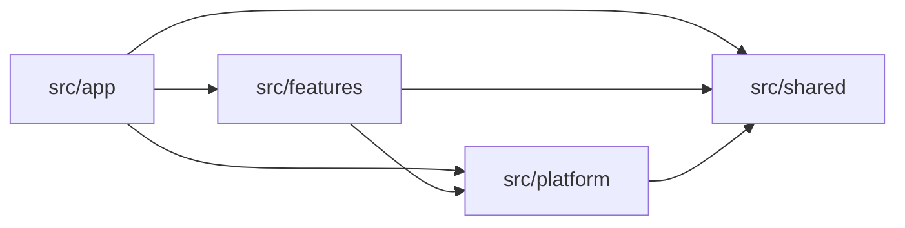

# Struktur Folder

Aturan pesanan, klien database, dan header khusus route memiliki alasan perubahan yang berbeda. Tempatkan masing-masing dalam direktori yang sesuai dengan tanggung jawabnya.

Gunakan empat direktori di tingkat teratas `src`:

```text
src/
  app/          # Next.js routes and page composition
  features/     # Business capabilities across server and client
  platform/     # Database connections and external integrations
  shared/       # Code with generic behavior across features
```

Next.js juga membutuhkan beberapa file entry point framework di luar direktori tersebut. Letakkan `src/proxy.ts` di samping `src/app` untuk [pengalihan route awal](./protected-resources#use-proxy-for-early-redirects). Batasi pekerjaannya pada batas request. [Konvensi Proxy Next.js](https://nextjs.org/docs/app/api-reference/file-conventions/proxy)

Tinjau import sekaligus penempatan file.

Ikuti aturan kepemilikan, penempatan, dan dependensi sejak fitur pertama. Mulai dengan modul operasi langsung di root fitur, presentasi di `ui/`, serta schema dan aturan murni di `model/`. Kelompokkan modul operasi terkait di dalam fitur ketika mulai sulit ditelusuri di root. Repository dan mapper terpisah adalah abstraksi tambahan dengan syarat penggunaan masing-masing.

## Tetapkan tanggung jawab setiap direktori {#give-each-directory-a-responsibility}

### `src/app`: tangani route dan susun halaman {#src-app-handle-routes-and-compose-pages}

Simpan pohon URL dan file siklus hidup Next.js di `app`:

```text
src/app/
  layout.tsx
  page.tsx
  (authenticated)/
    layout.tsx
    orders/
      page.tsx
      loading.tsx
      error.tsx
      [orderId]/
        page.tsx
    dashboard/
      page.tsx
      _components/
        DashboardHeader.tsx
  api/
    health/
      route.ts
```

[Referensi struktur proyek Next.js](https://nextjs.org/docs/app/getting-started/project-structure) mendefinisikan konvensi routing. Perjelas kepemilikan: file route menggunakan antarmuka fitur untuk menyusun aplikasi.

| File atau konvensi | Tanggung jawab |
| --- | --- |
| `page.tsx` | Membaca input route dan menyusun UI fitur untuk URL tersebut. |
| `layout.tsx` | Menyusun presentasi yang digunakan bersama oleh sebagian pohon route. |
| `loading.tsx` | Menampilkan UI loading ketika segmen route sedang menunggu. |
| `error.tsx` | Menyediakan error boundary dan UI pemulihan; Next.js mengharuskan file ini berupa Client Component. |
| `route.ts` | Menyesuaikan request dan response HTTP, seperti health check atau API pesanan. |
| `(authenticated)/` | Mengelompokkan route tanpa menambah segmen URL. Nama itu sendiri tidak menegakkan autentikasi. |
| `[orderId]/` | Menyediakan ID pesanan sebagai parameter route. |
| `_components/DashboardHeader.tsx` | Menyimpan UI yang hanya digunakan untuk menyusun route dashboard tersebut. |

Simpan aturan pembatalan pesanan dalam fitur orders, meskipun hanya satu route yang memanggilnya.

### `src/features`: satukan satu kapabilitas bisnis {#src-features-keep-a-business-capability-together}

Fitur berisi kode yang berubah ketika perilaku bisnisnya berubah. Fitur dapat mencakup kode server dan klien. Gunakan nama produk seperti `orders`, `billing`, dan `membership` agar Anda tahu tempat memulai perubahan.

Simpan autentikasi di `auth`: UI login, verifikasi sesi, dan tabel autentikasi. Simpan keanggotaan akun, peran, penentuan lingkup akun, dan preferensi keanggotaan di `membership`, yang memanggil query sesi publik auth. Tambahkan `user` ketika profil pribadi dan pengaturan pengguna membutuhkan operasi sendiri, serta `account` ketika detail dan siklus hidup akun bisnis membutuhkannya. Akun login tertaut di Better Auth adalah bagian dari autentikasi; akun itu tidak mewakili akun bisnis.

Fitur yang hanya membaca data dapat dimulai dengan komponen dan query server. Untuk mutasi bisnis, tempatkan operasi dalam use case dan biarkan action atau adapter HTTP menangani request serta response. Contoh orders di bawah menunjukkan file untuk tanggung jawab tersebut.

### `src/platform`: hubungkan database dan layanan luar {#src-platform-connect-to-databases-and-outside-services}

Simpan penyiapan integrasi dan klien di `platform`:

```text
src/platform/
  database/
    client.ts          # Configure the database connection
    transaction.ts     # Provide a shared transaction helper, if needed
  email/
    client.ts          # Configure the email provider
  observability/
    logger.ts          # Configure application logging
    metrics.ts         # Configure metric recording
  storage/
    object-storage.ts  # Wrap the object-storage provider
```

Implementasinya bergantung pada database dan provider Anda. Modul platform dapat membuka transaksi, mengirim pesan, atau mencatat metrik. Fitur orders menentukan apakah pesanan boleh dibatalkan dan pelanggan mana yang berhak menerima pengembalian dana.

Kode server fitur mengimpor modul platform yang dibutuhkannya. Kode platform tidak boleh mengimpor fitur. Simpan query database khusus fitur dan adapter repository bersama fitur pemiliknya.

Untuk autentikasi, letakkan klien SDK browser di `platform/auth/client.ts` dan factory provider di `platform/auth/server.ts`. Fitur auth memberikan tabelnya kepada factory itu dan menyusun instance terkonfigurasi di `auth.provider.ts`. Dengan begitu, auth memiliki persistensi tanpa membuat platform mengimpor fitur. Klien bertipe yang mengikat prosedur RPC membership tetap di `features/membership/membership.rpc-client.ts`; transport RPC bersama berada di `platform/rpc/client.ts`.

### `src/shared`: bagikan kode dengan perilaku generik {#src-shared-share-code-with-generic-behavior}

Gunakan `shared` untuk kode yang perilakunya tidak bergantung pada fitur bisnis tertentu:

```text
src/shared/
  ui/
    Button.tsx              # Generic button behavior and presentation
    Dialog.tsx              # Generic dialog behavior and presentation
  types/
    result.ts               # A generic success-or-failure result type
  validation/
    primitives.ts           # Reusable Zod schemas without business policy
  utils/
    currency.ts             # Format currency values for display
    assert-unreachable.ts   # Report an unexpected exhaustive-branch value
```

Namai utilitas berdasarkan pekerjaannya. Gunakan `utils/currency.ts` dengan ekspor `formatCurrency()` untuk pemformatan tampilan. Contoh aplikasi menerima jumlah dalam sen dan menampilkannya sebagai USD, sesuai lingkup satu mata uangnya.

Simpan aturan harga, pajak, dan pembulatan khusus pesanan di `model/` fitur pemiliknya. Formatter menampilkan jumlah yang diberikan; fitur menentukan jumlah yang ditagihkan. Batas yang sama berlaku pada UI: `StatusBadge` yang mengenali status pemenuhan pesanan berada di fitur tersebut.

Gunakan dua pemeriksaan sebelum memindahkan kode ke shared:

1. Bisakah Anda mendeskripsikan modul tanpa menyebut fitur?
2. Bisakah Anda mengubahnya tanpa mengubah atau menegosiasikan aturan bisnis suatu fitur?

Jika salah satu jawabannya tidak, simpan bersama fitur. Izinkan sebagian duplikasi selama perilaku bersama belum jelas. Setelah beberapa fitur bergantung pada abstraksi bersama, perubahannya membutuhkan pemeriksaan seluruh pemanggil tersebut.

## Mulai fitur orders dengan file yang digunakannya {#start-the-orders-feature-with-the-files-it-uses}

Misalkan halaman pesanan membaca database aplikasi ini dan menggunakan Server Action Next.js untuk membatalkan pesanan. Fitur itu dimulai dengan file berikut:

```text
src/features/orders/
  ui/
    OrderDetails.tsx
    CancelOrderForm.tsx
  model/
    order.schema.ts
    order-cancellation.ts
  order.queries.ts
  order.actions.ts
  cancel-order.use-case.ts
```

Tempatkan query, action, dan use case di samping UI serta model fitur. Server Component di `ui/` dapat memanggil `order.queries.ts` langsung, dan formulir dapat mengirim melalui `order.actions.ts`. Server Component dan Client Component sama-sama berada di `ui/`; letakkan `'use client'` pada batas interaktif. Direktori ini mengatur tanggung jawab dalam satu fitur. Next.js mendefinisikan graf modul server dan klien melalui import dan directive. [Komposisi komponen Next.js](https://nextjs.org/docs/app/getting-started/server-and-client-components#interleaving-server-and-client-components)

| File | Isi | Pengguna |
| --- | --- | --- |
| `ui/OrderDetails.tsx` | Tampilan detail pesanan. | Halaman pesanan atau tampilan fitur lain. |
| `ui/CancelOrderForm.tsx` | Kontrol pengiriman pembatalan pesanan. | Tampilan detail pesanan. |
| `model/order.schema.ts` | Schema Zod dan tipe yang diinferensikan darinya. | Formulir, action, query, dan modul fitur lainnya. |
| `model/order-cancellation.ts` | Aturan murni yang menentukan apakah status pesanan yang diberikan mengizinkan pembatalan. | UI pembatalan dan use case server. |
| `order.queries.ts` | Implementasi dan ekspor pembacaan server terkait, seperti `getOrderDetails` dan `listOrders`. | Server Component dan adapter server. |
| `order.actions.ts` | Mem-parsing request Server Action Next.js, memanggil use case terlindungi, lalu menyegarkan atau merevalidasi UI. | Formulir dan kontrol yang mengirim melalui Server Actions. |
| `cancel-order.use-case.ts` | Memverifikasi pemanggil, memeriksa kepemilikan dan kelayakan pembatalan terhadap pesanan tersimpan, lalu menjalankan update. | Action, Route Handler, atau operasi server fitur lain. |

`order.actions.ts` bersifat opsional. Gunakan `.actions.ts` khusus untuk Server Actions Next.js yang didefinisikan dengan `'use server'`. Mutasi adalah operasi yang mengubah data atau memicu efek; Server Action adalah salah satu cara UI memanggilnya. [Panduan mutasi Next.js](https://nextjs.org/docs/app/getting-started/mutating-data)

Ketika browser memanggil API langsung, tempatkan request fitur di [`order.api.ts`](#put-browser-api-requests-in-order-api-ts). Request tersebut tidak membutuhkan file actions.

Fitur yang hanya membaca data dapat menghilangkan formulir pembatalan, kebijakan, action, dan use case. Repository, prosedur RPC, atau konfigurasi TanStack Query memiliki alasan keberadaan sendiri; contoh ini tidak mewajibkan satu pun.

### Simpan presentasi dan interaksi di `ui/` {#keep-presentation-and-interaction-in-ui}

Komponen fitur dapat berupa Server Component atau Client Component. Lokasinya mengidentifikasi kapabilitas bisnis yang ditampilkan.

Tempatkan `'use client'` pada batas interaktif terkecil yang berguna. Halaman pesanan dapat tetap berupa Server Component sementara kontrol interaktif menangani state browser. Formulir yang mengirim Server Action juga dapat dirender oleh Server Component. [Server dan Client Components Next.js](https://nextjs.org/docs/app/getting-started/server-and-client-components), [Server Actions Next.js](https://nextjs.org/docs/app/getting-started/mutating-data#server-components)

Saat tampilan membesar, satukan bagian internalnya:

```text
ui/OrderDetails/
  OrderDetails.tsx    # Compose the order details view
  OrderItems.tsx      # Render this view’s order lines
  useOrderDetails.ts  # Coordinate React interaction state, if needed
```

Formulir checkout dalam contoh aplikasi menggunakan susunan yang sama: `ui/CheckoutForm/` berisi `CheckoutForm.tsx`, `CheckoutItem.tsx`, dan `CheckoutSummary.tsx`. Formulir memiliki draft jumlah barang dan memberikan nilai serta callback kepada komponen anak. Gunakan context ketika konsumen yang lebih dalam membutuhkannya; anak langsung dapat menerima props. Nama komponen menjelaskan perilakunya dan sesuai dengan nama file. Nama itu tidak harus mengulang nama direktori fitur.

### Tempatkan request API browser di `order.api.ts` {#put-browser-api-requests-in-order-api-ts}

Aplikasi full-stack Next.js juga dapat menggunakan backend yang sudah ada. Jika UI orders memanggil backend itu langsung, fiturnya dapat dimulai dengan:

```text
src/features/orders/
  ui/
    OrderDetails.tsx
    CancelOrderButton.tsx
  model/
    order.schema.ts
  order.api.ts          # HTTP/RPC requests for order reads and mutations
```

Gunakan `order.api.ts` untuk fungsi request biasa seperti `fetchOrderDetails` dan `cancelOrder`. Fungsi ini memanggil endpoint HTTP atau klien RPC, memeriksa response, dan mem-parsing data hasil dengan Zod. API dapat berasal dari backend yang sudah ada atau Route Handler aplikasi Next.js ini.

Komponen dapat memanggil fungsi tersebut langsung. Ketika fitur menggunakan TanStack Query, factory options-nya dapat memanggil fungsi yang sama. Kelompokkan pembacaan dan mutasi terkait dalam file ini; tanggung jawabnya tetap sama dengan atau tanpa library query. [Contoh mutasi API](./data-fetching-and-mutation#call-an-existing-api-for-mutations) menunjukkan kedua konsumen.

Tambahkan `order.queries.ts` ketika pemanggil server membutuhkan pembacaan fitur langsung, dan `order.actions.ts` ketika UI mengirim melalui Server Action Next.js. Tempatkan mutasi bisnis yang diimplementasikan aplikasi ini dalam use case server. Fitur hanya membutuhkan file untuk jalur yang digunakannya.

Jaga `order.api.ts` aman untuk diimpor browser. Penyiapan klien HTTP atau RPC bersama berada di `platform`; request khusus pesanan berada di sini. Panggilan yang membutuhkan kredensial privat tetap di implementasi server fitur dan menggunakan klien platform khusus server. [Tanggung jawab server dan klien Next.js](https://nextjs.org/docs/app/getting-started/server-and-client-components#when-to-use-server-and-client-components)

## Tempatkan definisi dan perilaku bisnis murni di `model/` {#put-definitions-and-pure-business-behavior-in-model}

Schema input pembatalan dapat menerima ID pesanan yang valid meskipun pesanannya sudah dikirim. Input valid hanyalah satu bagian dari keputusan apakah operasi boleh dilanjutkan.

Gunakan `model/` untuk schema Zod, tipe, konstanta, perhitungan, dan aturan yang bekerja dari nilai yang diberikan. Modul ini harus berjalan tanpa Next.js, database, atau koneksi jaringan. Record ORM mendeskripsikan persistensi; model fitur mendeskripsikan data dan perilaku bisnis yang dibutuhkan.

| Tanggung jawab | Pertanyaan yang dijawab | Contoh |
| --- | --- | --- |
| Schema Zod | Apakah data memenuhi batasannya? | Apakah jumlah barang pada baris pesanan merupakan bilangan bulat positif? |
| Tipe | Nilai apa yang digunakan kode ini? | Field apa yang membentuk hasil internal `OrderTotals`? |
| Konstanta | Nilai tetap apa yang digunakan aturan bisnis? | Berapa baris yang boleh dimiliki satu pesanan? |
| Perhitungan | Hasil apa yang diperoleh dari nilai ini? | Berapa total harga baris-baris ini? |
| Keputusan bisnis | Berdasarkan fakta ini, apakah operasi diizinkan? | Apakah status saat ini mengizinkan pembatalan? |

### Gunakan schema Zod dan inferensikan tipenya {#use-zod-schemas-and-infer-their-types}

Gunakan [Zod](https://zod.dev/basics) untuk schema runtime dan validasi. Simpan schema bersama fitur pemilik maknanya, lalu parsing input tidak tepercaya pada batas saat input memasuki operasi.

```ts
// src/features/orders/model/order.schema.ts
import { z } from 'zod'

export const orderStatusSchema = z.enum([
  'pending',
  'confirmed',
  'shipped',
  'cancelled',
])

export const cancelOrderInputSchema = z.object({
  orderId: z.string().min(1),
})

export const orderLineSchema = z.object({
  quantity: z.number().int().positive(),
  unitPriceInCents: z.number().int().nonnegative(),
})

export type OrderStatus = z.infer<typeof orderStatusSchema>
export type CancelOrderInput = z.infer<typeof cancelOrderInputSchema>
export type OrderLine = z.infer<typeof orderLineSchema>
```

`orderStatusSchema` mendefinisikan nilai status yang diizinkan dan memvalidasinya saat runtime. Inferensikan `OrderStatus` dari schema itu agar nilai hanya memiliki satu definisi. Contoh ini tidak membutuhkan objek konstanta status atau enum TypeScript terpisah. [Enum Zod](https://zod.dev/api#enums)

Schema input pembatalan memeriksa bahwa ID adalah string yang tidak kosong. Operasi server tetap perlu menemukan pesanan dan mengotorisasi pemanggil.

Secara bawaan, simpan tipe berbasis schema di samping schema-nya. Tambahkan `order.types.ts` ketika tipe fitur lain membutuhkan modul sendiri, misalnya hasil perhitungan internal:

```ts
// src/features/orders/model/order.types.ts
export type OrderTotals = {
  subtotalInCents: number
  discountInCents: number
  totalInCents: number
}
```

Tipe ini mendeskripsikan hasil yang dibuat di dalam fitur. Jika bentuk yang sama nantinya membutuhkan validasi runtime, definisikan schema Zod dan inferensikan tipenya. API [`z.infer`](https://zod.dev/basics#inferring-types) menjaga tipe selaras dengan schema; transformasi dapat menggunakan `z.input` dan `z.output` ketika input dan output berbeda.

### Ekstrak perilaku bisnis ketika membutuhkan modul sendiri {#extract-business-behavior-when-it-needs-its-own-module}

Simpan perhitungan singkat yang digunakan sekali di dekat pemanggilnya dalam fitur pemilik selama mudah diikuti. Penjumlahan harga baris pesanan saja tidak membenarkan pembuatan file model. Ketika penetapan harga melibatkan kelayakan diskon, pembulatan, atau keputusan khusus pesanan lainnya, kelompokkan perilaku itu di `order-pricing.ts` agar dapat dipahami dan diuji bersama.

Alasan lain untuk mengekstrak modul adalah aturan yang digunakan bersama UI dan kode server. Misalkan formulir harus menyembunyikan pembatalan untuk pesanan terkirim, dan server harus menegakkan aturan kelayakan yang sama. Letakkan perilaku bersama itu di `model/order-cancellation.ts`:

```ts
// src/features/orders/model/order-cancellation.ts
import type { OrderStatus } from './order.schema'

export function canCancelOrder(status: OrderStatus) {
  return status === 'pending' || status === 'confirmed'
}
```

`shipped` adalah status valid, tetapi tidak mengizinkan pembatalan menurut aturan contoh ini. [Penelusuran pembatalan](#follow-a-cancellation-from-the-form-to-the-stored-order) menggunakan fungsi ini pada formulir dan operasi server. Formulir menggunakan status yang ditampilkan; server memeriksa pesanan tersimpan terkini sebelum mengubah data.

Ini mengikuti [panduan konsep](./concepts#clean-architecture-keep-business-rules-independent-of-integrations): simpan perilaku pesanan bersama orders dan biarkan aturan bisnis yang diekstrak bekerja tanpa akses database atau framework. Modul ini ada untuk berbagi kebijakan pembatalan di antara pemanggil tersebut.

Namai modul yang diekstrak sesuai tanggung jawab bisnisnya. Gunakan `order-cancellation.ts` untuk kebijakan pembatalan atau `order-pricing.ts` untuk perilaku harga. Satukan fungsi terkait; membuat fungsi tidak mengharuskan pembuatan file. File umum fitur seperti `order.utils.ts` atau `order.rules.ts` memberi lebih sedikit petunjuk tentang tanggung jawab mana yang harus dibuka.

Zod mendukung [custom refinement](https://zod.dev/api#refinements). Jika parsing perlu menegakkan aturan murni yang sudah ada, panggil aturan itu dari refinement. Simpan pencarian database dan otorisasi dalam operasi server agar parsing schema model tidak menjalankan I/O tersembunyi.

### Tempatkan konstanta bersama aturannya {#place-constants-with-the-rules-they-belong-to}

Simpan konstanta di samping satu-satunya konsumen. Tambahkan `order.constants.ts` ketika nilai bisnis tetap yang berkaitan digunakan bersama oleh beberapa modul orders:

```ts
// src/features/orders/model/order.constants.ts
export const MAX_ORDER_LINES = 100
```

Untuk aplikasi dengan batas tersebut, schema pembuatan pesanan dapat menggunakan `z.array(orderLineSchema).min(1).max(MAX_ORDER_LINES)`, sementara editor menggunakan batas yang sama untuk menentukan kapan berhenti menambah baris. Batas produk bersama itu layak mendapat definisi terpisah. Nilai `100` hanya contoh; pilih batas yang dibutuhkan aplikasi Anda.

Simpan nilai status dalam `orderStatusSchema`; contoh ini tidak membutuhkan file konstanta status terpisah. Label yang digunakan satu komponen dapat tetap di `ui/`. URL provider dan kredensial berada bersama konfigurasi server atau platform.

## Mulai modul operasi di root fitur {#keep-operation-modules-at-the-feature-root}

Mulai query, Server Action, use case, dan modul pendukung langsung di root fitur. Gunakan nama file seperti `order.queries.ts`, `order.actions.ts`, dan `cancel-order.use-case.ts` untuk mengidentifikasi tanggung jawab. Fungsi request browser dan query options berada di sampingnya ketika fitur membutuhkan jalur itu.

Berbagi direktori tidak membuat setiap modul aman diimpor browser atau terbuka bagi fitur lain. Pertahankan perlindungan runtime dalam modul dan impor hanya operasi yang ditujukan bagi setiap pemanggil. Saat fitur tumbuh, kelompokkan tanggung jawab ketika file-nya sulit diikuti; gunakan aturan runtime dan import publik yang sama dalam kelompok itu.

Sediakan query dan use case sebagai operasi server publik fitur. Route dan fitur lain boleh mengimpor fungsi tersebut langsung. Membership juga dapat menyediakan [wrapper aksesnya](#share-membership-checks-through-the-query-module) dari modul query. Jaga repository, mapper DTO internal, dan fungsi bantu implementasi tetap privat dalam fitur. [Contoh antarmuka publik](#expose-the-operations-and-components-callers-need) menunjukkan import yang diizinkan.

Saat menggunakan RPC, sediakan ekspor prosedur dari `order.rpc.ts` untuk dipasang oleh router aplikasi. Panggilan bisnis lintas fitur tetap menggunakan query dan use case publik.

Pasang API HTTP provider langsung di entry point aplikasi. Route Handler auth mengimpor instance terkonfigurasi dari `auth.provider.ts` dan mengekspor `handler`-nya sebagai `GET` dan `POST`. Backend terpisah memasang handler tersebut di `backend/server.ts`. Batasi import provider pada entry point auth ini; fitur lain memanggil `auth.queries.ts` untuk verifikasi sesi. Frontend HTTP meneruskan request auth melalui `platform/auth/server.ts`.

Tandai modul server biasa dengan `import 'server-only'`, termasuk query dan use case publik. Next.js menggunakan penanda itu untuk menolak import Client Component yang tidak disengaja. Modul Server Action menggunakan `'use server'` agar UI dapat memanggil ekspornya melalui Next.js. Jaga modul API browser dan query options bebas dari dependensi khusus server. [Batas runtime Next.js](https://nextjs.org/docs/app/getting-started/server-and-client-components#preventing-environment-poisoning), [Server Functions](https://nextjs.org/docs/app/api-reference/directives/use-server)

Query mengambil data. Use case memiliki mutasi bisnis atau alur kerja, yang dapat mencakup pembacaan, penulisan, dan panggilan ke fitur lain. Pembatalan sudah membutuhkan use case karena memeriksa kepemilikan, menerapkan aturan kelayakan, dan mengoordinasikan update. Simpan pekerjaan itu dalam use case meskipun fungsinya pendek. Action dan Route Handler mem-parsing input, memanggil operasi, dan menyesuaikan response. Operasi publik terlindungi memverifikasi pemanggil melalui fitur membership dan menegakkan akses resource secara internal; ikuti [panduan perlindungan resource](./protected-resources#put-data-protection-in-the-feature-s-server-operations) untuk batas tersebut.

| File server | Tanggung jawab | Kapan dibuat |
| --- | --- | --- |
| `order.queries.ts` | Mengimplementasikan pembacaan server publik terkait, dengan pembatasan akses dan field hasil yang aman. | Fitur menyediakan pembacaan server langsung. |
| `order.actions.ts` | Menyesuaikan kiriman Server Action Next.js menjadi panggilan use case dan respons UI. | UI menggunakan Server Actions. |
| `create-order.use-case.ts` | Memiliki pembuatan pesanan, termasuk pemeriksaan bisnis dan persistensi. | Aplikasi mengimplementasikan pembuatan pesanan. |
| `cancel-order.use-case.ts` | Memiliki pembatalan berdasarkan status pesanan terkini dan akun pemanggil. | Aplikasi mengimplementasikan pembatalan pesanan; ditunjukkan di bawah. |
| `order.dto.ts` | Memetakan record internal menjadi data transfer object (DTO) yang boleh diterima pemanggil. | Pemetaan digunakan bersama atau membutuhkan modul terpisah agar pemilihan field dan konversi jelas. |
| `order.repository.ts` | Membungkus operasi persistensi khusus pesanan. | `findOrderForAccount`, `cancelOrderIfUnchanged`; tambahkan ketika beberapa operasi menggunakan ulang perilaku persistensi atau membutuhkan pengganti untuk pengujian. |
| `order.rpc.ts` | Menyesuaikan request RPC menjadi query dan use case fitur. | Aplikasi menyediakan operasi ini melalui RPC. |

Fungsi terkait dapat berbagi file. `order.queries.ts` dapat berisi beberapa pembacaan, dan `order.repository.ts` dapat berisi pembacaan serta penulisan. Pisahkan berdasarkan tanggung jawab ketika diperlukan; tidak ada aturan satu fungsi per file.

Selalu pilih field yang boleh diterima pemanggil. Query dapat memilih dan memetakan field itu langsung. Simpan schema dan tipe DTO yang digunakan browser di `model/`; tempatkan mapper server terpisah di `order.dto.ts` ketika pemetaan memenuhi syarat di atas. Data hasil yang aman tetap wajib meskipun tidak ada file mapper.

Contoh aplikasi orders menggunakan ulang `toOrderDto()` untuk hasil daftar dan detail, sehingga mapper-nya berada di `order.dto.ts`. Mapper memilih field publik dan mengubah tanggal tersimpan menjadi string ISO. Menambahkan kolom ke tabel tidak otomatis menambahkannya ke response.

Repository menggunakan klien database platform. Simpan keputusan bisnis dalam model atau use case. Jika membutuhkan repository yang dapat diganti, fitur memiliki kontrak sekaligus adapter implementasinya. [Panduan konsep](./concepts#clean-architecture-keep-business-rules-independent-of-integrations) menjelaskan pemisahan opsional itu.

### Bagikan pemeriksaan membership melalui modul query {#share-membership-checks-through-the-query-module}

Ekspor `withMembership` di samping `requireMembership` dalam `membership.queries.ts` ketika beberapa operasi berbagi pemeriksaan membership yang sama. Modul ini menyediakan pembacaan membership dan wrapper publik yang menerapkannya. Jaga wrapper khusus server dan impor langsung dari modul tersebut.

Contoh native menyimpan pembacaan pesanan terkait dalam satu `order.queries.ts`:

```ts
import { withMembership } from '@/features/membership/membership.queries'

export const listOrders = withMembership(({ scopeId }) => listCachedOrders(scopeId))
```

Wrapper mengembalikan fungsi yang dipanggil sebagai `listOrders(requestHeaders)`. Pada setiap panggilan, wrapper memverifikasi membership sebelum meneruskan anggota terverifikasi dan argumen lainnya ke callback. Pemeriksaan yang gagal mencegah callback berjalan. Orders tetap memiliki izin resource, validasi input, field hasil yang aman, dan caching; fungsi bantu cache privat menerima ID lingkup yang diizinkan.

Lihat [implementasi wrapper](https://github.com/ishk-sftckz/RFAStack/blob/main/examples/next-native/src/features/membership/membership.queries.ts) dan [pembacaan pesanan](https://github.com/ishk-sftckz/RFAStack/blob/main/examples/next-native/src/features/orders/order.queries.ts). Panggilan langsung `requireMembership()` tetap sesuai ketika operasi membutuhkan nilai membership sebagai bagian alurnya. Wrapper tidak memiliki kebijakan cache otomatis. Wrapper mempersingkat pemeriksaan akses berulang, tetapi pemisahan file tetap bergantung pada kemudahan menelusuri modul query secara utuh.

### Kelompokkan pembacaan orders yang membesar di dalam fitur {#group-growing-order-reads-inside-the-feature}

Pertahankan satu `order.queries.ts` selama pembacaannya mudah diikuti bersama. Ketika filter daftar, pengambilan detail, dan pelaporan masing-masing membutuhkan implementasi besar, pisahkan tanggung jawab itu ke modul query terpisah. Jika modul tersebut memenuhi root fitur, kelompokkan dalam `queries/`:

```text
src/features/orders/
  queries/
    order-list.queries.ts       # List reads and their private helpers
    order-details.queries.ts    # Detail reads and their private helpers
    order-report.queries.ts     # Order reporting reads
  order.actions.ts
  cancel-order.use-case.ts
  model/
    order.schema.ts
    order-cancellation.ts
  ui/
    OrderDetails.tsx
    CancelOrderForm.tsx
```

Ini salah satu kemungkinan struktur lanjutan dari fitur orders yang lebih kecil di atas. Tambahkan hanya tanggung jawab yang dimiliki aplikasi; fungsi pendek kedua saja tidak membutuhkan file atau folder baru. Pengelompokan menambah tingkat direktori dan memperpanjang path import, jadi gunakan ketika membantu menemukan pembacaan terkait.

Simpan pembacaan publik terlindungi dan fungsi bantu privatnya dalam modul query yang sama. Misalnya, `order-list.queries.ts` dapat mengekspor `listOrders(requestHeaders)` dan menjaga `listCachedOrders(scopeId)` tanpa ekspor. Operasi publik tetap memverifikasi membership sebelum memanggil fungsi bantunya. Lapisan `.controller.ts` tidak diperlukan untuk pemisahan ini: pemeriksaan akses, pengambilan data, dan pemilihan hasil aman tetap menjadi bagian query publik. Action, Route Handler, dan prosedur RPC menangani format request serta response masing-masing.

Perbarui pemanggil agar mengimpor operasi dari modul implementasinya:

```ts
import { listOrders } from '@/features/orders/queries/order-list.queries'
```

Simpan modul ini di bawah `features/orders/`; `src/queries/` global akan memisahkan pembacaan pesanan dari fitur pemiliknya. Pertahankan import langsung, penanda khusus server, dan fungsi bantu privat setelah memindahkan file. Fitur lain dapat tetap menggunakan satu file query di root sampai membutuhkan pemisahan sendiri.

Pohon ini menggambarkan struktur opsional untuk fitur yang lebih besar. Contoh native tetap menyatukan pembacaan daftar, detail, dan pengiriman dalam [order.queries.ts](https://github.com/ishk-sftckz/RFAStack/blob/main/examples/next-native/src/features/orders/order.queries.ts), dengan `withMembership` untuk pemeriksaan akses bersama.

### Telusuri pembatalan dari formulir sampai pesanan tersimpan {#follow-a-cancellation-from-the-form-to-the-stored-order}

Contoh ini menggunakan Server Action Next.js. Formulir menggunakan kebijakan pembatalan bersama untuk menentukan apakah kontrol ditampilkan, lalu mengirim ID ke action publik:

```tsx
// src/features/orders/ui/CancelOrderForm.tsx
import { canCancelOrder } from '../model/order-cancellation'
import type { OrderStatus } from '../model/order.schema'
import { cancelOrder } from '../order.actions'

export function CancelOrderForm({
  orderId,
  status,
}: {
  orderId: string
  status: OrderStatus
}) {
  if (!canCancelOrder(status)) return null

  return (
    <form action={cancelOrder}>
      <input type="hidden" name="orderId" value={orderId} />
      <button type="submit">Cancel order</button>
    </form>
  )
}
```

Action mem-parsing input dengan Zod dan memanggil use case terlindungi:

```ts
// src/features/orders/order.actions.ts
'use server'

import { refresh } from 'next/cache'
import { cancelOrderInputSchema } from './model/order.schema'
import { cancelOrderUseCase } from './cancel-order.use-case'

export async function cancelOrder(formData: FormData) {
  const input = cancelOrderInputSchema.parse({
    orderId: formData.get('orderId'),
  })

  await cancelOrderUseCase(input)
  refresh()
}
```

Formulir hanya memberikan ID pesanan. Use case memperoleh akun melalui `requireAccount`, operasi publik membership untuk memverifikasi sesi dan menentukan akun yang boleh digunakan pemanggil. Use case memvalidasi input-nya sendiri, memuat pesanan dalam akun itu, dan menerapkan aturan murni:

```ts
// src/features/orders/cancel-order.use-case.ts
import 'server-only'
import { requireAccount } from '@/features/membership/membership.queries'
import { database } from '@/platform/database/client'
import { canCancelOrder } from './model/order-cancellation'
import { cancelOrderInputSchema, orderStatusSchema } from './model/order.schema'
import type { CancelOrderInput } from './model/order.schema'

export async function cancelOrderUseCase(input: CancelOrderInput) {
  const account = await requireAccount()
  const { orderId } = cancelOrderInputSchema.parse(input)
  const order = await database.order.findFirst({
    where: { id: orderId, accountId: account.id },
    select: { id: true, status: true },
  })

  if (!order) throw new Error('Order not found')

  const status = orderStatusSchema.parse(order.status)
  if (!canCancelOrder(status)) {
    throw new Error('This order can no longer be cancelled')
  }

  const result = await database.order.updateMany({
    where: { id: orderId, accountId: account.id, status },
    data: { status: 'cancelled' },
  })

  if (result.count !== 1) {
    throw new Error('The order changed before cancellation completed')
  }
}
```

Contoh database menggunakan klien bergaya Prisma dari `platform/database/client`. Update menyertakan akun dan status yang sudah diperiksa, sehingga pengiriman yang terjadi bersamaan tidak dapat ditimpa pembatalan ini. Contoh mengasumsikan kelayakan bergantung pada kepemilikan dan status; aturan tambahan mungkin membutuhkan transaksi atau kontrol konkurensi lain.

Use case ini memanggil database langsung. Tambahkan repository ketika persistensi perlu dibagikan atau diganti. Use case tetap memiliki operasi pada kedua susunan.

Penelusuran ini menunjukkan lokasi setiap tanggung jawab. Di UI, ubah kegagalan yang diperkirakan menjadi pesan di samping formulir. Jika pembacaan di-cache, batalkan validitas data cache terkait sekaligus segarkan halaman. [Panduan pengambilan data](./data-fetching-and-mutation#update-the-screen-after-the-mutation-succeeds) membahas keputusan respons dan cache tersebut.

## Sediakan operasi dan komponen yang dibutuhkan pemanggil {#expose-the-operations-and-components-callers-need}

Antarmuka publik fitur terdiri dari operasi dan komponen yang ditujukan bagi modul aplikasi lain. Query dan use case server publik adalah fungsi server biasa; mengekspornya tidak membuat endpoint HTTP atau menjadikannya dapat dipanggil dari browser.

Impor pembacaan server dan use case langsung dari modul implementasinya. Gunakan modul action saat memanggil Server Action Next.js, dan modul UI saat menyusun tampilan:

```ts
import { getOrderDetails } from '@/features/orders/order.queries'
import { cancelOrderUseCase } from '@/features/orders/cancel-order.use-case'
import { cancelOrder } from '@/features/orders/order.actions'
import { OrderDetails } from '@/features/orders/ui/OrderDetails'
```

Mulai pembacaan server fitur di `order.queries.ts`. Satukan pembacaan terkait dan ekspor operasi yang dibutuhkan pemanggil langsung dari modul implementasinya, termasuk setelah [memisahkan pembacaan orders yang membesar](#group-growing-order-reads-inside-the-feature). [Panduan pengambilan data](./data-fetching-and-mutation#read-during-rendering-through-a-server-component) menunjukkan query yang memanggil database dan mengembalikan DTO.

Route memperoleh input-nya dan memanggil query publik itu:

```tsx
// src/app/(authenticated)/orders/[orderId]/page.tsx
import { requireAccount } from '@/features/membership/membership.queries'
import { getOrderDetails } from '@/features/orders/order.queries'
import { OrderDetails } from '@/features/orders/ui/OrderDetails'

export default async function OrderPage({
  params,
}: {
  params: Promise<{ orderId: string }>
}) {
  const account = await requireAccount()
  const { orderId } = await params
  const order = await getOrderDetails({ accountId: account.id, orderId })

  return <OrderDetails order={order} />
}
```

Di sini, halaman memperoleh akun untuk mengidentifikasi lingkup yang diminta. [Query memverifikasi pemilihan akun secara internal](./data-fetching-and-mutation#verify-the-requested-account-in-a-detail-read) dan membatasi pembacaan pada kedua ID. Untuk rendering server, panggil langsung. Memanggil Route Handler aplikasi sendiri menambah perjalanan HTTP dan dapat gagal selama prerender saat build. Gunakan Route Handler ketika browser atau konsumen HTTP lain membutuhkan endpoint. [Panduan Backend for Frontend Next.js](https://nextjs.org/docs/app/guides/backend-for-frontend#server-components)

### Tambahkan query options ketika fitur menggunakan TanStack Query {#add-query-options-when-the-feature-uses-tanstack-query}

Pembacaan server dan definisi query TanStack memiliki pekerjaan berbeda:

| File | Hasil memanggil ekspornya | Kapan dibuat |
| --- | --- | --- |
| `order.queries.ts` | `getOrderDetails(input)` menjalankan pembacaan server dan mengembalikan data. | Pemanggil server membutuhkan pembacaan. |
| `order.actions.ts` | `cancelOrder(formData)` memanggil Server Action Next.js yang memanggil use case. | UI menggunakan Server Action untuk mutasi tersebut. |
| `order.api.ts` | `fetchOrderDetails(input)` atau `cancelOrder(input)` membuat request HTTP/RPC. | Fungsi request khusus fitur membutuhkan modul. |
| `order.query-options.ts` | `orderDetailsOptions(input)` mengembalikan query key, fungsi request, dan pengaturan cache. | Fitur menggunakan TanStack Query. |
| `order.mutation-options.ts` | Mengembalikan konfigurasi mutasi TanStack bersama. | Berbagi konfigurasi antarkonsumen layak mendapat modul terpisah. |

Tambahkan file tersebut sesuai pemanggil yang ada. Formulir dengan Server Action tidak membutuhkan mutation options TanStack. Komponen dapat memanggil `order.api.ts` tanpa file options. Tambahkan query options untuk cache query klien, dan ekstrak mutation options ketika berbagi konfigurasinya berguna.

Utamakan factory options yang diekspor daripada hook yang hanya membungkus `useQuery` atau `useMutation`. Komponen dapat menggunakan options langsung; tambahkan custom hook ketika mengoordinasikan perilaku React. TanStack mendokumentasikan [query options](https://tanstack.com/query/latest/docs/framework/react/guides/query-options) dan [mutation options](https://tanstack.com/query/latest/docs/framework/react/typescript#typing-mutation-options) sebagai definisi yang dapat digunakan ulang.

Options bersama harus aman diimpor pada kedua lingkungan. Jangan masukkan import database. Untuk prefetch server, gunakan pembacaan fitur langsung; refetch browser menggunakan HTTP atau RPC. Kedua jalur harus mengembalikan bentuk data terotorisasi yang sama untuk cache key yang sama. [Contoh prefetch](./data-fetching-and-mutation#prefetch-when-the-client-needs-the-same-data-afterward) menunjukkan cara mengisi cache klien dari hasil server.

### Jaga import dalam batas yang diizinkan {#keep-imports-within-the-allowed-boundaries}

Panah menunjukkan dependensi yang diizinkan di antara empat direktori:



| Dari | Boleh bergantung pada | Tidak boleh bergantung pada |
| --- | --- | --- |
| `app` | Antarmuka publik fitur, penyiapan platform, komponen dasar shared | Implementasi privat fitur |
| `features` | Implementasinya sendiri, antarmuka publik eksplisit fitur lain, platform, shared | `app`, implementasi privat fitur lain |
| `platform` | Paket eksternal, konfigurasi aplikasi, komponen dasar shared | Kebijakan bisnis, `app`, fitur |
| `shared` | Komponen dasar shared generik lainnya | `app`, fitur, perilaku platform khusus bisnis |

Deklarasi tabel boleh merujuk kolom tabel fitur lain untuk mendefinisikan foreign key. Misalnya, tabel membership merujuk ID pengguna auth untuk mempertahankan batasan database di antara keduanya. Batasi import ini pada deklarasi tabel dan gunakan hanya untuk hubungan schema. Query, use case, route, dan UI tetap menggunakan operasi publik fitur untuk mengakses data fitur lain. Pemeriksaan batas pada contoh mengizinkan referensi kolom dalam deklarasi `.references()` dan menolak query atau ekspor ulang melalui import tersebut.

`app` boleh menggunakan kode platform untuk kebutuhan framework seperti penyiapan observabilitas atau endpoint kesehatan. Simpan operasi bisnis di fitur pemiliknya, termasuk panggilan operasi tersebut ke integrasi.

Izin ini berlaku bersama batas runtime. Next.js melaporkan error build ketika Client Component mengimpor modul bertanda `import 'server-only'`. File khusus `'use server'` membuka Server Functions melalui framework; gunakan untuk action, sementara factory query options tetap dalam modul biasa. [Batas runtime Next.js](https://nextjs.org/docs/app/getting-started/server-and-client-components#preventing-environment-poisoning), [Server Functions](https://nextjs.org/docs/app/api-reference/directives/use-server)

```ts
// ✅ Use the feature’s public server read from server code.
import { getOrderDetails } from '@/features/orders/order.queries'

// ❌ Reaching into private persistence couples callers to its implementation.
import { orderRepository } from '@/features/orders/order.repository'
```

Jaga import pembacaan server, action, dan UI tetap eksplisit. Satu barrel root yang mencampurnya dengan persistensi privat membuat batas runtime dan kepemilikan sulit diikuti:

```ts
// ❌ This import combines public UI and actions with a private repository.
import { OrderDetails, cancelOrder, orderRepository } from '@/features/orders'
```

## Konvensi Penamaan {#naming-conventions}

Nama file berikut adalah konvensi yang kami rekomendasikan. Pertahankan nama file khusus Next.js seperti `page.tsx`, `layout.tsx`, dan `route.ts`.

| Jenis | Konvensi | Contoh |
| --- | --- | --- |
| Direktori fitur | Kapabilitas produk, biasanya jamak untuk koleksi entity. | `orders/`; `membership/` untuk kapabilitas. |
| Prefix file fitur | Nama entity tunggal ketika file mendeskripsikan entity tersebut. | `order.schema.ts` dalam `orders/`. |
| Komponen | PascalCase sesuai komponen yang diekspor. | `OrderDetails.tsx` mengekspor `OrderDetails`. |
| Hook React | `use` diikuti nama camelCase deskriptif. | `useOrderDetails.ts`. |
| Modul bisnis yang diekstrak | Kebab-case yang menjelaskan tanggung jawab yang membutuhkan modul sendiri; fungsi terkait boleh berbagi. | `order-cancellation.ts`, `order-pricing.ts`. |
| Schema | `.schema.ts` untuk schema Zod; tipe hasil inferensi boleh tetap di sini. | `order.schema.ts` mengekspor `cancelOrderInputSchema`. |
| Tipe | `.types.ts` ketika definisi TypeScript terpisah membutuhkan modul. | `order.types.ts` mengekspor `OrderTotals`. |
| Konstanta | `.constants.ts` untuk konstanta terkait yang digunakan beberapa file; nama huruf besar untuk nilai tetap. | `order.constants.ts` mengekspor `MAX_ORDER_LINES`. |
| Pembacaan server publik | `*.queries.ts`; fungsi menjelaskan operasinya. | `order.queries.ts` mengekspor `getOrderDetails`. |
| Server Actions Next.js | `*.actions.ts`, hanya saat menggunakan Server Actions. | `order.actions.ts` mengekspor `cancelOrder`. |
| Mutasi dan alur bisnis | `<operation>.use-case.ts`; ekspor operasi langsung. | `cancel-order.use-case.ts` mengekspor `cancelOrderUseCase`. |
| Request API browser | `.api.ts` untuk request HTTP/RPC khusus fitur; pembacaan dan penulisan terkait boleh berbagi. | `order.api.ts` mengekspor `fetchOrderDetails` dan `cancelOrder`. |
| Options TanStack | `.query-options.ts` atau `.mutation-options.ts`. | `order.query-options.ts` mengekspor `orderDetailsOptions`. |
| Prosedur RPC | `*.rpc.ts` untuk prosedur fitur yang dibuka ke router RPC aplikasi. | `order.rpc.ts`. |
| Modul server pendukung privat | Entity atau tanggung jawab dengan suffix peran, di root fitur. | `order.repository.ts`, `order.dto.ts`. |

Gunakan suffix ketika membantu pembaca membedakan peran. Namai perilaku bisnis secara langsung daripada mengumpulkannya dalam file `helpers`, `common`, `misc`, atau `utils` di tingkat fitur. Satukan fungsi kecil terkait, lalu pisahkan file ketika tanggung jawab sulit ditemukan atau diikuti.

### Namai pembacaan berdasarkan hasil dan tanggung jawabnya {#name-reads-by-their-result-and-responsibility}

Gunakan `list` untuk operasi fitur yang mengembalikan koleksi dan `get` untuk satu resource atau hasil agregat. Gunakan `fetch` untuk fungsi bantu request yang bertanggung jawab mengambil data melalui HTTP atau RPC. Pemanggil dapat membedakan `getOrderDetails` dalam modul query server dari `fetchOrderDetails` dalam modul API browser.

| Jenis fungsi | Konvensi | Contoh |
| --- | --- | --- |
| Pembacaan koleksi | `list` + kata benda jamak; koleksi kosong adalah hasil valid. | `listProducts`, `listOrders`, `listCurrentProducts`. |
| Pembacaan satu resource atau agregat | `get` + nama hasil; dokumentasikan penanganan ketiadaan data. | `getOrder`, `getOrderDetails`, `getAccountBalance`. |
| Fungsi bantu pembacaan HTTP/RPC | `fetch` + data yang diminta. | `fetchProducts`, `fetchOrderDetails`, `fetchDeliveryEstimate`. |
| Pencarian repository opsional | `find` + target pencarian; kembalikan `null` atau `undefined` jika tidak ada. | `findOrderForAccount`. |
| Pemeriksaan membership atau akses wajib | `require` + konteks yang diperlukan; lempar error saat pemeriksaan gagal. | `requireAccount`, `requireMembership`. |
| Mutasi | Kata kerja yang menjelaskan operasi bisnis. | `createOrder`, `cancelOrder`, `savePreferences`. |

Ini adalah konvensi proyek. Panduan API Google menggunakan [`Get` untuk satu resource](https://google.aip.dev/131) dan [`List` untuk koleksi](https://google.aip.dev/132). Next.js juga menggunakan `getPosts` dalam [contoh pengambilan datanya](https://nextjs.org/docs/app/getting-started/fetching-data#streaming-data-with-the-use-api), jadi `getProducts` adalah pilihan valid pada basis kode yang konsisten menggunakan `get` untuk pembacaan. Di sini, `listProducts` memperjelas bahwa hasilnya koleksi.

“Data fetching” mendeskripsikan pemuatan data. Istilah itu tidak mengharuskan prefix `fetch` atau panggilan HTTP: Server Component dapat menggunakan ORM atau klien database langsung. [Pengambilan data Next.js](https://nextjs.org/docs/app/getting-started/fetching-data)

Query fitur boleh menggunakan database, cache, atau layanan eksternal secara internal dan tetap bernama `get` atau `list`. Pertahankan nama bawaan library seperti `findMany` dan metode RPC hasil generasi. `queryFn` TanStack dapat memanggil fungsi apa pun yang mengembalikan promise data dan melakukan reject saat gagal; nama fungsi tidak mengendalikan perilaku itu. [Fungsi query TanStack](https://tanstack.com/query/latest/docs/framework/react/guides/query-functions)

Pertahankan nama query publik seperti `listOrders` dan `getOrder` saat menambahkan caching. `Cached` bersifat opsional dalam nama fungsi bantu privat: `listCachedOrders(scopeId)` menekankan batas cache, sementara `listOrdersForScope(scopeId)` menekankan data yang dipilih. Panduan caching menggunakan bentuk pertama agar batasnya terlihat. Dua fungsi dalam modul yang sama tetap membutuhkan nama berbeda; menambahkan `cache()` atau `'use cache'` tidak menetapkan konvensi penamaan terpisah.

## Tempatkan komponen bersama perilaku yang diwakilinya {#put-components-with-the-behavior-they-represent}

| Komponen | Lokasi | Alasan |
| --- | --- | --- |
| `OrderStatusBadge` | `features/orders/ui` | Mengenali status pesanan dan maknanya. |
| `DashboardHeader` | `app/(authenticated)/dashboard/_components` | Hanya ada untuk menyusun route tersebut. |
| `Button` | `shared/ui` | Menyediakan interaksi generik tanpa kebijakan produk. |
| `CheckoutSummary` | `features/checkout/ui` | Mewakili perilaku checkout, meskipun baru satu route yang menampilkannya. |

Pindahkan komponen lokal route ke fitur ketika mulai mengekspresikan perilaku bisnis fitur tersebut. Pindahkan komponen fitur ke shared ketika input dan perilakunya tidak lagi bergantung pada aturan fitur.

Jumlah route yang menggunakan komponen tidak menentukan pemiliknya.

## Tetapkan pemilik alur lintas fitur {#give-a-cross-feature-workflow-its-own-owner}

Alur checkout dapat membaca inventaris dan membuat pesanan. Tempatkan koordinasi itu di fitur checkout. Untuk UI yang mengirim melalui Server Action Next.js:

```text
src/features/checkout/
  checkout.actions.ts                # Handle a Next.js Server Action submission
  complete-checkout.use-case.ts       # Coordinate inventory and orders
```

Sediakan mutasi UI melalui `checkout.actions.ts`. Simpan alur dalam `complete-checkout.use-case.ts`, tempat ia memanggil operasi server publik dari inventory dan orders. Setiap fitur yang terlibat mempertahankan aturannya sendiri. Checkout mengoordinasikan alur; orders tetap memiliki perilaku pesanan.

Route Handler atau fitur lain memanggil use case publik langsung. [Contoh mutasi API](./data-fetching-and-mutation#use-route-handlers-for-mutations-consumed-through-an-api) menunjukkan import tersebut. Use case harus tetap tidak bergantung pada perilaku refresh atau penanganan formulir milik action.

Komposisi sederhana dari beberapa tampilan fitur dapat tetap di halaman `app`. Mulai operasi lintas fitur dengan panggilan langsung bertipe. Tambahkan event ketika fitur penerima boleh bertindak nanti dan alur mengizinkan kegagalan independen. Jangan tempatkan koordinasi bisnis di `shared`.

## Penempatan File {#file-placement}

| Pertanyaan | Penempatan |
| --- | --- |
| Apakah ini route, layout, handler, atau komposisi khusus route Next.js? | `src/app` |
| Apakah kode mengekspresikan atau menampilkan satu kapabilitas bisnis? | `src/features/<feature>` |
| Apakah kode mendefinisikan data fitur atau menghitung aturan dari nilai yang diberikan? | `model/` fitur tersebut |
| Apakah ini pembacaan server publik? | File `*.queries.ts` fitur |
| Apakah ini Server Action Next.js? | File `*.actions.ts` fitur |
| Apakah kode mengimplementasikan mutasi atau alur bisnis? | Modul `<operation>.use-case.ts` di root fitur |
| Apakah kode membuat request HTTP/RPC khusus fitur dari browser? | File `.api.ts` fitur |
| Apakah ini implementasi server pendukung? | Modul di root fitur, privat bagi fitur |
| Apakah kode mengonfigurasi TanStack Query untuk fitur? | File options fitur, ketika diperlukan |
| Apakah kode mengoordinasikan alur bisnis lintas fitur? | Fitur pemilik alur |
| Apakah kode mengonfigurasi klien integrasi atau koneksi bersama aplikasi? | `src/platform` |
| Apakah perilakunya generik lintas fitur dan bebas kebijakan bisnis? | `src/shared` |
| Apakah beberapa aplikasi harus menggunakannya ulang sebagai paket stabil? | Paket workspace |

Ketika dua lokasi tampak masuk akal, simpan kode bersama pemilik yang lebih spesifik sampai Anda bisa menjelaskan bagian yang akan digunakan bersama oleh pemanggil lain.

## Tegakkan batas sejak fitur pertama {#enforce-the-boundaries-from-the-first-feature}

Periksa kepemilikan, penempatan, dan import setiap kali menambahkan operasi fitur. Sebagian fitur akan mengulang peran internal yang mirip, dan sebagian duplikasi tetap ada selama Anda menentukan apakah perilakunya memang sama. Pilihan itu tidak melonggarkan aturan import publik atau runtime.

Tinjau keputusan tersebut bersama kode:

1. Identifikasi pemilik bisnis dan pemanggil yang dituju oleh file baru.
2. Gunakan import publik eksplisit lintas batas fitur.
3. Periksa batas runtime sekaligus dependensi direktori.
4. Buat peran yang diperlukan dan jelaskan kebutuhan abstraksi tambahan seperti repository dan mapper terpisah.
5. Tambahkan linting dependensi ketika tinjauan manual tidak lagi menangkap pelanggaran secara andal.

Selanjutnya: [pilih batas eksekusi dan transport untuk pembacaan serta mutasi](./data-fetching-and-mutation).
